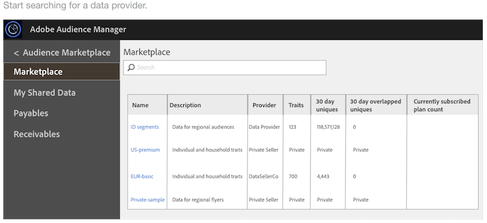
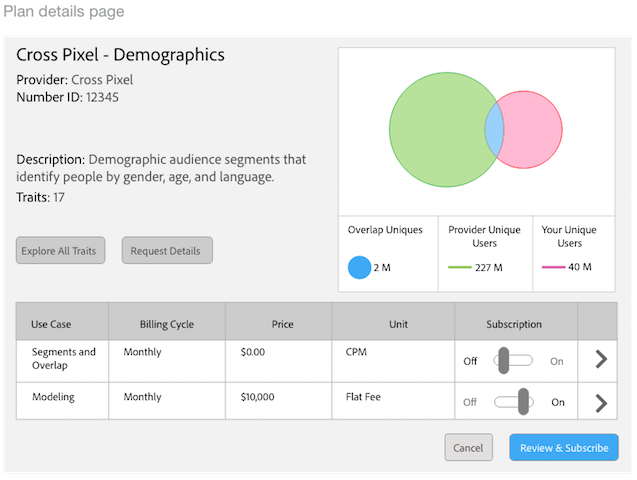
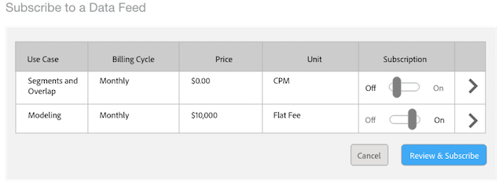
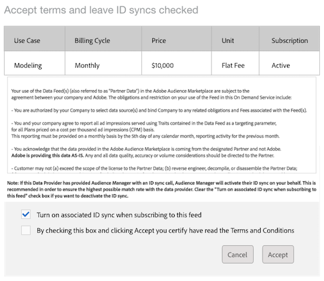

# Subscribe to a Public Data Feed

To subscribe to a public data feed: 

>1. Go to **[!UICONTROL  Audience Marketplace > Marketplace]**. Use the search feature or browse through the list to find a data feed.

>       1. Click the name of the data feed you want to use. This opens the [ plan details page ](../../../c_features/c_audience_marketplace/c_marketplace_buyer/marketplace-buyer-details.md#concept_61D21E5C524940FCA28FB5D515C3065D) for the selected feed.

>        
>1. Choose a use case from the subscriptions table and:
>    * Move the **[!UICONTROL  Subscription]** slider to **[!UICONTROL  On]**.
>    * Click **[!UICONTROL  Review & Subscribe]**. This opens the [!UICONTROL  Terms and Conditions] window.

>       1. In the [!UICONTROL  Terms and Conditions] window:
>    * **Important:** Leave the **[!UICONTROL  ID sync]** check box checked. This setting helps improve match rates with your data provider.
>    * Check the terms and conditions box and click **[!UICONTROL  Accept]** to complete the subscription process.

>        
>[!MORE_LIKE_THIS]
>
>* [ Billing and Impression Allocation for CPM Data Feeds ](marketplace_cpm_billing.md#concept_E757985A4850400288F1DD9A02B755D5)
>* [ Billing and Impression Allocation for Flat Fee Data Feeds ](marketplace_flat_billing.md#concept_FE781C4C5C044C1F986F1AB6BA4E328F)
>* [ How to Report CPM Usage ](t_marketplace_report_cpm_usage.md#task_22D86C3A39544CA8A4BC2360DC115877)
