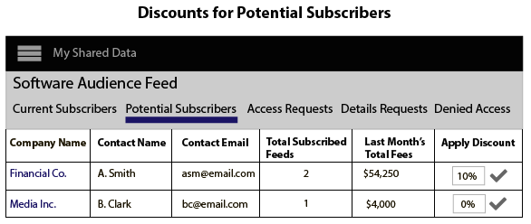
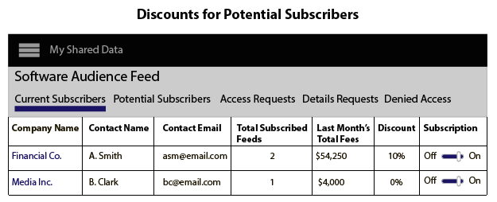

# Discounts for Data Providers

## Apply Discounts to a Data Feed {#section_78B92438EF424B328A4A339236F76D6A}

To discount a feed, add a discount amount as a % to the discount field and confirm your changes. Data providers can discount a data feeds in [!UICONTROL  Audience Marketplace] from either: 

* **[!UICONTROL  My Shared Data > Potential Subscribers]**
* **[!UICONTROL  My Shared Data > Details Requests]**
In these examples, the seller has added 10% discount to the Software Audience data feed. 

 

 

## Review Discounted Feeds {#section_1E01A755F11F4824A3D294C2BF03B957}

Data providers can see all of their subscribers and discounted feeds in **[!UICONTROL  Audience Marketplace > My Shared Data > Current Subscribers]**. 

 
>[!MORE_LIKE_THIS]
>
>* [ My Shared Data: About ](c_myshared_data.md#concept_AA5C5992C0CA40E498AE9D8FA789F00A)
