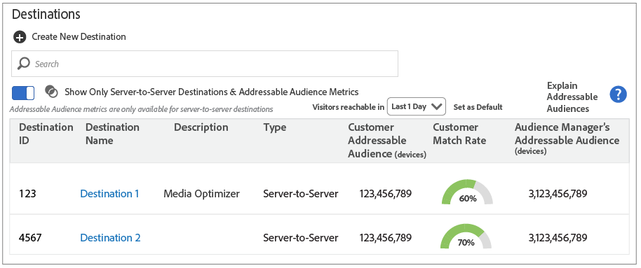

# Destinations Home Page

Contents: 

<ul class="simplelist"> 
 <li> <a href="../../c_features/c_destinations/destinations-home.md#section_6CD57AF083EC43C2BD3AA93D80441017" format="dita" scope="local"> Default Landing Page </a> </li> 
 <li> <a href="../../c_features/c_destinations/destinations-home.md#section_35CB44028A3B45B6B25FE1D05A5F16A5" format="dita" scope="local"> Addressable Audiences Landing Page </a> </li> 
</ul>

## Default Landing Page {#section_6CD57AF083EC43C2BD3AA93D80441017}

The default landing page lists and helps you manage all of your destinations. You can create, edit, and search for destinations here. 

 

## Addressable Audiences Landing Page {#section_35CB44028A3B45B6B25FE1D05A5F16A5}

Slide the **[!UICONTROL  Show Only Addressable Audience Metrics]** toggle to see audience data and match rates for your server-to-server destinations. When enabled, this feature: 

* Lets you filter the report to return audience data and match rates for fixed time intervals.
* Returns data for server-to-server destinations only. Cookie and URL destinations are excluded from the list. Slide the toggle again to return to the default view.
 
>[!MORE_LIKE_THIS]
>
>* [ Addressable Audiences ](addressable-audiences.md#concept_8E0BAEF0978F4968B21482E79E601889)
