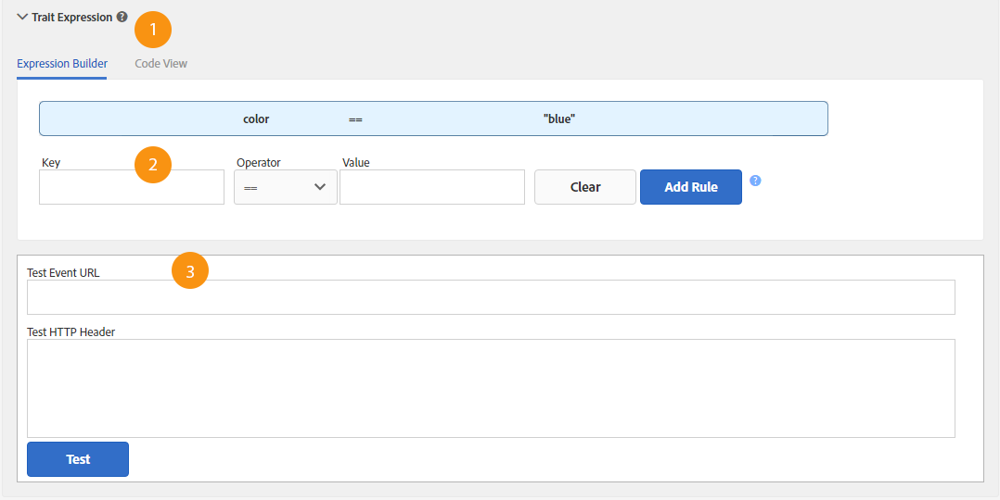

# Managing Trait Rules

**Main Signal Rules Features Described** 

 
1. The **[!UICONTROL  Expression Builder]** or **[!UICONTROL  Code View]** tabs provide an overview of the rules in your trait. The **[!UICONTROL  Expression Builder]** tab lets you create rules with fields and drop-down menus. The **[!UICONTROL  Code View]** lets you create rules by manually writing those expressions as code. The illustration above shows a simple trait composed of a signal that evaluates data for a qualifying condition where a product key equals a specific value, in this case ` color == "blue".`
1. The fields and controls in this section let you create signals from key-value pairs and set the relationship between them with a comparison operator. A key, operator, and value are required.
1. The test fields let you validate combinations of signal rules or the URLs that you want to use when sending data to Audience Manager.

