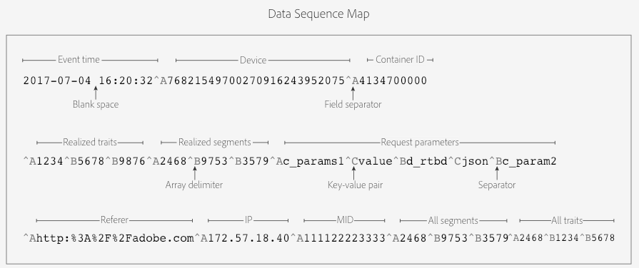
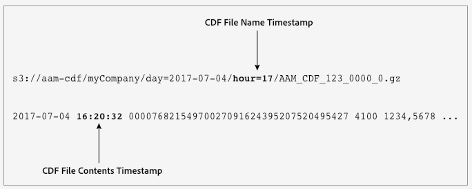

# Customer Data Feeds

Basic information about Customer Data Feed (CDF) files and instructions on how to get started. Start here if you're interested in receiving CDF files or just want more information.

## Customer Data Feeds {#concept_114B993EC5E246AE8CDD55E695B344FC}

Basic information about [!UICONTROL Customer Data Feed] (CDF) files and instructions on how to get started. Start here if you're interested in receiving CDF files or just want more information.

## File Contents and Purpose {#section_F0D2FA4C021A4C5EBC1D5308AE2F256F}

<!-- cdf-intro.xml -->

A CDF file contains the same data that an [!DNL Audience Manager] event call ( `/event`) sends to our servers. This includes data like user IDs, trait IDs, segment IDs, and all the other parameters captured by an event call. Internal [!DNL Audience Manager] systems processes event data into a CDF file with content organized into fields that appear in a set order. [!DNL Audience Manager] tries to generate CDF files hourly and stores them in a secure, customer-specific bucket on an Amazon S3 server. We provide these files so you can work with [!DNL Audience Manager] data outside of the limits imposed by our user interface.

>[!NOTE]
>
>You should not use CDF files as a proxy to monitor page traffic, reconcile report discrepancies, or for billing, etc.

## Getting Started {#section_5DCA2FA476E048A797C1021E5C75AA92}

There is no self-service process to start CDF file delivery. Contact your [!DNL Audience Manager] consultant or Customer Care to get started. During implementation, your [!DNL Audience Manager] representative will:

* Set up your Amazon S3 storage bucket. 
* Provide read-only S3 authentication credentials to your file storage bucket. You will not be able to see or access directories and files that belong to other customers.

File notifications and CDF files will appear in your S3 bucket when they're ready for download. You're responsible for monitoring and downloading files from your assigned S3 directory. See [Customer Data Feed File Processing Notifications](../c_features/cdf-files.md#concept_00F913A9946A4A10A0F34269AC84A563) .

## Next Steps {#section_AB55E04E26D9464D8EB911D51B45E4B8}

The following documentation and the [Customer Data Feed FAQ](../faq/faq-cdf.md#concept_E832A7307FA0475C918F95116C21CBC6) can help you become more familiar with this service. 

## Customer Data Feed Contents Defined {#reference_6257ACA5665D4820900F111CFED50866}

Lists and defines the data elements and arrays in a [!UICONTROL Customer Data Feed] (CDF) file, by order of appearance. Definitions include data types, but this information is not part of a CDF file.

## Definitions {#section_DB2A76D38BCD4FE3832B84FD835F153C}

<!-- cdf-contents-defined.xml -->

A CDF file includes some or all of the fields defined below. For information about internal file organization, see [Customer Data Feed File Structure](../c_features/cdf-files.md#concept_4F215D39A64A43CCAE8791FCD3D5232D).

<table id="table_46BC897A30C2469AB5911F5B85A3FAA7"> 
 <thead> 
  <tr> 
   <th colname="col1" class="entry"> Field </th> 
   <th colname="col2" class="entry"> Data Type </th> 
   <th colname="col3" class="entry"> Description </th> 
  </tr> 
 </thead>
 <tbody> 
  <tr> 
   <td colname="col1"> <p><span class="codeph"> Event Time</span> </p> </td> 
   <td colname="col2"> <p>Timestamp </p> </td> 
   <td colname="col3"> <p>The time a CDF file was processed by the <span class="wintitle"> Data Collection Servers</span> (DCS). The timestamp uses the <i>yyyy-mm-dd hh:mm:ss</i> format and is set in the UTC time zone. </p> <p> <p>Note: The Event Time <i>is not</i>: <p> 
       <ul id="ul_41ABC813FAAC4659AC8DA13F4A6DD7EB"> 
        <li id="li_0192D253EA4C49C4BF2E8BA62CEE028E">The time of the page event or the event call itself, although it may be close to those times. </li> 
        <li id="li_271DF14395BC495FBF17186588A554A8">Related to the DCS hour in the file name. See also, <a href="../c_features/cdf-files.md#concept_C907608AC1ED44BA8EF870F45E5A9CB9" format="dita" scope="local"> Customer Data Feed File Name Times and File Content Times...</a>. </li> 
       </ul> </p> </p> </p> </td> 
  </tr> 
  <tr> 
   <td colname="col1"> <p><span class="codeph"> Device</span> </p> </td> 
   <td colname="col2"> <p>String </p> </td> 
   <td colname="col3"> <p>This is the <span class="wintitle"> Unique User ID</span> (UUID), which is a 38-digit device ID for your site visitor. See also, <a href="../reference/ids-in-aam.md#reference_D55EC67D86664B7499F3257BB870FEC8" format="dita" scope="local"> Index of IDs in Audience Manager</a>. </p> </td> 
  </tr> 
  <tr> 
   <td colname="col1"> <p><span class="codeph"> Container ID</span> </p> </td> 
   <td colname="col2"> <p>Numeric </p> </td> 
   <td colname="col3"> <p>The ID of the container that fires ID syncs. </p> </td> 
  </tr> 
  <tr> 
   <td colname="col1"> <p><span class="codeph"> Realized Traits</span> </p> </td> 
   <td colname="col2"> <p>Numeric Array </p> </td> 
   <td colname="col3"> <p>An array of trait IDs that contains all the traits a visitor realized (qualified for) in the event call. </p> <p>Note that the array can contain traits for which the visitor had qualified before and for which they re-qualify through this event call. </p> </td> 
  </tr> 
  <tr> 
   <td colname="col1"> <p><span class="codeph"> Realized Segments</span> </p> </td> 
   <td colname="col2"> <p>Numeric Array </p> </td> 
   <td colname="col3"> <p>An array of segment IDs that contains all the segments a visitor realized (qualified for) in the event call. </p> </td> 
  </tr> 
  <tr> 
   <td colname="col1"> <p><span class="codeph"> Request Parameters</span> </p> </td> 
   <td colname="col2"> <p>String </p> </td> 
   <td colname="col3"> <p>A string that captures all the parameters (variables, IDs, key-value pairs, etc.) passed in on the event call. </p> <p>Shortened example: </p> <p> <span class="codeph"> d_rtbd:json,c_contextData.a.CarrierName:mobile,c_contextData.a.adid:92D56353-49C5-431E-B474-FC528D585810,c_contextData.a,RunMode:Application,c_contextData.a.DaysSinceLastUpgrade:61,d_cid_ic:xid%01EACB6E40-AC65-4012-9FE9-ABD59965E9C4%011,c_contextData.a.PrevSessionLength:583</span> </p> </td> 
  </tr> 
  <tr> 
   <td colname="col1"> <p><span class="codeph"> Referer Data Type</span> </p> </td> 
   <td colname="col2"> <p>String </p> </td> 
   <td colname="col3"> <p>The unencoded URL of the referring page (if any). </p> </td> 
  </tr> 
  <tr> 
   <td colname="col1"> <p><span class="codeph"> IP Data Type</span> </p> </td> 
   <td colname="col2"> <p>String </p> </td> 
   <td colname="col3"> <p>The IP address for the visitor captured in the event call. </p> </td> 
  </tr> 
  <tr> 
   <td colname="col1"> <p><span class="codeph"> MCDevice </span> </p> </td> 
   <td colname="col2"> <p>String </p> </td> 
   <td colname="col3"> <p>The <span class="keyword"> Experience Cloud</span> ID (MID) assigned to the site visitor. See also, <a href="https://marketing.adobe.com/resources/help/en_US/mcvid/mcvid_cookies.html" format="https" scope="external"> Cookies and theExperience Cloud ID service</a>. </p> </td> 
  </tr> 
  <tr> 
   <td colname="col1"> <p><span class="codeph"> All Segments</span> </p> </td> 
   <td colname="col2"> <p>Numeric Array </p> </td> 
   <td colname="col3"> <p>An array of segment IDs that contains previously realized segments and new segments the visitor is qualified for. </p> </td> 
  </tr> 
  <tr> 
   <td colname="col1"> <p><span class="codeph"> All Traits</span> </p> </td> 
   <td colname="col2"> <p>Numeric Array </p> </td> 
   <td colname="col3"> <p>An array of first and third-party trait IDs that contains previously realized traits and new traits the visitor has qualified for since the last generated data feed. </p> </td> 
  </tr> 
 </tbody> 
</table>

## Customer Data Feed File Structure {#concept_4F215D39A64A43CCAE8791FCD3D5232D}

Lists and defines the data structure of a [!UICONTROL Customer Data Feed] (CDF) file. This includes data sequence, field delimiters and separators, a data file map, and sample file.

## Data Field Identifiers and Sequence {#section_FBE42884A7714114BC5D434C105BCCEF}

<!-- cdf-file-structure.xml -->

CDF files do not contain labeled columns or field headers. Instead, a CDF file defines fields and arrays with non-printing ASCII characters. Also, the CDF file lists each field and array in a specific order. Understanding the field identifiers and order will help you parse the file properly.

<table id="table_D2C8786DF7CE47E5ADB8930EC825F8F6"> 
 <thead> 
  <tr> 
   <th colname="col1" class="entry"> CDF File Element </th> 
   <th colname="col2" class="entry"> Description </th> 
  </tr> 
 </thead>
 <tbody> 
  <tr> 
   <td colname="col1"> <p>Field Separators and Delimiters </p> </td> 
   <td colname="col2"> <p>These non-printing characters define the elements and structure of your CDF file: </p> <p> 
     <ul id="ul_056A9B90AC88405CBB5F81A56CD6E4C9"> 
      <li id="li_B9DA15DCB6A445D781B8753C1C4262B0">Ctrl + a (ASCII <span class="codeph"> 001</span> or <span class="codeph"> ^A</span>) separates data in individual fields with a non-printing space indicator. </li> 
      <li id="li_E68D0CC065B34AC9AF91F166CAA2A67C">Ctrl + b (ASCII <span class="codeph"> 002</span> or <span class="codeph"> ^B</span>) separates data an array and request parameters. </li> 
      <li id="li_6C32D927FEF04CDE9887374E8C2688E7">Ctrl + c (ASCII <span class="codeph"> 003</span> or <span class="codeph"> ^C</span>) defines key-value pairs. </li> 
     </ul> </p> </td> 
  </tr> 
  <tr> 
   <td colname="col1"> <p>Field Sequence </p> </td> 
   <td colname="col2"> <p> <p>Important: <span class="keyword"> Audience Manager</span> reserves the right to add new fields to the end of the CDF file in future releases. This means the technical design of your file parsing system should not assume a fixed number of columns (though it may assume a fixed order for existing columns). </p> </p> <p>Data in your CDF file appears in the order shown below. </p> <p> 
     <ol id="ol_1FDF4A7F089448ED8A724378C23009C8"> 
      <li id="li_CB97D90B54EB4F95861583D4A5F660C7">Event Time </li> 
      <li id="li_C44E8CCB1A964B7A941FD772FB8A7608">Device </li> 
      <li id="li_F8AE0D4CA19D411686A240FE06F56147">Container ID </li> 
      <li id="li_660D17989BE54610A01229C47894E8A9">Realized Traits </li> 
      <li id="li_1591180564374204852785C6FFCA4F74">Realized Segments </li> 
      <li id="li_FE38DA4969EE4E19B39124E77E2EA5F9">Request Parameters </li> 
      <li id="li_9AC25DA883214FBC902D7CE9DACFAE28">Referer </li> 
      <li id="li_BA05F1C33B5B4625B450425FF1911B30">IP Address </li> 
      <li id="li_08E632FB135F42B5830D5CBFE6EE6BE8">Experience Cloud Device ID (or MID). See also, <a href="https://marketing.adobe.com/resources/help/en_US/mcvid/mcvid_cookies.html" format="https" scope="external"> Cookies and the Experience Cloud ID Service</a> </li> 
      <li id="li_7A05AF4790A1425A90D019681DF4A595">All Segments </li> 
      <li id="li_1B5A6F076A354BA0A931CB260E6D2675">All Traits </li> 
     </ol> </p> <p>For field descriptions, see <a href="../c_features/cdf-files.md#reference_6257ACA5665D4820900F111CFED50866" format="dita" scope="local"> Customer Data Feed Contents Defined</a>. </p> </td> 
  </tr> 
 </tbody> 
</table>

## CDF File Map {#section_E57453FBC4D4489484F122BE75EECBDE}

CDF file data appears in the order shown below.



**Identifying Arrays**

Arrays in a CDF file start and end with the `Ctrl + a` field separator. This makes the first element in an array appear like a standalone data field. For example, the realized traits array starts with `^A1234`. The array delimiter and ID `^B5678` follows this entry. As a result, you might be tempted to think that the first element in the realized traits array is ID 5678 (because it starts with `^B`). This is not the case, which is why you need to be familiar with the sequence and structure of a data file. Even though the first element in the realized trait array (or any of the other arrays in a CDF file) starts with `^A`, the order of appearance or position in the file defines the start of an array. And, the first element in an array is always separated from the preceding entry by `^A`.

## Sample CDF File {#section_8DD0364915C8428B8BCEF02C981779EA}

A sample CDF file could look similar to the following. We've inserted line breaks into this example to help it fit the page.

 

## Customer Data Feed File Naming Conventions {#reference_DAC53BEEA60B426588D1B66B3B92E8C1}

Lists and defines the elements in your [!UICONTROL Customer Data File] (CDF) file name.

## CDF File Name: Syntax and Example {#section_C06A94AD48E84B758645FB74BAEFAB34}

<!-- cdf-file-name.xml -->

A typical CDF file name contains the elements listed below. Note, *italics* indicates a variable placeholder:

<ul class="simplelist"> 
 <li> <b>Syntax:</b> <span class="codeph"> s3://aam-cdf/<span class="varname"> your s3 bucket name</span>/day=<span class="varname"> yyyy-mm-dd</span>/hour=<span class="varname"> hh</span>/<span class="varname"> AAM_CDF_partner ID_AAM process ID</span>_0.gz</span> </li> 
 <li> <b>Example:</b> <span class="codeph"> s3://aam-cdf/dataCompany/day=2017-09-14/hour=17/AAM_CDF_1234_000058_0.gz</span> </li> 
</ul>

In your S3 storage bucket, files are sorted in ascending order by Partner ID (PID), day, and hour.

## CDF File Name Elements Defined {#section_D8D955D05105486EB77C4F5DA08C7CBD}

The following table lists and defines the elements in a CDF file name.

<table id="table_4AC4F90C1C7D43E2A93CB3B6908D7E94"> 
 <thead> 
  <tr> 
   <th colname="col1" class="entry"> File Name Element </th> 
   <th colname="col2" class="entry"> Description </th> 
  </tr> 
 </thead>
 <tbody> 
  <tr> 
   <td colname="col1"> <p> <span class="codeph"> s3://aam-cdf/</span> </p> </td> 
   <td colname="col2"> <p>This is the default, root storage bucket for your CDF file on an Amazon S3 server. </p> </td> 
  </tr> 
  <tr> 
   <td colname="col1"> <p> <span class="codeph"> <span class="varname"> your S3 bucket name</span> </span> </p> </td> 
   <td colname="col2"> <p>The name of the read-only, S3 bucket that holds your CDF files. </p> </td> 
  </tr> 
  <tr> 
   <td colname="col1"> <p> <span class="codeph">day=<span class="varname"> yyyy-mm-dd</span></span> </p> </td> 
   <td colname="col2"> <p>The date your file was processed. </p> </td> 
  </tr> 
  <tr> 
   <td colname="col1"> <p> <span class="codeph">hour=<span class="varname"> hh</span></span> </p> </td> 
   <td colname="col2"> <p>A time value expressed in 24-hour notation and set in the UTC time zone. See also, <a href="../c_features/cdf-files.md#concept_C907608AC1ED44BA8EF870F45E5A9CB9" format="dita" scope="local"> Customer Data Feed File Name Times and File Content Times...</a>. </p> </td> 
  </tr> 
  <tr> 
   <td colname="col1"> <p> <span class="codeph"> <span class="varname"> partner ID</span> </span> </p> </td> 
   <td colname="col2"> <p>Your partner ID. </p> </td> 
  </tr> 
  <tr> 
   <td colname="col1"> <p> <span class="codeph"> <span class="varname"> AAM process ID</span>_0</span> </p> </td> 
   <td colname="col2"> <p>An internal, <span class="keyword"> Audience Manager</span> process ID. </p> </td> 
  </tr> 
  <tr> 
   <td colname="col1"> <p> <span class="codeph"> .gz</span> </p> </td> 
   <td colname="col2"> <p>A gzip file extension. CDF files are gzip compressed. </p> </td> 
  </tr> 
 </tbody> 
</table>

## Customer Data Feed File Processing Notifications {#concept_00F913A9946A4A10A0F34269AC84A563}

[!DNL Audience Manager] writes a `.info` file to your S3 directory to let you know when your [!UICONTROL Customer Data File] (CDF) is ready for download. The `.info` file also includes JSON-formatted metadata about the contents of your CDF files. Review this section for information about the syntax and fields used by this notification file.

## Sample Info File {#section_BC331FC87C5A4BC9AE799B53F4FAA3E7}

<!-- cdf-notifications.xml -->

Each `.info` file contains a `Files` and `Totals` section. The `Files` section contains an array that holds specific metrics for each hourly file. The `Totals` section contains metrics aggregated across all your CDF files for a particular day. The contents of your `.info` file could look similar to the following example.

```js
{
    "Files": [
        {
            "FileByteSize": 2709730,
            "FileChecksumMD5": "a9ea418e79511642cff11c2a898037dc-1",
            "FileName": "AAM_CDF_1109_000000_0.gz",
            "FileSequenceNumber": 1
        },
        {
            "FileByteSize": 2783351,
            "FileChecksumMD5": "7b469485d60274b6991acd0817855840-3",
            "FileName": "AAM_CDF_1109_000001_0.gz",
            "FileSequenceNumber": 2
        }
    ],
    "Totals": {
        "Day": "2017-09-26",
        "Hour": "18",
        "TotalByteSize": 150092997,
        "TotalNumberFiles": 2
    }
}
```

## Info File Fields Defined {#section_24CE58EEA37347B58C4C02E1B7BF5278}

The following tables list and define the elements in a CDF `.info` file.

**Files Object**

<table id="table_582101B414864DA991CE813A7937ECC6"> 
 <thead> 
  <tr> 
   <th colname="col1" class="entry"> Field </th> 
   <th colname="col2" class="entry"> Description </th> 
  </tr> 
 </thead>
 <tbody> 
  <tr> 
   <td colname="col1"> <p> <span class="codeph"> Files</span> </p> </td> 
   <td colname="col2"> <p>Starts the array that contains metadata about your CDF files. </p> </td> 
  </tr> 
  <tr> 
   <td colname="col1"> <p> <span class="codeph"> FileByteSize</span> </p> </td> 
   <td colname="col2"> <p>File size in bytes. </p> </td> 
  </tr> 
  <tr> 
   <td colname="col1"> <p> <span class="codeph"> FileChecksumMD5</span> </p> </td> 
   <td colname="col2"> <p>The Amazon S3 ETag. The number following the hyphen shows the number of parts used to build the file during the multi-part upload. The <span class="codeph"> ETag</span> is not identical to the MD5 checksum of the file. </p> </td> 
  </tr> 
  <tr> 
   <td colname="col1"> <p> <span class="codeph"> FileName</span> </p> </td> 
   <td colname="col2"> <p>The file name. See <a href="../c_features/cdf-files.md#reference_DAC53BEEA60B426588D1B66B3B92E8C1" format="dita" scope="local"> Customer Data Feed File Naming Conventions</a>. </p> </td> 
  </tr> 
  <tr> 
   <td colname="col1"> <p> <span class="codeph"> FileSequenceNumber</span> </p> </td> 
   <td colname="col2"> <p>An index number for each file. </p> </td> 
  </tr> 
 </tbody> 
</table>

**Totals Object**

<table id="table_44F0B2D229E84A5DB3041760B1A50858"> 
 <thead> 
  <tr> 
   <th colname="col1" class="entry"> Field </th> 
   <th colname="col2" class="entry"> Description </th> 
  </tr> 
 </thead>
 <tbody> 
  <tr> 
   <td colname="col1"> <p> <span class="codeph"> Totals</span> </p> </td> 
   <td colname="col2"> <p>Starts the object that contains aggregated data about all your CDF files. </p> </td> 
  </tr> 
  <tr> 
   <td colname="col1"> <p> <span class="codeph"> Day</span> </p> </td> 
   <td colname="col2"> <p>The day for which the data is available. Uses <i>yyyy-mm-dd</i> format. </p> </td> 
  </tr> 
  <tr> 
   <td colname="col1"> <p> <span class="codeph"> Hour</span> </p> </td> 
   <td colname="col2"> <p>The hour for which data is available. Uses 24-hour format set in UTC time zone. </p> </td> 
  </tr> 
  <tr> 
   <td colname="col1"> <p> <span class="codeph"> TotalByteSize</span> </p> </td> 
   <td colname="col2"> <p>Total size of all your CDF files for that date in bytes. </p> </td> 
  </tr> 
  <tr> 
   <td colname="col1"> <p> <span class="codeph"> TotalNumberFiles</span> </p> </td> 
   <td colname="col2"> <p>Total number of files uploaded to your S3 directory. </p> </td> 
  </tr> 
 </tbody> 
</table>

## Customer Data Feed File Name Times and File Content Times are Different {#concept_C907608AC1ED44BA8EF870F45E5A9CB9}

Your [!UICONTROL Customer Data Feed](CDF) file contains timestamps in the file name and file contents. These timestamps record different event processes for the same CDF file. It is not uncommon to see different timestamps in the name and contents of the same file. Understanding each timestamp can help you avoid common mistakes when working with this data or trying to sort it by time.

## Locating CDF File Timestamps {#section_215B6A745B85476BA5DB2CDD8CD5C170}

<!-- cdf-time-differences.xml -->

CDF files record time differently in 2 separate locations.



## Understanding the Difference Between Timestamps {#section_A8747AB22CF440C4805E9B0D9B9D2AB7}

The following table provides additional details about your CDF file timestamps along with information about how to use them properly.

<table id="table_77F52DDF37F549209D9DE19272F2E57E"> 
 <thead> 
  <tr> 
   <th colname="col1" class="entry"> Timestamp Location </th> 
   <th colname="col2" class="entry"> Description </th> 
  </tr> 
 </thead>
 <tbody> 
  <tr> 
   <td colname="col1"> <p> <b>File Name</b> </p> </td> 
   <td colname="col2"> <p>The timestamp in your CDF file name marks the time when <span class="keyword"> Audience Manager</span> started preparing your file for delivery. This timestamp is set in the UTC time zone. It uses the <span class="codeph"> hour=</span> parameter, with time formatted as a 2-digit hour in 24-hour notation. This time can be different than the event time recorded in the file contents. </p> <p>When working with CDF files, sometimes you'll notice that your S3 bucket is empty for a particular hour. An empty bucket means can mean either of the following: </p> <p> 
     <ul id="ul_17F1B3AD9D17414EA5D2C976E98D3354"> 
      <li id="li_E2FE44B220574073B2961F17AE201509">There's no data for that particular hour. </li> 
      <li id="li_D95E682F50624030815FD75F2A60BE36"> Our servers are under heavy loads and can't process files for a particular hour. When the server catches up, it puts the files that should have gone in an earlier time bucket files into a bucket with a later time value. For example, you'll see this when a file that should have been in the hour 17 bucket appear in the hour 18 bucket (with <span class="codeph"> hour=18</span> in the file name). In this case, the server probably started processing your file in hour 17 but couldn't complete it within that time interval. Instead, the file gets pushed to the next hourly time bucket. </li> 
     </ul> </p> <p> <p>Important: Do not use the file name timestamp to group events by time. If you need to group by time, use the <span class="codeph"> EventTime</span> timestamp in the file contents. </p> </p> </td> 
  </tr> 
  <tr> 
   <td colname="col1"> <p> <b>File Contents</b> </p> </td> 
   <td colname="col2"> <p>The timestamp in your CDF file contents marks the time the <span class="wintitle"> Data Collection Servers</span> started processing the file. This timestamp is set in the UTC time zone. It uses the <span class="codeph"> EventTime</span> field, with time formatted as <span class="codeph"><span class="varname"> yyyy-mm-dd hh:mm:ss</span></span>. This time is close to the actual time of the event on the page, but it can be different than the hour indicator in the file name. </p> <p> <p>Tip: Unlike the <span class="codeph"> hour=</span> timestamp in the file name, you can use <span class="codeph"> EventTime</span> to group data by time. </p> </p> </td> 
  </tr> 
 </tbody> 
</table>

>[!MORE_LIKE_THIS]
>
>* [Customer Data Feed FAQ](faq-cdf.md#concept_E832A7307FA0475C918F95116C21CBC6)
