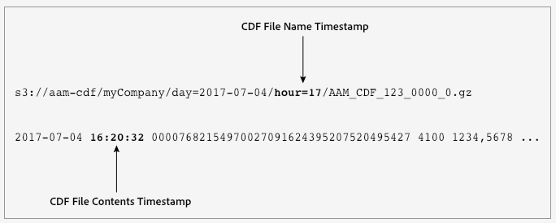

# Customer Data Feed File Name Times and File Content Times are Different

## Locating CDF File Timestamps {#section_215B6A745B85476BA5DB2CDD8CD5C170}

CDF files record time differently in 2 separate locations. 

 

## Understanding the Difference Between Timestamps {#section_A8747AB22CF440C4805E9B0D9B9D2AB7}

The following table provides additional details about your CDF file timestamps along with information about how to use them properly. 

<table id="table_77F52DDF37F549209D9DE19272F2E57E"> 
 <thead> 
  <tr> 
   <th colname="col1" class="entry"> Timestamp Location </th> 
   <th colname="col2" class="entry"> Description </th> 
  </tr> 
 </thead>
 <tbody> 
  <tr> 
   <td colname="col1"> 
 <b>File Name</b> 
 </td> 
   <td colname="col2"> 
The timestamp in your CDF file name marks the time when  Audience Manager started preparing your file for delivery. This timestamp is set in the UTC time zone. It uses the  hour= parameter, with time formatted as a 2-digit hour in 24-hour notation. This time can be different than the event time recorded in the file contents. 
 
When working with CDF files, sometimes you'll notice that your S3 bucket is empty for a particular hour. An empty bucket means can mean either of the following: 
 
 
     <ul id="ul_17F1B3AD9D17414EA5D2C976E98D3354"> 
      <li id="li_E2FE44B220574073B2961F17AE201509">There's no data for that particular hour. </li> 
      <li id="li_D95E682F50624030815FD75F2A60BE36"> Our servers are under heavy loads and can't process files for a particular hour. When the server catches up, it puts the files that should have gone in an earlier time bucket files into a bucket with a later time value. For example, you'll see this when a file that should have been in the hour 17 bucket appear in the hour 18 bucket (with  hour=18 in the file name). In this case, the server probably started processing your file in hour 17 but couldn't complete it within that time interval. Instead, the file gets pushed to the next hourly time bucket. </li> 
     </ul> 
 
 
Note: Do not use the file name timestamp to group events by time. If you need to group by time, use the  EventTime timestamp in the file contents. 
 
 </td> 
  </tr> 
  <tr> 
   <td colname="col1"> 
 <b>File Contents</b> 
 </td> 
   <td colname="col2"> 
The timestamp in your CDF file contents marks the time the  Data Collection Servers started processing the file. This timestamp is set in the UTC time zone. It uses the  EventTime field, with time formatted as  yyyy-mm-dd hh:mm:ss. This time is close to the actual time of the event on the page, but it can be different than the hour indicator in the file name. 
 
 
Note: Unlike the  hour= timestamp in the file name, you can use  EventTime to group data by time. 
 
 </td> 
  </tr> 
 </tbody> 
</table>

>[!MORE_LIKE_THIS]
>
>* [ Customer Data Feed Contents Defined ](cdf-contents-defined.md#reference_6257ACA5665D4820900F111CFED50866)
>* [ Customer Data Feed File Naming Conventions ](cdf-file-name.md#reference_DAC53BEEA60B426588D1B66B3B92E8C1)
>* [ Customer Data Feed FAQ ](cdf-faq.md#concept_E832A7307FA0475C918F95116C21CBC6)
