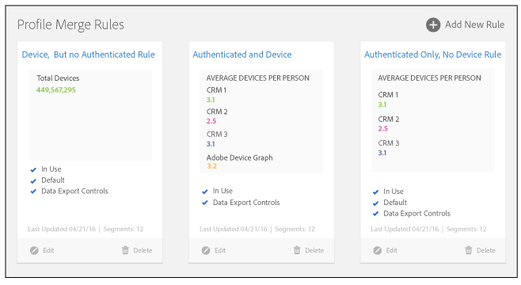

# Profile Merge Rules Dashboard

The [!UICONTROL  Profile Merge Rules] dashboard provides a unified workspace that lets you manage your [!UICONTROL  Profile Merge Rules]. The dashboard is located at **[!UICONTROL  Audience Data]** > **[!UICONTROL  Profile Merge Rules]**. Your rules dashboard could look similar to the example shown below. 

 

When working with [!UICONTROL  Profile Merge Rules], you can: 

* Create a maximum of 3 rules from your cross-device data sources. See [ Create a Cross-Device Data Source](../../c_features/profile-link-intro/merge-rules-start/create-cross-device-datasource.md#concept_3B7696B3EC77416492D3B99EBD79EA44).
* Designate a default merge rule. [ Segment Builder](../../c_features/c_segments/c_segment_builder/c_segment_builder.md#concept_FABA1F399CFD4E83B874043638D0FA54) automatically applies the default rule to any new segments you create.
* Apply [ Data Export Controls](../../c_features/c_dec.md#concept_155AAFBA7D804467B6F8279D26C9D05C) to a merge rule. [!UICONTROL  Data Export Controls] prevent you from sending data to destinations when that would violate data privacy or use agreements.
* Track the average number of devices for each user.
* Work with basic controls to create, edit, and delete rules. Only administrators can manage rules, but other users can view them and apply them to segments. See [ Profile Merge Rule Options Defined](../../c_features/profile-link-intro/merge-rule-definitions.md#concept_44FFF67CD9654DB2B43ECA13C2FD1CE0) and [ Use Cases for Merge Rules](../../c_features/profile-link-intro/merge-rule-targeting-options.md#concept_7F8EC9D100AE442185B2C3EE65814DD2).

>[!MORE_LIKE_THIS]
>
>* [ Profile Merge Rules FAQ ](profile-merge-faq.md#concept_C8E29A974E194B62B0BAC1CCDD0DF4FF)
