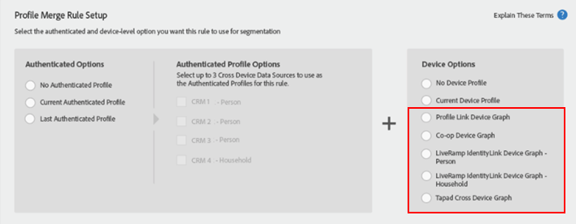

# Important Considerations for Profile Merge Rules with Device Graphs

Avoid using Profile Merge Rules with a Device Graph for segments which have little to no real-time segment population.

>[!IMPORTANT]
>
>If the [!UICONTROL Profile Merge Rule] is configured incorrectly, the segment population exported to batch destinations may be significantly lower than expected.

Segments using a [Profile Merge Rule with a Device Graph](../../c_features/profile-merge-rules/merge-rule-targeting-options.md#section_F6D35A63A04346EE85DE533A43E5EE0D) are only evaluated against devices seen in real-time on [Audience Manager’s Edge Servers](../../reference/system-components/components-edge.md#concept_DD36E2B5A23D4CC5A91CA9808B908B8E) after the segment has been created.

Remember, a [!UICONTROL Profile Merge Rule] with a [!UICONTROL Device Graph] has one of the following device options selected, as shown below.

Devices that qualify for a segment in real-time are measured by the [segment’s real-time population](../../c_features/c_segments/segment-builder-data.md#section_ED9F6B29E9D541499E3FC7C0A1753FCE).

A low real-time segment population means that very few of the devices qualifying for the segment are being seen in real-time. For best performance, segments with little to no real-time population should use a [!UICONTROL Profile Merge Rule] set to evaluate the *Current Device*, like in the image below.

Setting the [!UICONTROL Profile Merge Rule] to evaluate the *Current Device* ensures that all devices (not just those seen in real-time) are evaluated for the segment. All devices qualifying for the segment are defined by the total segment population, as shown below. 

 