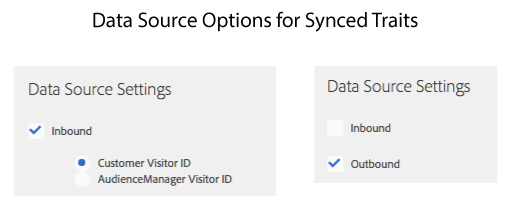

# Active Audience Traits and Data Source Synced Traits

These are special traits used by Addressable Audiences. Active Audience and Data Source Synced Traits are located in Audience Data > Traits > Audience Traits.

>[!NOTE]
>
>Access requires administrator permissions.

## Active Audience Traits {#section_B83B287B477C4B94B2E83818869D8186}

An [!UICONTROL Active Audience] trait contains all of the devices under management in your [!DNL Audience Manager] account. You can use an [!UICONTROL Active Audience Trait] like other traits when you build or edit segments. Also, [Addressable Audiences](../../c_features/addressable-audiences.md#concept_8E0BAEF0978F4968B21482E79E601889) requires this trait to generate overlap data. All accounts have an [!UICONTROL Active Audience] trait by default. This trait cannot be deleted.

## Data Source Synced Traits {#section_12FD915CE3734194AB3F56B427BFE88A}

[!UICONTROL Data Source Synced Traits] appear in the [!UICONTROL Audience Traits] folder when you [create or edit a datasource](../../c_features/manage-datasources.md#concept_3B7696B3EC77416492D3B99EBD79EA44) and apply either of these settings:

[!UICONTROL Data Source Synced Traits] track all of the users associated with a data source. You can use a [!UICONTROL Data Source Synched Trait] like other traits when you build or edit segments. When you create a [!UICONTROL Data Source Synced Trait], the trait name matches the name used by your data source. Edit the data source to change the trait name. These traits cannot be deleted.

>[!TIP]
>
>[!UICONTROL Data Source Synced Traits] are useful for troubleshooting. Click a trait name to check the metrics on the trait summary page. If your selected trait returns data, that indicates the ID synchronization process is set up properly and pushing data to [!DNL Audience Manager].

>[!MORE_LIKE_THIS]
>
>* [Addressable Audiences](addressable-audiences.md#concept_8E0BAEF0978F4968B21482E79E601889)
