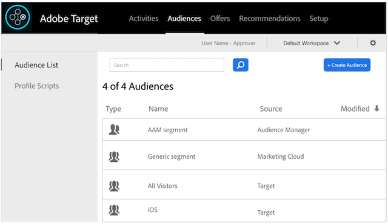

# Integrate Audience Manager With Target

An Audience Manager - Target integration requires: 

* The [ Experience Cloud service ](https://marketing.adobe.com/resources/help/en_US/mcvid/). If you're not using this service, see the [ implementation guides ](https://marketing.adobe.com/resources/help/en_US/mcvid/mcvid-implementation-guides.html) to get started.
* Profiles and Audiences. If you're not provisioned for Profiles and Audiences, complete the form on the [ Experience Cloud Integrations page ](https://adobe.allegiancetech.com/cgi-bin/qwebcorporate.dll?idx=X8SVES) or contact your consultant to get started.

All of your Audience Manager segments will appear in Target shortly after you complete these steps in the implementation process. Look in **[!UICONTROL  Audiences > Audience List]** to see your Audience Manager segments in Target. 

 
