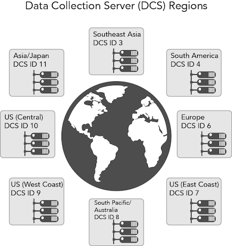

# Data Collection Components

Audience Manager contains the following data-collection components: 

* [ Data Collection Servers (DCS) and Profile Cache Servers (PCS) ](../../c_reference/c_compintro/c_compcollect.md#section_DEB68BEDDB4D4BCDAF50653D3F4568E2)
* [ Data Integration Library (DIL) ](../../c_reference/c_compintro/c_compcollect.md#section_71E528B4528742BA9F6CA69D1AF26C1D)
* [ Inbound Server-to-Server ](../../c_reference/c_compintro/c_compcollect.md#section_0CC5BA6F15CE4379AA3144D201B11F87)
* [ Log Files ](../../c_reference/c_compintro/c_compcollect.md#section_7900899D0DAB4F278A964F129E7E7A19)

## Data Collection Servers (DCS) and Profile Cache Servers (PCS) {#section_DEB68BEDDB4D4BCDAF50653D3F4568E2}

The DCS and PCS work together and separately provide services related to trait realization, audience segmentation, and data storage. 

**Data Collection Servers (DCS) Function** 

In [!DNL  Audience Manager], the DCS: 

* Receives and evaluates trait data from an event call. This includes information used for real-time segmentation and data passed in at scheduled intervals by server-to-server transfers.
* Segments users based on their realized traits and the qualification rules you create with [ Segment Builder](../../c_features/c_segments/c_segment_builder/c_segment_builder.md#concept_FABA1F399CFD4E83B874043638D0FA54).
* Creates and manages device IDs and authenticated profile IDs. This includes identifiers such as data provider IDs, user IDs, declared IDs, integration codes, etc.
* Checks the PCS for additional traits a user has already realized prior to a real-time event call. This lets the DCS qualify users based on real-time data and historical data.
* Writes log files and sends those to analytics systems for storage and processing.
**DCS Manages Demand Through Global Server Load Balancing (GSLB)** 

The DCS is a geographically distributed and load-balanced system. This means [!DNL  Audience Manager] can direct requests to and from a regional data center based on the geographic location of a site visitor. This strategy helps improve response times because a DCS response goes directly to a data center that contains information about that visitor. GSLB makes our system efficient because relevant data is cached in servers closest to the user. 
>[!IMPORTANT]
>
>The DCS only detects web traffic originating from devices that use IPv4.

In an event call, geographic location is captured in a key-value pair returned in a larger body of JSON data. This key-value pair is the `"dcs_region": *` region ID`*` parameter. 

 

As a customer, you engage with the DCS indirectly through our data collection code. You can also work directly with the DCS through a set of APIs. See [ Data Collection Server (DCS) API Methods and Code](../../c_api/dcs-intro/dcs-intro.md#concept_64E817EC9F2E4298BAFDCD5B1B3D03F0). 

**Profile Cache Servers (PCS)** 

The PCS is a large database (basically, a huge server-side cookie). It stores data received for active users from server-to-server transfers and the DCS. PCS data consists of device IDs, authenticated profile IDs, and their associated traits. When the DCS receives a real time call, it checks the PCS for other traits a user may belong to or qualify for. And, if a trait is added to a segment at a later time, those trait IDs are added to the PCS and users can qualify for that segment automatically, without a visit to a particular site or app. The PCS helps deepen Audience Manager's understanding of your users because it can match and segment users in real time or behind the scenes with new and historic trait data. This behavior gives you a more complete and accurate picture of your users than from real-time qualifications alone. 

There are no UI controls that lets our customers work directly with the PCS. Customer access to the PCS is indirect, through its role as a data store and data transfers. The PCS runs on [ Apache Cassandra](http://cassandra.apache.org/). 

**Purging inactive IDs from the PCS** 

As indicated previously, the PCS stores trait IDs for active users. An active user is any user who has been seen by the [ edge data servers](../../c_reference/c_compintro/c_compedge.md#concept_DD36E2B5A23D4CC5A91CA9808B908B8E) from any domain during the last 14-days. These calls to the PCS keep a user in an active state: 

* [!DNL  /event] calls
* [!DNL  /ibs] calls (ID syncs)

<!-- Removed /dpm calls from the bulleted list. /dpm calls have been deprecated. -->

The PCS flushes traits if they're inactive for 17-days. These traits aren't lost however. They're stored in Hadoop. If the user is seen again at another time, then Hadoop pushes all of their traits back to the PCS, typically within a 24-hour period. 

**Other DCS/PCS Processes: Privacy Opt-out** 

These server systems handle privacy and user opt-out requests. User cookie information is not collected in the log file if a user has opted out of data collection. For more information about our privacy policies see the [ Adobe Privacy Center](http://www.adobe.com/privacy/advertising-services.html). 

## Data Integration Library (DIL) {#section_71E528B4528742BA9F6CA69D1AF26C1D}

DIL is code you place on the page for data collection. See the [ DIL API](../../c_api/c_dil/c_dil.md#concept_6D73ED3DBA604EE49B66B5572AA6A32C) for more information about available services and methods. 

## Inbound Server-to-Server {#section_0CC5BA6F15CE4379AA3144D201B11F87}

These are systems that receive data sent in by various server-to-server integrations with our clients. See the documentation on [ sending audience data](../../c_integration/c_onboarding_data/c_onboarding_data.md#concept_3BF153ABA4CE46F99A41A0114316847C) for more information. 

## Log Files {#section_7900899D0DAB4F278A964F129E7E7A19}

The PCS creates and writes data to the log files. These are sent to other database systems for processing, reporting, and storage. 
>[!MORE_LIKE_THIS]
>
>* 
