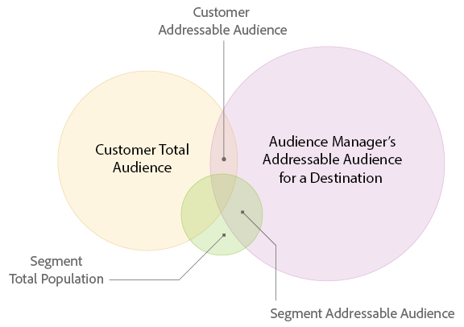
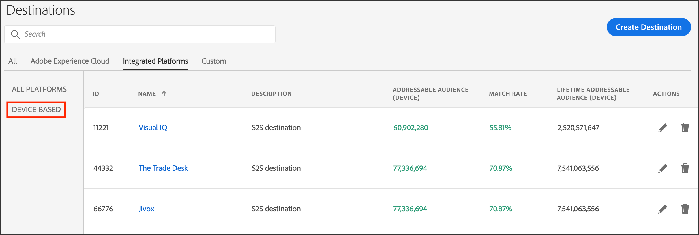

# [!UICONTROL Addressable Audiences] {#addressable-audiences}

An overview of the [!UICONTROL Addressable Audience] feature and use cases.

## What is an [!UICONTROL Addressable Audience]? {#addressable-audience-description}

The [!UICONTROL Addressable Audiences] feature shows you the overlap between the audiences you see across all of your properties where [!DNL Audience Manager] collects data and your selected destination. To help you understand this concept, take a look at the illustration below. The overlap between each circle represents the different types of addressable audiences.

|Metric|Description|
|---|---|
|[!UICONTROL Audience Manager Addressable Audience] for a [!UICONTROL Destination]|A count of all devices that have interacted with all [!DNL Audience Manager] customers at the platform-level during the report look-back period and that could be matched with your chosen [!UICONTROL destination].   This metric is useful because it shows you: <ul><li>The size of the total [!UICONTROL addressable audience] that [!DNL Audience Manager] can reach on a particular targeting [!UICONTROL destination].</li><li>How big the [!DNL Audience Manager] profile pool is for a targeting platform and the size of their audiences.</li></ul> |
|[!UICONTROL Customer Total Audience]|A count of devices that have realized either a [!UICONTROL rule-based trait] on your properties or an [!UICONTROL onboarded trait] from your offline files during the look-back window.|
|[!UICONTROL Addressable Audience Match Rate]|A count of overlap of devices that have realized either a [!UICONTROL rule-based trait] or an [!UICONTROL onboarded trait] during the look-back window and devices that we have an ID sync with the chosen [!UICONTROL destination] regardless of the time of syncs.  This metric represents devices that:<ul><li>Have realized either a [!UICONTROL rule-based] or an [!UICONTROL onboarded trait] during the look-back window `AND`</li><li>Have an ID sync with the chosen [!UICONTROL destination] regardless of the time of syncs.</li>|
|[!UICONTROL Customer Match Rate]|[!UICONTROL Customer Addressable Audience] ÷ [!UICONTROL Customer Total Audience] expressed as a percentage.|
|[!UICONTROL Total Segment Population]|A count of all the devices that were a member of your [!UICONTROL segment] during the report look-back period.|
|[!UICONTROL Segment Addressable Audience]|The number of users who have belonged to the [!UICONTROL segment] during the report look-back period and have an active ID sync on your site. [!UICONTROL Segments] can include your own first-party data and second and third-party data, via [!UICONTROL traits] acquired in the [Audience Marketplace](../features/audience-marketplace/marketplace-data-buyers/marketplace-data-buyers.md).   Tip: When used with the 1-day look-back period, this metric can help you understand the current state of your [!UICONTROL segments]. This is because the [!UICONTROL Segment Addressable Audience] metric represents the users who stayed in a [!UICONTROL segment] throughout the previous day. Combine this with the fact that [!DNL Audience Manager] refreshes [!UICONTROL Addressable Audiences] daily, combining this metric and lookback period provides the most up-to-date snapshot of your [!UICONTROL segments].|
|[!UICONTROL Segment Match Rate]|[!UICONTROL Segment Addressable Audience] ÷ [!UICONTROL Total Segment Population] expressed as a percentage.|

## [!UICONTROL Addressable Audiences] Interface {#addressable-audience-interface}

The [!UICONTROL Addressable Audience] feature turns this abstract concept into quantifiable data. In [!DNL Audience Manager], this feature displays audience overlap with data visualizations that provide at-a-glance information along with numeric data in tabular form.

[!UICONTROL Addressable Audiences] is located in **[!UICONTROL Audience Data > Destinations]**. Select **[!UICONTROL Integrated Platforms > Device-Based]** to see addressable audiences metrics.

The three metrics you can see on the [!UICONTROL Addressable Audiences] landing page represent:

Metric | Description |
---------|----------|
 **[!UICONTROL Addressable Audience (Device)]** | This metric represents the [!UICONTROL Customer Addressable Audience] (described in the table above) *for the last 30 days.* |
 **[!UICONTROL Match Rate]** | This metric represents the [!UICONTROL Addressable Audience Match Rate] (described in the table above) *for the last 30 days*. |
 **[!UICONTROL Lifetime Addressable Audience (Device)]** | A count of all devices that have interacted with all [!DNL Audience Manager] customers at the platform-level during the report look-back period and that could be matched with this [!UICONTROL destination]. See [Platform-Level Metrics](/help/using/features/addressable-audiences.md#platform-level-metrics) for more information. |

 Click on the name of a [!UICONTROL server-to-server destination] to view your addressable audience data. Note, this feature returns data for [!UICONTROL server-to-server destinations] only and access requires administrator permissions.

Reviewing this data can help you with:

* **Forecasting and planning:** [!UICONTROL Segment Addressable Audience] data gives you more granularity into the segments you are planning to send to a destination for audience targeting and activation.

* **Performance reviews:** The [!UICONTROL Addressable Audiences] feature is also a troubleshooting tool. It lets you review campaign performance, understand campaign reach, and lets you cross-check with targeting/activation partners if you don't see the results you expect.

### Prospecting with Third-Party Data and Implications for Match Rates

Before purchasing third-party data for audience acquisition, customers can validate the overlap with other data providers. This can help you make an informed decision prior to buying new data. The ID syncs for purchased third-party data rely not only on the overlap of your data but also on third-party providers’ footprints with all other [!DNL Audience Manager] customers. Your [!DNL Adobe] consultant can help you identify additional relevant data sources to optimize prospecting campaigns.

### Mobile Users and Match Rates

There are gaps when trying to connect [!DNL Safari] or mobile app users where there are no third-party [!DNL cookies] present. That makes it difficult to sync users with some partners because only those [!DNL Adobe] IDs for synced third-party [!DNL cookies] are provided in the media delivery logs. This is a reason why you might see [low match rates](../features/addressable-audiences.md#low-match-rates) for your [!UICONTROL destinations].

## Date Ranges in [!UICONTROL Addressable Audiences] and [!UICONTROL Destinations] {#date-ranges}

Read the sections below for available date ranges and how data ages out of each interval in the reports for an [!UICONTROL Addressable Audience] or [!UICONTROL Destination].

## Available Date Ranges and Time Zones {#available-date-ranges}

<!-- addressable-audience-dates.xml -->

Reports for your [!UICONTROL Addressable Audiences] and [Destinations](../features/destinations/destinations.md) use the same date range intervals. The date range options include:

* [!UICONTROL Last 1 Day] (This interval runs from Midnight to Midnight of the previous 24-hour period. It is not a real or current-time metric.)
* [!UICONTROL Last 7 Days]
* [!UICONTROL Last 14 Days]
* [!UICONTROL Last 30 Days]
* [!UICONTROL Last 60 Days]
* [!UICONTROL Last 90 Days]
* [!UICONTROL Lifetime]

All dates and date ranges are set in the [!DNL UTC] time zone. See [Time Zones in Audience Manager](../reference/aam-time-zones.md).

## Data in Date Range Intervals {#date-range-intervals}

The [!UICONTROL Addressable Audience] and [!UICONTROL Destination] metrics return a count of unique users for the selected time interval. For example, a visitor is only counted once, even if they come to your site multiple times. The first visit is the unique visit and gets recorded. The subsequent visits are returning visits and are not counted because they're not unique.

Date ranges contain data for the selected time interval or older. And, the data ages out of each report interval as time passes. For example, let's assume you see 2 visitors after choosing the [!UICONTROL Last 30 Days] option. In the reports, these visitors:

* *Will be* included in the results returned by the longer time intervals (60 days, 90 days, and Lifetime).
* *Will not be* included in the shorter intervals that precede the [!UICONTROL Last 30 Day] option (Current, 7 days, and 14 days).

And, on day 31, these visitors only show up in the 60 day, 90 day, and [!UICONTROL Lifetime] results. They have aged out of the 30 day interval. Visitors do not age out of the [!UICONTROL Lifetime] interval.

## [!UICONTROL Addressable Audiences] Metrics {#addressable-audience-metrics}

This section describes the types of metrics provided by [!UICONTROL Addressable Audiences].

### Customer-Level Metrics {#customer-level-metrics}

<!-- addressable-audience-metrics.xml -->

These metrics return data for traits realized when visitors come to your site or when you send inbound data files to [!DNL Audience Manager]. These metric provide a comprehensive view of audience size for your account.

|Metric|Description|
|---|---|
|[!UICONTROL Customer Addressable Audience]|A count of overlap of devices that have realized either a [!UICONTROL rule-based trait] or an [!UICONTROL onboarded trait] during the look-back window and devices that we have an ID sync with the chosen destination regardless of the time of syncs.  This metric represents devices that:<ul><li>Have realized either a [!UICONTROL rule-based] or an [!UICONTROL onboarded trait] during the look-back window `AND`</li><li>Have an ID sync with the chosen [!UICONTROL destination] regardless of the time of syncs.</li></ul>|
|[!UICONTROL Customer Total Audience]|A count of devices that have realized either a [!UICONTROL rule-based trait] on your properties or an [!UICONTROL onboarded trait] from your offline files during the look-back window. |
|[!UICONTROL Customer Match Rate]|[!UICONTROL Customer Addressable Audience] ÷ [!UICONTROL Customer Total Audience] expressed as a percentage.|

### Segment-Level Match Metrics {#segment-level-metrics}

These metrics return data on [!UICONTROL segment] membership. They help provide a more granular and accurate view of the audience size for each of your [!UICONTROL segments].

>[!NOTE]
>
>The way the look-back window is applied at the [!UICONTROL segment] level is different from that at the customer level. Visitors can come to the site and realize a [!UICONTROL trait] 10 days ago, and they could qualify for a [!UICONTROL segment] since then and dropped out of the [!UICONTROL segment] 2 days ago. When the 7 day look-back is applied, these visitors will be counted at the [!UICONTROL segment] level but not at the customer level.

|Metric|Description|
|---|---|
|[!UICONTROL Segment Addressable Audience]|The number of users who have belonged to the [!UICONTROL segment] during the report look-back period and have an active ID sync on your site. Segments can include your own first-party data and second party and third party data, via [!UICONTROL traits] acquired in the [Audience Marketplace](../features/audience-marketplace/marketplace-data-buyers/marketplace-data-buyers.md).  Tip: When used with the 1-day look-back period, this metric can help you understand the current state of your [!UICONTROL segments]. This is because the [!UICONTROL Segment Addressable Audience] metric represents the users who stayed in a [!UICONTROL segment] throughout the previous day. Combine this with the fact that [!DNL Audience Manager] refreshes [!UICONTROL Addressable Audiences] daily, combining this metric and lookback period provides the most up-to-date snapshot of your [!UICONTROL segments].|
|[!UICONTROL Total Segment Population]|A count of all the devices that were a member of your [!UICONTROL segment] during the report look-back period.|
|[!UICONTROL Segment Match Rate]|[!UICONTROL Segment Addressable Audience] ÷ [!UICONTROL Total Segment Population] expressed as a percentage.|

### Platform-Level Metrics {#platform-level-metrics}

This metric returns data on activities collected across all [!DNL Audience Manager] customers. They can provide a broader view of the customer's audience compared with the aggregated [!DNL Audience Manager] customers.

|Metric|Description|
|---|---|
|[!DNL Audience Manager] [!UICONTROL Addressable Audience]|A count of all devices that have interacted with all [!DNL Audience Manager] customers at the platform-level during the report look-back period and that could be matched with your chosen [!UICONTROL destination].   This metric is useful because it shows you:<ul><li>The size of the [!UICONTROL total addressable audience] that [!DNL Audience Manager] can reach on a particular targeting destination.</li><li>How big the [!DNL Audience Manager] profile pool is for a targeting platform and the size of their audiences.</li></ul>|

## Comparing [!UICONTROL Customer] and [!UICONTROL Segment Addressable Audiences] {#comparing-metrics}

You shouldn't compare the [!UICONTROL Customer Addressable Audience] and [!UICONTROL Segment Addressable Audience] metrics to determine if one is more significant than the other. These are separate, different, and independent metrics. As described in the definitions above, each of these is derived from different data sets. Given this, you should avoid deriving any conclusions if one metric is larger than the other. All you can say when comparing these is that:

* [!UICONTROL Customer Addressable Audiences] is based on [!UICONTROL trait] realizations *for your own, first-party data*. This metric provides a broad, comprehensive view of your integration with a data partner.

* [!UICONTROL Segment Addressable Audiences] is based on segment qualifications *for your own first-party data, plus second and third-party data*. This metric provides a granular, more accurate view of your [!UICONTROL addressable audiences] in a targeting platform.

## Causes of Low Match Rates for [!UICONTROL Addressable Audiences] {#low-match-rates}

Common elements responsible for low [!UICONTROL Addressable Audience] match rates or discrepancies in reported numbers.

|Cause|Description|
|---|---|
|Mobile Traffic|Most [!UICONTROL server-to-server] integrations rely on synchronization processes facilitated by third-party [!DNL cookies]. However, mobile environments do not use third-party [!DNL cookies]. As a result, your [!UICONTROL Addressable Audiences] numbers may seem low compared to [!UICONTROL segment] size.   As of January 2018, you can activate mobile audiences in the same [!DNL Google] and [!DNL Adobe Advertising Cloud] destinations set up for [!UICONTROL cookie-based] audiences. While this means that you can send [!UICONTROL segments] with combined [!DNL cookie] and mobile ID membership to your [!DNL Google] and [!DNL Advertising Cloud] destinations, keep in mind that [!UICONTROL Addressable Audiences] only display the overlap between [!DNL cookie] IDs and destinations. [!DNL Audience Manager] sends 100% of mobile audiences to [!UICONTROL destinations], but mobile audiences are not measured by the [!UICONTROL Addressable Audience] metric.   **Note**: For example, take a [!UICONTROL segment] with a population of 1,000,000. If you map this [!UICONTROL segment] to a [!DNL Google] or [!DNL Adobe Advertising Cloud] destination, you might see an [!UICONTROL Addressable Audience] of 700,000 devices and a [!UICONTROL Match Rate] of 70%. The membership of 700,000 consists of [!DNL cookie] IDs which have an ID sync with the [!UICONTROL destination]. Your [!UICONTROL Addressable Audience] might, in fact, be much higher, because addressable mobile IDs do not appear in this metric. |
|[!DNL Safari] Traffic|[!DNL Safari] blocks third-party [!DNL cookies]. This prevents [!DNL Audience Manager] from synchronizing IDs with the [!UICONTROL destination]. With the introduction of [ITP 2.0](https://webkit.org/blog/8311/intelligent-tracking-prevention-2-0/), you can expect your [!UICONTROL addressable audiences] not to include [!DNL Safari] users.|
|Tracked Media Impressions|Due to ad server best practices, ID syncs are not made within ad tags. Customers who do a large amount of offsite advertising will not synchronize users to third-party integrations in those environments. Also, a large amount of collected media impression data could reduce [!UICONTROL addressable audience] numbers.|

## Troubleshooting with [!UICONTROL Addressable Audiences] {#troubleshooting}

In addition to surfacing match rates, you can also use [!UICONTROL Addressable Audiences] as a troubleshooting tool.

For example, let's say you send a segment to a [!UICONTROL destination] and that [!UICONTROL destination] shows low reporting numbers. Checking the [!UICONTROL Addressable Audience] results will show you if this is a technical problem or just a case of low match rates. A low match rate shows your [!UICONTROL destination] isn't all that great for your selected segments. However, a difference in the [!UICONTROL total addressable audience] numbers between [!DNL Audience Manager] and the [!UICONTROL destination] indicates an integration, synchronization, or other technical problem. In these cases, contact your account manager.
