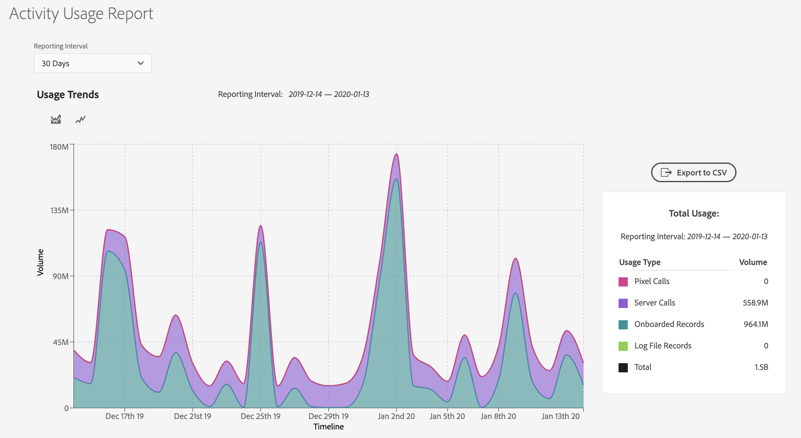
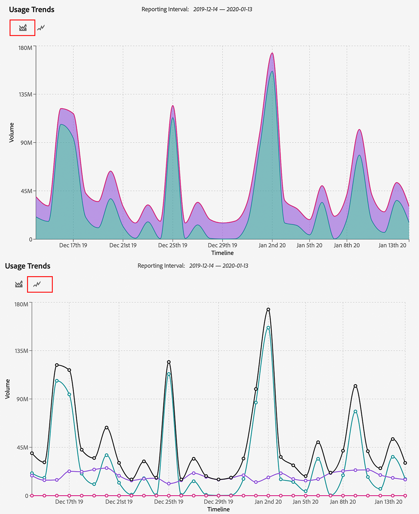
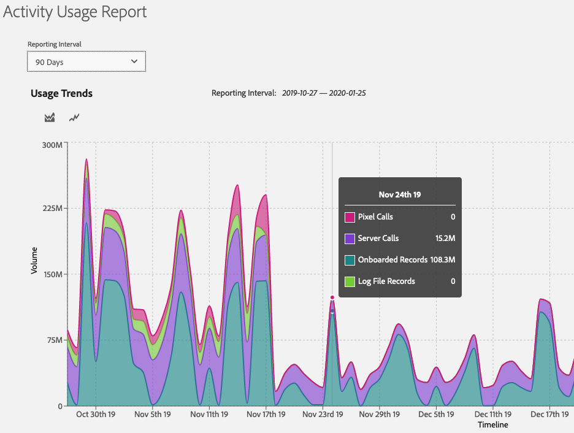
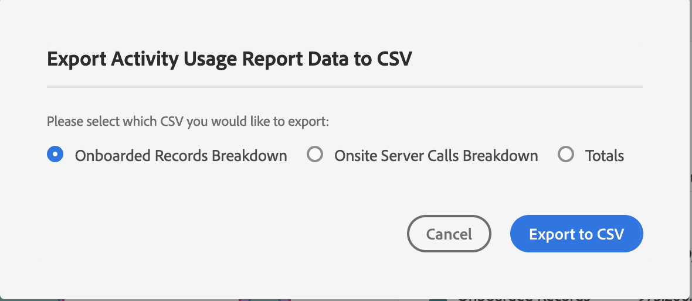

# Activity Usage Reporting

## Overview {#overview}

The [!UICONTROL Activity Usage Report] helps you view and track the activity usage of your Audience Manager instance, giving you a clear idea of how your usage compares to your contractual commitment.

Additionally, you can download the usage report whenever you need, for record keeping and custom analysis.

## Considerations {#considerations}

The [!UICONTROL Activity Usage Report] is available to all Audience Manager users with [administrator privileges](edit-account-settings.md).

> [!IMPORTANT]
>
> The [!UICONTROL Activity Usage Report] shows you the usage statistics of your Audience Manager instance. For any billing inquiries related to your activity usage, reach out to your Adobe representative.

## Use Cases {#use-cases}

There are two main use cases of the [!UICONTROL Activity Usage Report]:

* **Tracking actual instance usage against your usage commitment**: Most customers have a monthly estimated activity commitment per Audience Manager instance, which is then cumulated into a yearly commitment across all instances. While this report is not a billing report, it can provide helpful guidance as to whether you are exceeding the committed usage.
* **Validation for implementation changes**: If you recently updated your implementation, such as setting up Analytics server-side forwarding, or changing your Target server call settings, this report can help you check whether the new activity volume is in line with your expected volume.

## Using the Activity Usage Report {#using}

To see the [!UICONTROL Activity Usage Report], log in to your Audience Manager account, and go to **[!UICONTROL Administration]** > **[!UICONTROL Usage]**.

Next, use the **[!UICONTROL Reporting Interval]** filter to select the time interval to generate the report for. You can choose between 30, 60, 90 days, or a custom date range.

Once your report loads, you can see a breakdown of your activities for the selected period.

Activities define the aggregate total of all onsite and offsite interactions with Audience Manager, split into the following categories:

* **[!UICONTROL Server Calls]**: Any data collection or retrieval event sent to Audience Manager from websites, servers, email, mobile application(s), or other systems.
* **[!UICONTROL Pixel Calls]**: Data collected from ad (such as impression volume from a targeting platform) or email impression calls made to Audience Manager. These require the presence of the `d_event` parameter in the query string.
* **[!UICONTROL On-Boarded Records]**: Unique records ingested from your own customer relationship management sytem (CRM) or other offline data files, such as call center records, device IDs, and custom data feeds from external data providers.
* **[!UICONTROL Log File Records]**: Unique records from log files ingested into Audience Manager from a targeting platform.

> [!NOTE]
> A unique record defines each individual record of data in a file stored by Adobe on behalf of an Audience Manager customer.

Additionally, you can use the [!UICONTROL Usage Trends] graph types to switch between two type of graphs.

You can also hover your cursor over a specific date in the timeline to see the detailed usage for that date.

## Exporting Activity Usage Reports {#export}

For a better overview of your Audience Manager usage level, you can export the [!UICONTROL Activity Usage Report] based on the type of records that you want to include.

The **[!UICONTROL Onboarded Records Breakdown]** and **[!UICONTROL Onsite Server Calls Breakdown]** reports provide the most granular insight of source data available for these activities. The volume attributed to these breakdowns is based on your implementation.

### Onboarded Records Breakdown {#onboarded-breakdown}

This report contains onboarded records broken down by data source.

### Onsite Server Calls Breakdown {#onsite-breakdown}

This report contains a breakdown of server calls from three sources: [!UICONTROL Analytics], [!UICONTROL Target], and [!UICONTROL Other].

* **[!UICONTROL Analytics]**: These are billable server calls passed from all Adobe Analytics instances to Audience Manager, including server-side forwarding. Secondary server calls or duplicate server calls (as in the case of server side forwarding from multiple report suites) are not billable activities, so they are not included in this breakdown.
* **[!UICONTROL Target]**: These are server-side calls from Adobe Target to Audience Manager, to retrieve Audience Manager segment data as part of a server-to-server integration.
* **[!UICONTROL Other]**: Includes calls from any other website or system (partner sites, direct server calls, etc.), mobile browser/app calls via the [!DNL SDK], [!DNL DIL], event calls, and [!DNL DCS] calls. Also includes calls from [!DNL Target] if set up as a cookie integration (rather than server-to-server).
