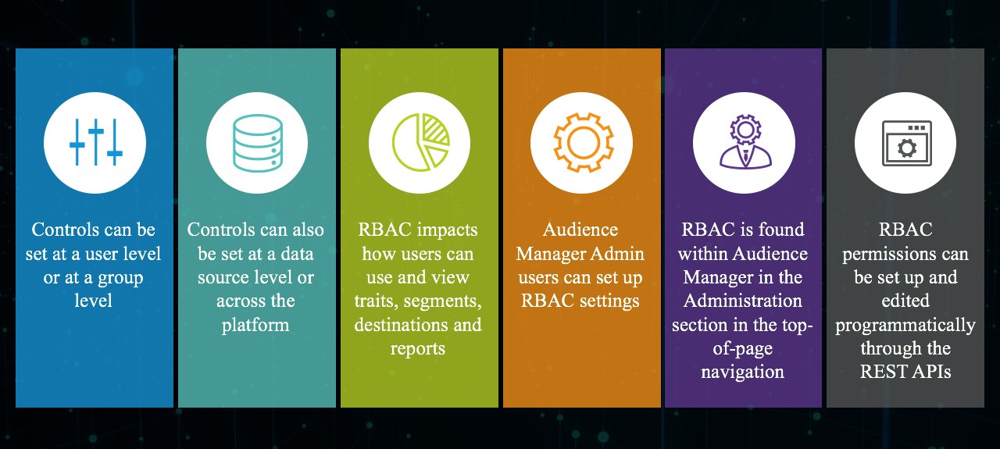
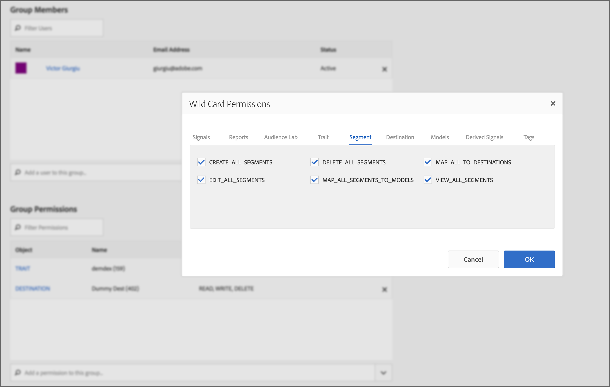
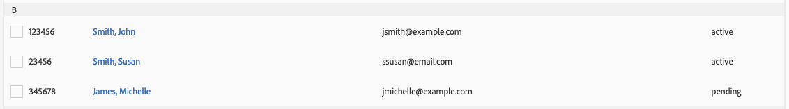
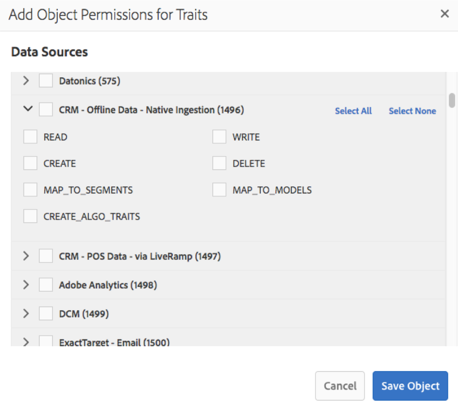

# [!UICONTROL Administration] (RBAC Controls) {#administration}

 

>[!IMPORTANT]
>
> User account management is moving to the [Admin Console](https://helpx.adobe.com/enterprise/using/admin-console.html). To start user migration, we require all Audience Manager customers to immediately take the necessary measures described in this article: [Audience Manager user migration to Admin Console](admin-console-migration.md).
> 
> After all customers have migrated, the user management sections of this document will go away.

The options under the [!UICONTROL Administration] menu let you create Audience Manager users and assign them to groups. You can also view limits (traits, segments, destinations, and models).

Enterprise customers using [!DNL Audience Manager] need one data management platform for all of their data, but must be able to control the visibility of the different data elements to specific business units. You can accomplish this using group permissions, also referred to as [!UICONTROL Role-Based Access Control] ([!UICONTROL RBAC]).

[!DNL Audience Manager] uses groups to assign permissions. Permissions are not assigned at the user level. Group permissions are tied to objects ([!UICONTROL traits], segments, etc.) and to actions you can perform on those objects (edit, view, etc.). These controls are also available through the Audience Manager REST APIs. See [User Management](/help/using/api/rest-api-main/aam-api-user-group-permission/aam-api-user.md), [Group Management](/help/using/api/rest-api-main/aam-api-user-group-permission/aam-api-group.md), and [Permissions Management](/help/using/api/rest-api-main/aam-api-user-group-permission/aam-api-permissions.md) API methods.

## Create Users {#create-users}

<!-- t_create_users.xml -->

>[!IMPORTANT]
>
> User account management is moving to the [Admin Console](https://helpx.adobe.com/enterprise/using/admin-console.html). To start user migration, we require all Audience Manager customers to immediately take the necessary measures described in this article: [Audience Manager user migration to Admin Console](admin-console-migration.md).
> 
> After all customers have migrated, the user management section of this document will go away.
> 
Create users in [!DNL Audience Manager] and specify user details, login status, and assign users to groups.

1. Click **[!UICONTROL Administration]** > **[!UICONTROL Users]**.
1. Click  to display the [!UICONTROL Create New User] page.
1. Under **[!UICONTROL User Details]**, fill in the fields:
   * **[!UICONTROL Username]:** Specify a unique username for Audience Manager.
   * **[!UICONTROL First Name]:** Specify the user's first name.
   * **[!UICONTROL Last Name]:** Specify the user's last name.
   * **[!UICONTROL Email Address]:** Specify the user's email address. [!DNL Audience Manager] does not send regular notification to users. [!DNL Audience Manager] administrators have access to users' email addresses and can manually email users as needed. For example, if a user forgets their password, the email address specified in this field is used to send a temporary password and instructions to reset the password.
   * **[!UICONTROL Phone Number]:** Specify the user's phone number.
   * **[!UICONTROL Is Admin]:** Specify if this user is an [!DNL Audience Manager] administrator. Admin users can manage users (create, edit, etc.) and groups (create, assign permissions, etc.). Non-admin users can control only their own user profiles, including editing their email addresses and resetting their own passwords. For more information, see [Edit Your Account Settings](../../features/administration/edit-account-settings.md).
1. Under **[!UICONTROL Login]**, select the desired status:
   * **[!UICONTROL Active]:**  Active users can access [!DNL Audience Manager] and have the permissions granted by group membership.
   * **[!UICONTROL Deactivated]:**  Deactivated users cannot access [!DNL Audience Manager] and do not have any permissions. If you deactivate users, their user information remains in [!DNL Audience Manager] and you can simple reactivate them, if necessary. If you remove users, you must re-create them if they need to use [!DNL Audience Manager] again in the future.
   * **[!UICONTROL Expired]:** A user's password is older than 90 days.
   * **[!UICONTROL Pending]:** The user has a temporary password, either as after a password reset or as a brand new account, and they have not yet set a permanent password.
   * **[!UICONTROL Locked Out]:** 5 incorrect login attempts will lock out a user.
1. Under **[!UICONTROL Assigned Groups]**, from the drop-down list, select the desired groups to which you want to assign this user.
  For more information about groups and permissions, see [Create a Group](../../features/administration/administration-overview.md#create-group).
1. Click **[!UICONTROL Save]**.

## Create a [!UICONTROL Group] {#create-group}

>[!IMPORTANT]
>
> User account management is moving to the [Admin Console](https://helpx.adobe.com/enterprise/using/admin-console.html). To start user migration, we advise all Audience Manager customers to immediately take the necessary measures described in this article: [Audience Manager user migration to Admin Console](admin-console-migration.md).
> 
> After all customers have migrated, this section will go away.

A *group* is a collection of users that share access rights to [!UICONTROL destination], [!UICONTROL segment], and [!UICONTROL trait] objects. You can limit groups to single objects only or give them broad access to combinations of different objects.

<!-- t_create_groups.xml -->

To create a group:

1. Click **[!UICONTROL Administration]** > **[!UICONTROL Groups]**.
2. Click   to open the [!UICONTROL Group Settings] page.
3. In [!UICONTROL Group Details]:
   * Name the group.
   * Provide a brief group description.
4. In [!UICONTROL Group Members], click a user from **[!UICONTROL Add Users]** options to add them to the group.
5. In [!UICONTROL Group Permissions], select a [trait](../../features/traits/trait-details-page.md), [segment](../../features/segments/segments-purpose.md), or [destination](../../features/destinations/destinations.md) from **[!UICONTROL Add Object]**.
   This opens a permissions window for your selected object.
6. Select the check box for the permissions you want group members to have.
7. *(Optional)* Assign [Wild Card Permissions](../../features/administration/administration-overview.md#wild-card-permissions) to the group.
8. Click **[!UICONTROL Save Group]**.

## Understanding [!UICONTROL Wild Card Permissions] {#wild-card-permissions}

>[!IMPORTANT]
>
> User account management is moving to the [Admin Console](https://helpx.adobe.com/enterprise/using/admin-console.html). To start user migration, we advise all Audience Manager customers to immediately take the necessary measures described in this article: [Audience Manager user migration to Admin Console](admin-console-migration.md).
> 
> After all customers have migrated, this section will go away.

Simplify group rights management with [!UICONTROL Wild Card Permissions].

<!-- c_wildcard_permissions.xml -->

[!UICONTROL Wild Card Permissions] give group members automatic access to each data source associated to a [!UICONTROL segment], [!UICONTROL destination], or [!UICONTROL trait]. By comparison, regular permissions only let you assign specific [!UICONTROL data sources] to the one of these objects. And, when you add new [!UICONTROL data sources], group members don't get access to those new sources.

You have to open the group permissions and assign those new [!UICONTROL data sources] to the group. [!UICONTROL Wild Card Permissions] let you avoid this manual [!UICONTROL data source] update process. Groups with [!UICONTROL Wild Card Permissions] get access to new [!UICONTROL data sources] without explicit authorization.

 

Read below for a description of what each [!UICONTROL wildcard permission] means:

**[!UICONTROL Trait]**

* `MAP_ALL_TRAITS_TO_MODELS` - Users can select [!UICONTROL traits] as the baseline for [!UICONTROL models].
* `EDIT_ALL_TRAITS` - Users can edit all [!UICONTROL traits] set up within their company account.
* `VIEW_ALL_TRAITS` - Users can view all [!UICONTROL traits] set up within their company account.
* `DELETE_ALL_TRAITS` - Users can delete all [!UICONTROL traits] set up within their company account.
* `CREATE_ALL_ALGO_TRAITS` - Users can create [!UICONTROL algorithmic traits].
* `MAP_ALL_TO_SEGMENTS` - Users can add any of the [!UICONTROL traits] belonging to their company to [!UICONTROL segments].
* `CREATE_ALL_TRAITS` - Users can create [!UICONTROL traits].

**[!UICONTROL Reports]**

* `PTRREPORTS` - This [!UICONTROL wildcard permission] refers to outdated functionality and will be removed from the Audience Manager user interface shortly.

**[!UICONTROL Models]**

* `VIEW_MODELS` - Users have permission to view [!UICONTROL models] belonging to their company.

**[!UICONTROL Derived Signals]**

* `VIEW_DERIVED_SIGNALS` - Users can view all the [!UICONTROL derived signals] belonging to their company.
* `CREATE_DERIVED_SIGNALS` - Users can create [!UICONTROL derived signals].
* `EDIT_DERIVED_SIGNALS` - Users can edit all the [!UICONTROL derived signals] belonging to their company.
* `DELETE_DERIVED_SIGNALS` - Users can delete any of the [!UICONTROL derived signals] belonging to their company.

**[!UICONTROL Destination]**

* `EDIT_ALL_DESTINATIONS` - Users can edit all the [!UICONTROL destinations] set up within their company account.
* `CREATE_DESTINATIONS` - Users can create [!UICONTROL destinations].
* `VIEW_ALL_DESTINATIONS` - Users can view all the [!UICONTROL destinations] set up within their company account.
* `DELETE_ALL_DESTINATIONS` - Users can delete all the [!UICONTROL destinations] set up within their company account.

**[!UICONTROL Tags]**

* `VIEW_TAGS` - Users can do everything (view, create, edit, delete) on their [!UICONTROL Tag Containers].

**[!UICONTROL Audience Lab]**

* `MANAGE_SEGMENT_TEST_GROUPS` - Users can do everything (view, create, edit, delete) on their [!UICONTROL Audience Lab] test groups.

**[!UICONTROL Segment]**

* `CREATE_ALL_SEGMENTS` - Users can create segments.
* `DELETE_ALL_SEGMENTS` - Users can delete all the segments set up within their company account.
* `MAP_ALL_TO_DESTINATIONS` - Users can map any of the segments belonging to their company to destinations.
* `EDIT_ALL_SEGMENTS` - Users can edit all the segments set up within their company account.
* `MAP_ALL_SEGMENTS_TO_MODELS` - Users can select segments as the baseline for models.
* `VIEW_ALL_SEGMENTS` - Users can view all the segments set up within their company account.

**[!UICONTROL Signals]**

* `VIEW_ALL_SIGNALS` - Users can view all signals captured in [Data Explorer](/help/using/features/data-explorer/data-explorer-overview.md).

## Use Cases {#use-cases}

### Monitoring User Access {#monitoring-user-access}

[!UICONTROL Role-Based Access Control] can help you monitor user login status, giving you a clear picture of who can access your Audience Manager instance.

Depending on your business requirements, you can enable and disable user accounts as needed.

### Ensure Access Protection for Sensitive [!UICONTROL Data Sources] {#protect-sensitive-data-sources}

You can configure [!UICONTROL Role-Based Access Control] at [!UICONTROL trait], segment, and [!UICONTROL destination] level, for each user group.

This capability helps you manage how your users view, create, read, write, and edit specific data sets, and even restrict users from accessing data sets that should not be available to them.

