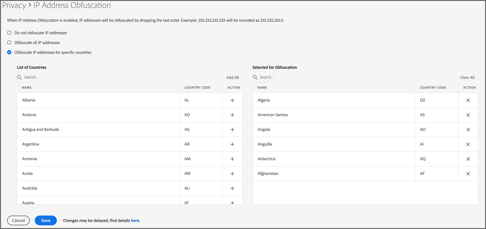

# IP Address Obfuscation {#ip-obfuscation}

Use this feature to obfuscate IP addresses collected in Audience Manager.

## Overview and Methodology {#overview-and-methodology}

Your company may desire to obfuscate IP address in many countries due to global privacy regulations. Audience Manager allows you to obfuscate visitor IP addresses on a global or country-by-country basis.

### IP Obfuscation Methodology 
 
Following the principles of "Privacy By Design",Adobe Audience Manager allows customers to enable IP obfuscation from the UI, either globally across all geographic regions or for specific countries. When you enable this setting, the last octet (the last portion) of the IP address is immediately discarded when the IP address is ingested into Audience Manager. Audience Manager discards this part of the IP address prior to processing (including before any optional geographic lookup or logging of the IP address). For example:

* Before obfuscation: `255.255.255.255`
* After obfuscation: `255.255.255.0`

See also, Collecting IP addresses and IP Address Obfuscation in our [Data Privacy section](/help/using/overview/data-security-and-privacy/data-privacy.md).

## IP Address Obfuscation Requirements {#ip-obfuscation-requirements}

IP address obfuscation is available only to Audience Manager administrator accounts. See [Create Users](/help/using/features/administration/administration-overview.md#create-users) to understand how to assign administrator privileges for a user.

>[!NOTE]
>
> Due to the large volume of data processed by Audience Manager, IP obfuscation changes can take up to 4 hours to come into effect, from the moment you update the settings.

## Configure IP Address Obfuscation {#configure-ip-obfuscation}

Follow the steps below to configure IP address obfuscation.

1. Log in to Audience Manager with an administrator account and go to **Administration > Privacy**.
2. Choose the type of IP obfuscation that you want to use.
   1. **Obfuscate all IP addresses:** select this option to have Audience Manager obfuscate the last octet of all visitor IP addresses, regardless of the region they originate from.
   2. **Obfuscate IP addresses for specific countries:** select this option to have Audience Manager obfuscate the last octet of visitor IP addresses for specific countries. Use the **List of Countries** or the corresponding **Search** field to find the countries to enable IP obfuscation for, and click the + icon to add them to the **Selected for Obfuscation** list. Once you've added all the required countries to the **Selected for Obfuscation** list, click **Save**.

 

## Disable IP Address Obfuscation {#disable-ip-obfuscation}

To disable IP address obfuscation globally, go to **Administration > Privacy**, select **Do not obfuscate IP addresses**, and click **Save**.

To disable IP address obfuscation for specific countries, find the countries in the **Selected for Obfuscation** list, then click their corresponding **X** icon. Click **Save** when you're done.

## Related concepts {#related-concepts}

* IP Address Obfuscation Video Demonstration
>[!VIDEO](https://video.tv.adobe.com/v/27218/)

* [Data Privacy](/help/using/overview/data-security-and-privacy/data-privacy.md) 

