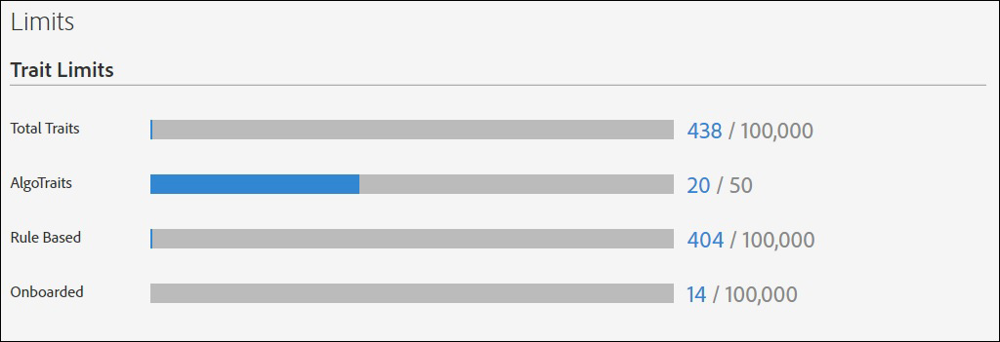

# Usage Limits {#usage-limits}

Audience Manager sets a maximum limit on the number of traits, segments, destinations, and algorithmic models that you can create for an account. Limits apply to these items whether created in the user interface or programmatically through [!DNL API] methods. Usage limits help protect Audience Manager from automated processes that may attempt to compromise our [!DNL API]s or user interface.

## ID Mapping Limits {#id-mapping-limits}

The table below lists the [ID mapping](../../integration/sending-audience-data/batch-data-transfer-explained/id-sync-http.md) limits for device IDs. Once an ID reaches any of the limits below, Audience Manager adds new ID mappings based on a [!DNL FIFO] (first in, first out) logic, by removing the oldest stored ID mapping, and adding the new one. Refer to [Index of IDs](../../reference/ids-in-aam.md) in Audience Manager for details on the IDs supported by Audience Manager.

|ID Mapping | Maximum Limit |
|-----------|-------------- |
|Device Advertising ID ([DAID](../../reference/ids-in-aam.md)) to Cross-device ID ([DPUUID]((../../reference/ids-in-aam.md))) | 100 Device Advertising IDs ([DAID](../../reference/ids-in-aam.md)) to 1 Cross-device ID ([DPUUID]((../../reference/ids-in-aam.md))) |
|Cross-device ID ([DPUUID]((../../reference/ids-in-aam.md))) to Device Advertising ID ([DAID](../../reference/ids-in-aam.md)) | 10 Cross-device IDs ([DPUUID]((../../reference/ids-in-aam.md))) to 1 Device Advertising ID ([DAID](../../reference/ids-in-aam.md)), per each [DPID]((../../reference/ids-in-aam.md)) |
|Cookie/browser ID to cookie/browser ID | 1000 cookie/browser  IDs to 1 cookie/browser ID |

## Item Limits {#item-limits}

The tables list the current limits by item type. You cannot create new traits, segments, destinations, or [!UICONTROL Algorithmic Models] if you reach a specific limit for one of these items. If you do reach a limit, you must delete an older item before you can create a new one.

### Trait Limits

| Trait Type    | Maximum Limit   |
| -------------------------- | ------------------------------------- |
| Total Traits               | 100,000   |
| Total Trait Qualifications | 150,000. For more information on trait qualification, see Trait Qualification Limit in [Trait Qualifications Reference](/help/using/features/traits/trait-qualification-reference.md#trait-qualification-limit). |
| Algorithmic                | 50       |
| Rule Based                 | 100,000  |
| Onboarded                  | 100,000  |
| Folder Traits              | 2,000    |

### Segment Limits

| Segment Type   | Maximum Limit |
| -------------- | ------------- |
| Total Segments | 20,000        |

### Destination Limits

| Destination Type   | Maximum Limit |
| ------------------ | ------------- |
| Total Destinations | 1,000         |
| Cookie             | 1,000         |
| URL                | 1,000         |
| S2S                | 100           |
| Adobe Analytics    | 10            |

### Algorithmic Model Limits

| Item  | Maximum Limit |
| -------- | ----- |
| Active Algorithmic Models  | 20. Audience Manager only counts *active* algorithmic models against the limit.|
| Algorithmic Models maximum audience size | 25,000,000.  Note that this limit cannot be increased. You can decrease audience sizes by selecting fewer data sources for the model or by selecting a shorter look-back window. |
| Maximum number of excluded traits for a model | 500. See [Trait Exclusion in Algorithmic Modeling](/help/using/features/algorithmic-models/trait-exclusion-algo-models.md). |

### Folder Limits

| Item | Maximum Limit|
| ------------- | ------------------ |
| Trait Folders | 2,000.  Your folder structure can be maximum 5 levels deep. |

### Derived Signals Limits

| Item            | Maximum Limit |
| --------------- | ------------- |
| Derived Signals | 50,000.       |

### Company User Accounts Limit

| Item  | Maximum Limit |
| ----------- | ------------- |
| Maximum number of user accounts for a company | 1,000.  |

## Monitor Usage {#monitor-usage}

You can see usage and limits for your account by going to **[!UICONTROL Administration > Limits]**. Access requires administrator permissions.

## Increase Item Limits {#increase-item-limits}

The default limits listed here should provide enough capacity for your business needs. If your organization consistently reaches these limits, contact your account representative to discuss an increase.