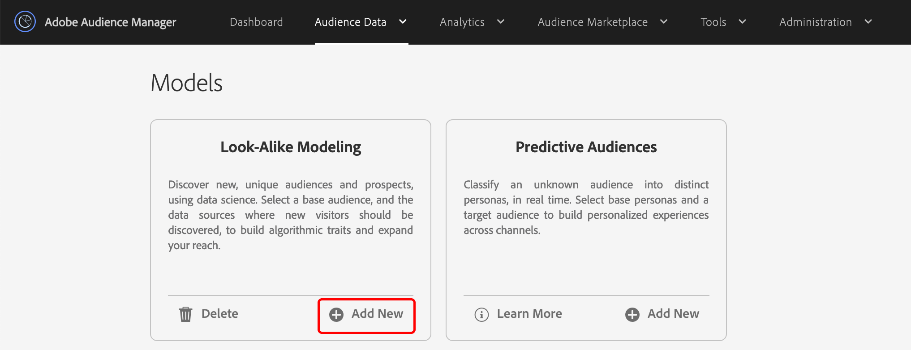
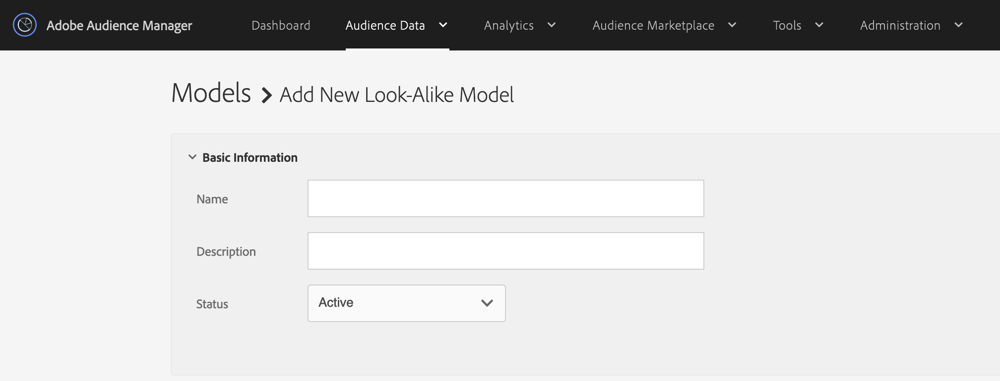
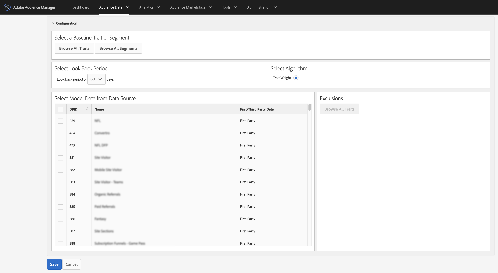
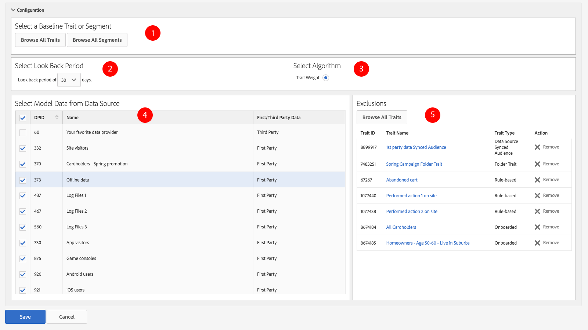

# Create a Look-Alike Model {#create-an-algorithmic-model}

Describes the required and optional steps that let you create a [!UICONTROL Look-Alike Model].

## Model Builder Section

[!UICONTROL Model Builder] consists of the [!UICONTROL Basic Information] and [!UICONTROL Configuration] sections. To create a model, complete the required fields in these two sections. Save your model to start the algorithm. [!DNL Audience Manager] sends you an automated notification after the first data run completes. After you receive the email, you can go to [Trait Builder](../../features/traits/about-trait-builder.md) and create algorithmic traits.

>[!NOTE]
>
>* The modeling process runs only once if you create a model and do not build any traits with it.
>* Build models from data sources that contain a meaningful amount of information. Models with insufficient data will run, but they will not return results.
>* *Do not* create models with other algorithmic traits or segments.
>* The automated email notification is sent one time only (after the first data run).

## Build the Model

Follow the steps below to build a [!UICONTROL Look-Alike Model]:

1. Go to **[!UICONTROL Audience Data]** > **[!UICONTROL Models]** and click **[!UICONTROL Add New]** in the [!UICONTROL Look-Alike Modeling] section.
    
2. In the [Basic Information](../../features/algorithmic-models/create-model.md#basic-information) section
    * Name the model.
    * *(Optional)* Provide a brief description about the model.
    * Set the status for the model to **[!UICONTROL Active]** or **[!UICONTROL Inactive]**. Inactive models will not run and will not produce any data.
    
3. In the [Configuration](../../features/algorithmic-models/create-model.md#configuration) section:
    * Click **[!UICONTROL Browse All Traits]** or **[!UICONTROL Browse All Segments]** to select a trait or segment you want to model against. Select an onboarded trait, a rule-based trait, or a segment as baseline. Otherwise, your models will not run.
    * Choose a 30, 60, or 90 day look-back period. This sets a time range for the model.
    * The [!UICONTROL TraitWeight] algorithm is selected by default.
    * Select a data source from the [!UICONTROL Available Data] list.
    * Click **[!UICONTROL Save]** when done.
    

## Basic Information for Algorithmic Models {#basic-information}

<!-- r_model_basic.xml -->

In [!UICONTROL Model Builder], the [!UICONTROL Basic Information] settings let you create new or edit existing models. To create a new model, provide a name and move on to the [!UICONTROL Configuration] settings. The description field is optional.

|  Field  | Description  |
|---|---|
|  **[!UICONTROL Name]** | Give your model a short, logical name that describes its function or purpose. Avoid abbreviations, special characters, and accent marks.  |
|  **[!UICONTROL Description]** | A field for additional descriptive information about the model.  |
|  **[!UICONTROL Status]** | Activates or deactivates the model (active by default). |

## Configuration {#configuration}

In [!UICONTROL Model Builder], the [!UICONTROL Configuration] section lets you add traits or segments to the model. In this section, select a baseline trait or segment, a look-back period, and data from your first and third-party data sources.

<!-- r_model_configuration.xml -->

### Prerequisites

Complete the required fields in the [!UICONTROL Basic Information] section first.

<table id="table_7A6BE5E5498D4776A30323B743954150"> 
 <thead> 
  <tr> 
   <th colname="col1" class="entry"> Field </th> 
   <th colname="col2" class="entry"> Description </th> 
  </tr> 
 </thead>
 <tbody> 
  <tr> 
   <td colname="col1"> 
<b>Select a Baseline Trait or Segment (1)</b> 
 </td> 
   <td colname="col2"> 
Click the trait or segment button to see a list of all your traits or segments. Your selected segment or trait becomes the baseline that the system algorithms use for modeling. 
 
 
<b>Note</b>:  Select an onboarded trait, a rule-based trait, or a segment as baseline. Otherwise, your models will not run. 
 
 </td> 
  </tr> 
  <tr> 
   <td colname="col1"> 
<b>Select Look Back Period (2)</b> 
 </td> 
   <td colname="col2"> 
Sets a time range for the model. Based on your selection, the algorithm includes and evaluates data from the previous 30, 60, or 90 days. 
 </td> 
  </tr> 
  <tr> 
   <td colname="col1"> 
<b>Select Algorithm (3)</b> 
 </td> 
   <td colname="col2"> 
At this time, Model Builder works with our proprietary  Trait Weight algorithm only.  Audience Manager may add other algorithmic functions in subsequent releases. 
 </td>
  </tr>
  <tr> 
   <td colname="col1"> 
<b>Select Model Data from Data Source (4)</b> 
 </td> 
   <td colname="col2"> 
Lets you select the first and third-party data sources you want to use in the model. 
 </td>
  </tr> 
  <tr> 
   <td colname="col1"> 
<b>Exclusions (5)</b> 
 </td> 
   <td colname="col2"> 
You can exclude traits from the data sources you selected for modeling. Use the  Exclusions list and read <a href="../../features/algorithmic-models/trait-exclusion-algo-models.md"> Algorithmic Models: Trait Exclusion</a> to learn more. 
 </td>
  </tr> 
 </tbody>
</table>

Watch the video below to learn how to create a first party look-alike model, so that you can find more of your own visitors who look like your converters.

>[!VIDEO](https://video.tv.adobe.com/v/23504/)

>[!MORELIKETHIS]
>
>* [Understanding TraitWeight](../../features/algorithmic-models/understanding-models.md#understanding-traitweight)
