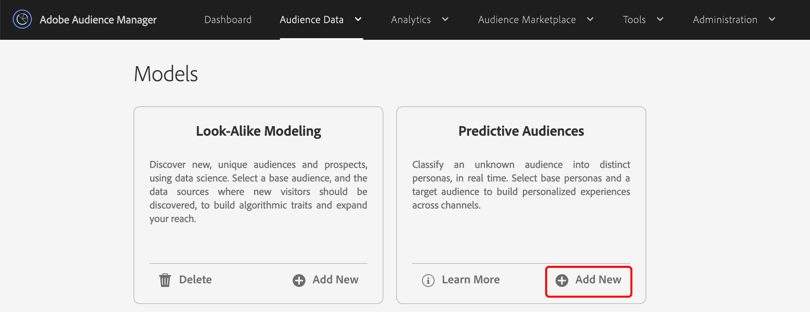
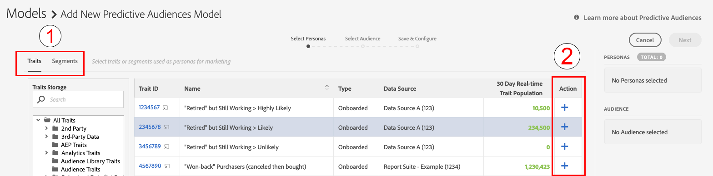
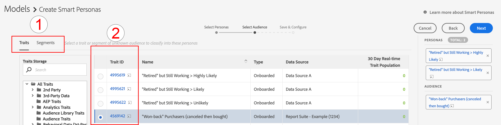
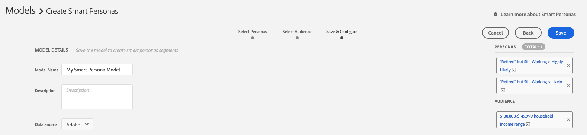
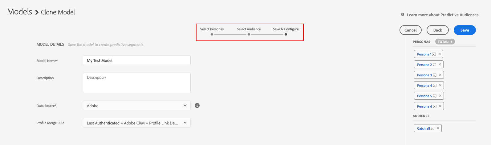

# Getting Started with Predictive Audiences {#predictive-audiences-getting-started}

>[!IMPORTANT]
>This article contains product documentation meant to guide you through the setup and usage of this feature. Nothing contained herein is legal advice. Please consult your own legal counsel for legal guidance.

## Create a Predictive Audiences Model {#create-predictive-audiences}

Before you create a [!UICONTROL Predictive Audiences] model, you need to decide which first-party data source you want to assign your [!UICONTROL Predictive Audiences] traits and segments to. You can use an existing first-party data source, or create a new one. See [Manage Data Sources](https://docs.adobe.com/content/help/en/audience-manager/user-guide/features/data-sources/manage-datasources.html) for details on how to create a new first-party data source.

Once you know which data source you're going to use, follow the steps below.

1. Go to **[!UICONTROL Audience Data]** > **[!UICONTROL Models]**.
1. In the [!UICONTROL Predictive Audiences] section, click **[!UICONTROL Add New]**.

    

1. Next, define the personas that you want to classify your audience by. You can do this by choosing either traits or segments to build personas from. Use the [!UICONTROL Traits] and [!UICONTROL Segments] tabs in the upper left corner of the screen to switch between your trait and segments catalog. Once you've identified the traits or segments that you want to use as personas, click the corresponding **[!UICONTROL Add]** icon in the [!UICONTROL Action] column.
    
   >[!NOTE]
   >You must choose a minimum of either two traits or two segments for your baseline personas. You cannot use a combination of both traits and segments.
1. Click **[!UICONTROL Next]** after you've defined your personas.
1. Next, select the first-party audience that you want to classify by choosing a first-party trait or segment for this audience. Use the [!UICONTROL Traits] and [!UICONTROL Segments] tabs in the upper left corner of the screen to switch between your traits and segments catalog. Select the first-party trait or segment that you want to use as your audience, to add it to the model.
   
1. Click **[!UICONTROL Next]** after you've chosen your audience.
1. Fill in the model details:
   * **[!UICONTROL Model Name]**: Enter a descriptive name for the model, that will help you identify it later. Names of the segments generated by the model will start with the name of the model.
   * **[!UICONTROL Description]**: Enter a description of the model that will help you identify its use case.
   * **[!UICONTROL Data Source]**: Select the first-party data source that you want the [!UICONTROL Predictive Audiences] segments from this model to be assigned to.
   * **[!UICONTROL Profile Merge Rule]**: Select the [!UICONTROL Profile Merge Rule] to be assigned for all predictive [!UICONTROL segments] created by this model. If your selected target audience is a [!UICONTROL segment], we recommend selecting the same [!UICONTROL Profile Merge Rule] of the target audience.
   
1. Click **[!UICONTROL Save]**.

## Cloning and Editing Predictive Audience Models {#clone-predictive-audiences}

Audience Manager does not support editing existing [!UICONTROL Predictive Audiences] models. To change a model's configuration, you can create a clone of an existing model and edit it. Here's how you can do this:

1. Go to **[!UICONTROL Audience Data]** > **[!UICONTROL Models]**.
2. Click the name of the [!UICONTROL Predictive Audiences] model that you want to clone.
3. Click the **[!UICONTROL Clone]** button in the upper left side of the screen.
   
4. Once you clone the model, you are taken to the [!DNL Save & Configure] page of the cloned model. In this page, you can change the [!UICONTROL data source] and the assigned[!UICONTROL Profile Merge Rule] of the model. To edit the personas and the target audience of the cloned model, use the [!UICONTROL Back] and [!UICONTROL Next] buttons to navigate between the three tabs, or click the three tab names

   

5. When you are done editing a model, click **[!UICONTROL Save]**.

## Deleting Predictive Audiences {#delete-predictive-audiences}

To delete a [!UICONTROL Predictive Audiences] model, go to **[!UICONTROL Audience Data]** > **[!UICONTROL Models]**, find the model that you want to delete, and click the **[!UICONTROL Delete]** icon.
