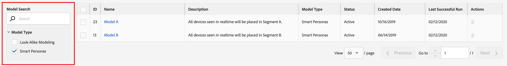
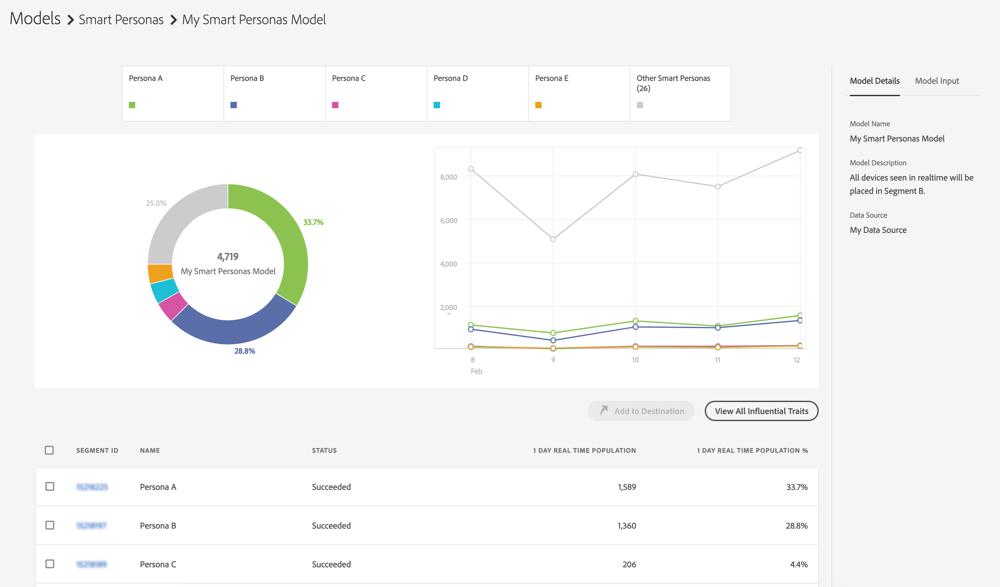

# Predictive Audiences Reporting

After you save a [!UICONTROL Predictive Audiences] model, Audience Manager immediately starts training it. Within a couple of hours, the computed model will start analyzing audiences on the [Data Collection Servers](https://docs.adobe.com/content/help/en/audience-manager/user-guide/reference/system-components/components-data-collection.html#dcs-pcs). Reporting will be available the following day.

To see the results of your [!UICONTROL Predictive Audiences] classification, go to **[!UICONTROL Audience Data]** > **[!UICONTROL Models]**, and click your model in the list.

Use the filtering options on the left hand side to search for the model name or filter the results based on model type.

The models table shows you the following information:

* **[!UICONTROL ID]**: the model ID uniquely identifies each model in your Audience Manager account;
* **[!UICONTROL Name]**: the name that you provided in the model creation step;
* **[!UICONTROL Description]**: the description that you provided in the model creation step;
* **[!UICONTROL Model Type]**: the type of each model ([!UICONTROL Look-Alike Modeling] or [!UICONTROL Predictive Audiences]);
* **[!UICONTROL Status]**: the status of each model:
  * **[!UICONTROL Pending]**: the model is initializing and will start producing results shortly;
  * **[!UICONTROL Active]**: the model is running successfully and producing results;
  * **[!UICONTROL Warning]**: the model failed to produce results, due to insufficient data (i.e. low baselines population, user profiles are not rich);
  * **[!UICONTROL Error]**: the model failed to run. You should contact your Adobe representative.

## Model Overview Report{#model-report}

Once you choose a model, its reporting page will load. At the top of the page you can see the top 5 largest [!UICONTROL Predictive Audiences] segments, based on 1 day real-time realization, that the model has classified your target audience by. The **[!UICONTROL Other]** category includes the rest of the personas, which were not included in the top 5 largest [!UICONTROL Predictive Audiences] segments.

Audience Manager displays both a color coded donut chart and a timeline graph for your [!UICONTROL Predictive Audiences].

Clicking the personas tabs at the top of the page adds or removes them from the chart and graph.

The donut chart shows you a persona-based breakdown of your target audience, while the graph shows you the 1-day real time population trend of your [!UICONTROL Predictive Audiences] segments over the past 6 days.

If the model status is [!UICONTROL Pending], [!UICONTROL Warning], or [!UICONTROL Error], the model status is displayed instead of the graphs.

The report table shows you the following information for each [!UICONTROL Predictive Audiences] segment.

1. **[!UICONTROL SEGMENT ID]**: the segment ID of the auto-created segment associated to each persona;
1. **[!UICONTROL NAME]**: the persona name;
1. **[!UICONTROL STATUS]**: the status of the [!UICONTROL Predictive Audiences] segment:
   * **[!UICONTROL Succeeded]**: users are being classified into this segment;
   * **[!UICONTROL Pending]**: the segment is still being initialized;
   * **[!UICONTROL Insufficient Training Data]**: users are not being classified into this segment due to insufficient data. The total baseline population is too low and does not provide enough data to learn from.
1. **[!UICONTROL 1 DAY REAL TIME POPULATION]**: The number of segment realizations for each persona, over the past 24 hours.
1. **[!UICONTROL 1 DAY REAL TIME POPULATION %]**: The percentage of segment realizations for each persona, over the past 24 hours, out of the total model population.

## Influential Traits{#influential-traits}

[!UICONTROL Influential Traits] are traits that the [!UICONTROL Predictive Audiences] algorithm discovered to be the strongest predictors for determining the persona classification of a visitor. Their sign indicates whether the presence of the trait increases(+) or decreases(-) the likelihood of the user belonging to the selected persona.

To view the influential traits for all of your personas, click [!UICONTROL View All Influential Traits].

The [!UICONTROL Influential Traits] window shows you the following information, for each persona from the selected mdoel:

1. **[!UICONTROL TRAIT ID]**: the segment ID of each influential trait for the selected persona;
2. **[!UICONTROL NAME]**: the name of each influential trait for the selected persona;
3. **[!UICONTROL DESCRIPTION]**: the description of each influential trait for the selected persona;
4. **[!UICONTROL WEIGHT]**: the weight of each influential trait for the selected persona, calculated based on the [TraitWeight](understanding-models.md#understanding-traitweight) algorithm. [!UICONTROL Influential Traits] are by default sorted by weight, in descending order.
5. **[!UICONTROL UNIQUE TRAIT REALIZATIONS]**: the number of unique trait realizations for each influential trait for the selected persona;
6. **[!UICONTROL TOTAL TRAIT POPULATION]**: the total trait population of each influential trait for the selected persona.
