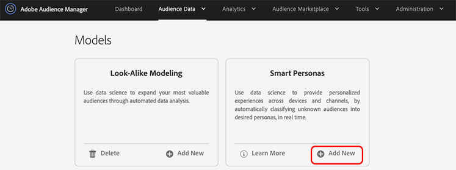
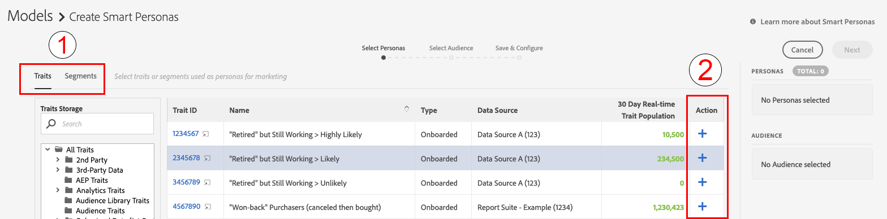
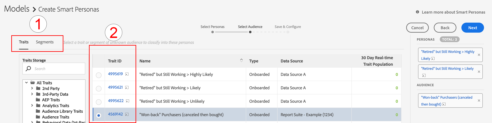
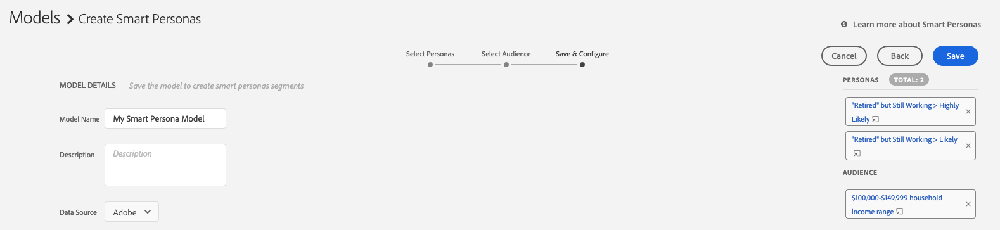

# Getting Started with Smart Personas {#smart-personas-getting-started}

## Create a Smart Personas Model {#create-smart-personas}

Before you create a [!UICONTROL Smart Personas] model, you need to decide which data source you want to assign your [!UICONTROL Smart Persona] traits and segments to. You can use an existing data source, or create a new one. See [Manage Data Sources](https://docs.adobe.com/content/help/en/audience-manager/user-guide/features/data-sources/manage-datasources.html) for details on how to create a new data source.

Once you know which data source you're going to use, follow the steps below.

1. Go to **[!UICONTROL Audience Data]** > **[!UICONTROL Models]**.
1. In the [!UICONTROL Smart Personas] section, click **[!UICONTROL Add New]**.

    

1. Next, define the personas that you want to classify your audience by. You can do this by choosing either traits or segments to build personas from. Use the [!UICONTROL Traits] and [!UICONTROL Segments] tabs in the upper left corner of the screen to switch between your trait and segments catalog. Once you've identified the traits or segments that you want to use as personas, click the corresponding **[!UICONTROL Add]** icon in the [!UICONTROL Action] column.
    
   >[!NOTE]
   >You must choose a minimum of either two traits or two segments for your baseline personas. You cannot use a combination of both traits and segments.
1. Click **[!UICONTROL Next]** after you've defined your personas.
1. Next, select the audience that you want to classify by choosing a trait or segment for this audience. Use the [!UICONTROL Traits] and [!UICONTROL Segments] tabs in the upper left corner of the screen to switch between your traits and segments catalog. Select the trait or segment that you want to use as your audience, to add it to the model.
   
1. Click **[!UICONTROL Next]** after you've chosen your audience.
1. Fill in the model details:
   1. **[!UICONTROL Model Name]**: Enter a suggestive name for the model, that will help you identify it later. Names of the segments generated by the model will start with the name of the model.
   2. **[!UICONTROL Description]**: Enter a description of the model that will help you identify its use case.
   3. **[!UICONTROL Data Source]**: Select the data source that you want the [!UICONTROL Smart Persona] segments from this model to be assigned to.
   
1. Click **[!UICONTROL Save]**.

## Editing Smart Personas {#edit-smart-personas}

Audience Manager does not support editing existing [!UICONTROL Smart Persona] models. To change a model's configuration, you must create a new model. If you have reached the limit of 10 [!UICONTROL Smart Persona] models and need to edit one of your models, you must delete a model and create a new one.

## Deleting Smart Personas {#delete-smart-personas}

To delete a [!UICONTROL Smart Persona] model, go to **[!UICONTROL Audience Data]** > **[!UICONTROL Models]**, find the model that you want to delete, and click the **[!UICONTROL Delete]** icon.
