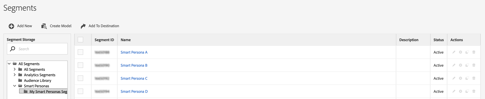

# Predictive Audiences Overview {#smart-personas}

[!UICONTROL Predictive Audiences] helps you classify an unknown audience into distinct personas, in real-time, using advanced data science techniques.

In a marketing context, a persona is an audience segment defined by visitors, users, or potential buyers, who share a specific set of traits, such as demographics, browsing habits, shopping history, etc.

[!UICONTROL Predictive Audiences] models take this concept a step further, by using Audience Manager's machine learning capabilities to automatically classify unknown audiences into distinct personas. Audience Manager achieves this by calculating the propensity of your unknown audience for a set of known audiences.

When you create a [!UICONTROL Predictive Audiences] model, the first step is choosing the baseline traits or segments that you want your target audience to be classified by. These traits or segments will define your personas.

During the evaluation phase, the model creates a new [!UICONTROL Predictive Audiences] segment for each trait or segment that you defined as baseline. The next time Audience Manager sees a visitor from your target audience who is not classified for a persona  (did not qualify for any of your baseline traits or segments), the [!UICONTROL Predictive Audiences] model will predict which of the [!UICONTROL Predictive Audiences] segments the visitor should belong to, and add the visitor to that segment.

You can identify the auto-created [!UICONTROL Predictive Audiences] segments in the Segments page. Each [!UICONTROL Predictive Audiences] model has its own folder under the [!UICONTROL Predictive Audiences] folder, and you can see each model's segments by clicking the model folder.

## Use Cases {#use-cases}

To help you better understand how and when you should use [!UICONTROL Predictive Audiences], here are a few use cases that Audience Manager customers can solve by using this feature.

### Use Case #1

As a marketer in an e-commerce company, I want to classify all my web and mobile visitors into various brand affinity categories, such as [!DNL Apple] products, [!DNL Google] products, [!DNL HP] products, etc., so that I can personalize their user experience.

### Use Case #2

As a marketer in a media company, I want to classify all my unauthenticated web and mobile visitors by favorite genres, so that I can suggest to them personalized content across all channels.

### Use Case #3

As an advertiser for financial services provider, I want to make sure I classify my audience based on their interest in mortgage loans, refinancing, student loans, etc., so that I can advertise to them in real time, within a short retargeting window.

### Use Case #4

As an advertiser, I want to classify my audience in real time, so that I can react quickly to trending news.

### Use Case #5

As a marketer, I want to predict which customer journey phase my website visitors are in, such as discovery, engagement, purchase or retention, so that I can target them accordingly.

## How Predictive Audiences Models Work

When you create a [!UICONTROL Predictive Audiences] model, you go through three steps:

1. First, you select a minimum of two traits or two segments that will define your personas.
1. Then, you choose a trait or segment that defines the target audience that you want to classify.
1. Finally, you choose a name for the model and select a data source that will store the [!UICONTROL Predictive Audiences] segments.

### Selection Criteria for Personas {#selection-personas}

You can choose any first-party trait or segment to define your personas. We recommend choosing your traits or segments so that each persona has at least a few hundred user profiles, and each user profile has a rich set of traits for the algorithm to learn from.

Make sure you are capturing granular traits across your digital properties. For optimal results, the overlap amongst personas should be minimal.

### Selection Criteria for Target Audience {#selection-audience}

Similar to persona selection, we recommend choosing your trait or segment that defines your target audience in such way that it has real time users with rich sets of traits, for classification into the right persona.

### Predictive Audiences Model Training Phase {#model-training}

Before the algorithm can classify your audience into the right personas, it needs to train itself on your data.

For each persona that you define, the algorithm retrieves all the [AAM UUIDs](https://docs.adobe.com/content/help/en/audience-manager/user-guide/reference/ids-in-aam.html) active in the last 30 days, and analyzes their respective traits.
This step takes place once every 24 hours, to account for changes in your audience.

### Predictive Audiences Model Classification Phase {#model-classification}

When a visitor who is part of the target audience is seen in real time, the model evaluates whether the visitor is part of the defined personas. For every visitor that does not belong to any of the personas, the model assigns a persona qualification score.

While evaluating audiences and assigning scores, the model uses the default **[!UICONTROL Profile Merge Rule]** defined in your account. Finally, the visitor gets classified into the persona for which they received the highest score.

## Considerations and Limitations {#considerations}

When configuring your [!UICONTROL Predictive Audiences] models, keep in mind the following considerations and limitations:

* You can create up to 10 [!UICONTROL Predictive Audiences] models.
* For each model, you can choose up to 50 base traits / segments.
* Third-party data is not currently supported in [!UICONTROL Predictive Audiences]. It will be supported in a future update.
* Audience classification is done only for real time audiences. Onboarded audiences classification will be supported in a future update.
* [!UICONTROL Predictive Audiences] performs audience classification based on all of your first party traits, from all your data sources.
* Segment evaluation for [!UICONTROL Predictive Audiences] uses the default **[!UICONTROL Profile Merge Rule]** that you defined in your account. To learn more about [!UICONTROL Profile Merge Rules] see the dedicated [documentation](https://docs.adobe.com/content/help/en/audience-manager/user-guide/features/profile-merge-rules/merge-rules-overview.html).
* Some traits and segments are not supported as baselines or target audiences. [!UICONTROL Predictive Audiences] models will fail to save when choosing one of the following as baselines or target audiences:
  * Automatically created [!UICONTROL Predictive Audiences] traits or segments;
  * [Adobe Experience Platform](../integration/../../integration/integration-aep/aam-aep-audience-sharing.md) traits or segments;
  * Algorithmic traits;
  * Third party traits.

## Data Export Controls{#dec}

[!UICONTROL Predictive Audiences] segments created by [!UICONTROL Predictive Audiences] models inherit the [Data Export Controls](https://docs.adobe.com/content/help/en/audience-manager/user-guide/features/data-export-controls.html) from the following data sources:

1. The data source that you choose when building the model.
2. The data sources of all baselines. Specifically, the union of all data export controls of all the baseline traits or segments.
3. The data sources of your target audience. Specifically, the union of all data export controls of all the traits or segments that make up your target audience.

The newly created [!UICONTROL Predictive Audiences] traits and segments will have the same privacy restrictions as the union of all the data sources described above.

Traits that have additional restrictions that aren’t part of the [!UICONTROL Predictive Audiences] segment privacy restrictions will be excluded from the training phase, and will not become influential for the model.

## Role-Based Access Controls{#rbac}

The traits and segments that you choose for personas and audience classification are subject to Audience Manager [Role-Based Access Controls](https://docs.adobe.com/content/help/en/audience-manager/user-guide/features/administration/administration-overview.html).

Audience Manager users can only select traits or segments for personas and target audiences, that they have [permission to view](https://docs.adobe.com/content/help/en/audience-manager/user-guide/features/administration/administration-overview.html#wild-card-permissions).
