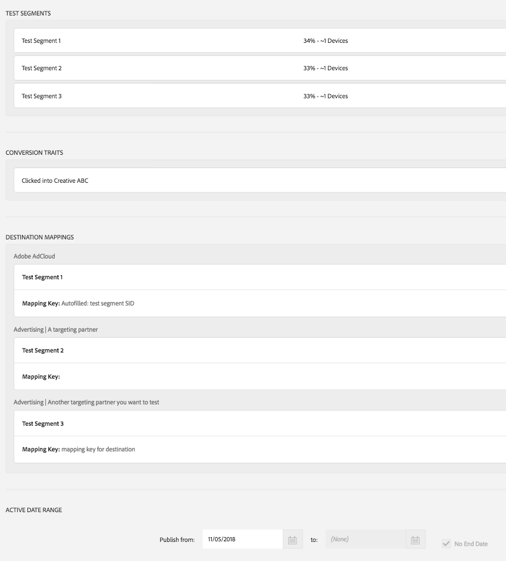
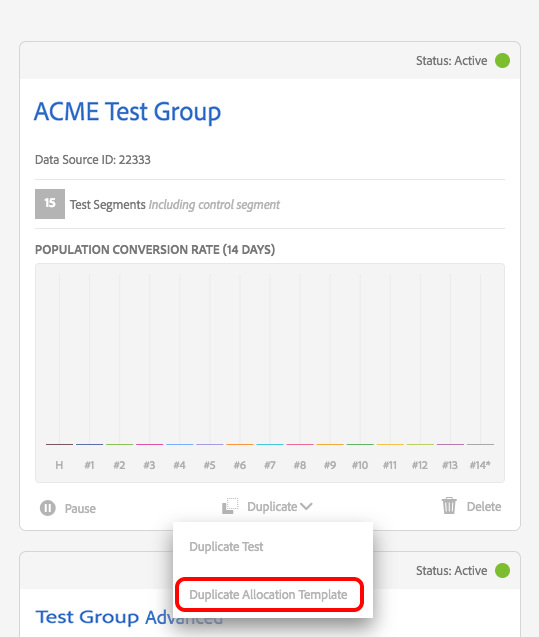
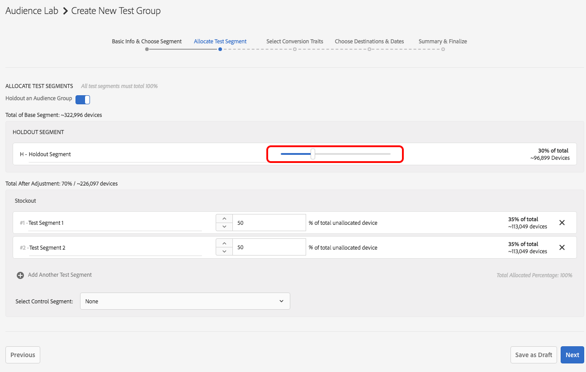

# [!DNL Audience Lab] Advanced Functionality {#audience-lab-advanced-functionality}

This article describes two features which provide advanced functionality for [!DNL Audience Lab]: [!DNL Duplicate Allocation Template] and [!DNL Segment Holdout].

## Duplicate Allocation Template {#section_520626580ECB48C9A6EFEFC9A5D49D1B}

<!-- 

The <b>Allocation Template</b> represents how you split a test group into test segments and the way the test segments are mapped to destinations. 

 -->

In [!DNL Audience Lab], the [!DNL Allocation Template] represents the various selections you make when creating a test group:

* The distribution of devices between test segments;
* The mapping of test segments to destinations;
* The conversion trait(s) you use for a test group;
* The date range in which the test group publishes to your selected destinations.

By duplicating an allocation template, you can reuse the same distribution of test segments and destinations for a different base segment, in a new test group. An example of an allocation template is illustrated below. The image is taken from the [!UICONTROl Summary & Finalize] step in the [!UICONTROL Create Test Group] workflow.

<!--
With the option to duplicate allocation templates, you can increase your productivity when running multivariate tests as part of multivariate campaigns.
-->

### Using [!UICONTROL Duplicate Allocation Template]

Create an initial test group, then select **[!UICONTROL Duplicate Allocation Template]** to reuse the same settings across multiple test groups. For example, you can use this feature if you're running a test where you want to determine the efficacy of several destinations for multiple segments.

1. In the Audience Lab main view, search for the test group whose allocation template you want to reproduce in a new test group. In the drop-down box, select **[!UICONTROL Duplicate Allocation Template]**.

   

1. In the [!UICONTROL Create Test Group] wizard, you can specify a base segment and rename your test segments, if you wish.
1. You *cannot* modify:

    * The distribution of devices between test segments;
    * The conversion trait(s);
    * The mapping of test segments to destinations. You can only fill in the mapping key, for the destinations that require one.
    * The date range in which your test group will publish to your selected destinations.

1. Review the information you added in the previous steps and select **[!UICONTROL Finalize Group]**.

## [!UICONTROL Test Segment Holdout] {#section_1D72DBA56C2F44ADB38B1BF86A300098}

>[!NOTE]
>
>[!UICONTROL Test Segment Holdout] is an advanced functionality, activated on customer request. Please contact [!DNL Customer Care] or [!DNL Adobe Consulting] to activate this feature.

Use this feature to withhold part of the audience from being included in the test. The percentage you select is left out of the test. This way, you can measure and compare the number of conversions from targeted (activated on destinations) and untargeted (holdout group) audiences.

<!--

Note that this option is different to the control segment because it subtracts the percentage ................. You can withhold an audience group and still use a control segment. 

-->

### Using [!UICONTROL Test Segment Holdout]

1. Create a new test group by using the [!UICONTROL Create Test Group] wizard.
1. In the **[!UICONTROL Allocate Test Segment]** step, you can select a part of the audience to be withheld from testing.

   

1. Use the slider to adjust how many devices you want to hold out from testing. Notice how Test Segment 1 and Test Segment 2 now only make out 70% of the total devices.

   

1. Go through the rest of the steps in the **[!UICONTROL Create Test Group]** workflow and select **[!UICONTROL Finalize Group]** when you're satisfied with your selection. You now have a test group with part of the audience withheld from testing.
