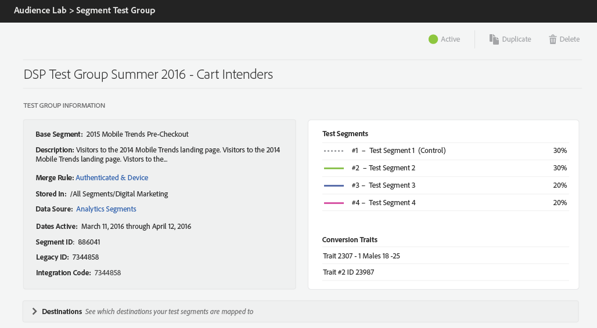

# Test Group Information {#test-group-information}

This section displays general information on the test group and the test segments it is divided into, the selected conversion traits and mapped destinations. The section also provides controls for duplicating or deleting the test group.

You can also see information on the baseline segment you used for the test group and how the test segments are divided.

The **[!UICONTROL Test Segments]** are populated randomly with users from the baseline segment you used for the test group. The overview shows the percentages of users you allotted to each test segment.

The **[!UICONTROL Conversion Traits]** drive the reporting for the test groups. To designate a trait as a conversion, when creating or editing traits in the [!UICONTROL Trait Builder], select **Conversion** as **[Event Type](../../features/traits/create-onboarded-rule-based-traits.md).**

The **[!UICONTROL Destinations]** card is collapsible. Press the arrows to open or close individual destinations and obtain the following information for test segments, grouped by the destinations these are mapped to:

* the number of devices from the base segment's total population allocated to each destination.
* mapping key;
* mapping value;
* [!DNL URL] & secure [!DNL URL] for [!DNL URL] destinations.

>[!NOTE]
>
>Remember that you can't edit test groups after you finalize them, you can only pause, delete or duplicate them.

