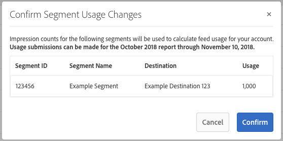

# Billing for Data Feed Buyers {#billing-for-data-feed-buyers}

Audience Marketplace data buyers agree to report all ad impressions served using traits contained in the data feed priced on a cost per thousand ad impressions ([!DNL CPM]) basis. [!DNL CPM] usage is due on the 5th day of each calendar month and includes data for previous month. Flat fee subscribers do not need to report usage.

## How to Report [!DNL CPM] Usage {#task_22D86C3A39544CA8A4BC2360DC115877}

<!-- t_marketplace_report_cpm_usage.xml -->

[!UICONTROL Audience Marketplace] data buyers agree to report all ad impressions served using traits contained in the data feed priced on a cost per thousand ad impressions ([!DNL CPM]) basis. [!DNL CPM] usage is due on the 5 day of each calendar month and includes data for previous month. Flat fee subscribers do not need to report usage.

[!UICONTROL Audience Marketplace] offers two ways to report [!DNL CPM] usage:

* **Segment-level reporting**: this is the recommended [!DNL CPM] usage reporting method. When you report [!DNL CPM] usage at segment level, the data feed-level reporting section is automatically filled in with the corresponding usage amounts, based on the algorithms described in [Cost Attribution for CPM Data Feeds](#concept_E757985A4850400288F1DD9A02B755D5).
* **Data feed-level reporting**: this method requires you to individually report the [!DNL CPM] usage for each data feed, based on the algorithms described in [Cost Attribution for CPM Data Feeds](#concept_E757985A4850400288F1DD9A02B755D5). However, this method is more tedious and prone to error than segment-level reporting.

## Report [!DNL CPM] Usage at Segment Level {#segment-level-report}

The [!UICONTROL Segment Usage] tab allows you to report segment-level usage, while displaying the segments grouped by the destinations they are mapped to.

After reporting [!DNL CPM] usage at segment level, [!UICONTROL Audience Marketplace] automatically assigns the corresponding data feeds the correct usage, based on the [Cost Attribution for CPM Data Feeds](#concept_E757985A4850400288F1DD9A02B755D5).

To report [!DNL CPM] usage at segment level:

1. Go to **[!UICONTROL Audience Marketplace > Payables]**.
2. Select the **[!UICONTROL Segment Usage]** tab.
3. Fill in the usage for your segments. You can use the [!UICONTROL Search] box to filter the segments if you only need to report usage for some of them.
4. Click **[!UICONTROL Edit Segments Usage]**.
5. Enter the [!DNL CPM] usage amount in the [!UICONTROL Usage] column.
6. Click **[!UICONTROL Save]** when you're done and review the confirmation dialog.
   
7. Click **[!UICONTROL Confirm]**.

## Report [!DNL CPM] Usage at Data Feed Level {#feed-level-report}

Data feed-level reporting is a more tedious and prone to error process, since you must individually calculate [!DNL CPM] usage for each data feed. We recommend that you [Report CPM Usage at Segment Level](#segment-level-report) instead.

To report [!DNL CPM] usage at segment level:

1. Go to **[!UICONTROL Audience Marketplace > Payables]**.
2. Select the **[!UICONTROL Feed Usage]** tab.
3. Use the [!UICONTROL Search] box to filter the data feeds and identify the ones that you need to report usage for.
4. Click **[!UICONTROL Edit Feeds Usage]**.
5. Calculate the [!DNL CPM] usage for each data feed based on the [Cost Attribution for CPM Data Feeds](#concept_E757985A4850400288F1DD9A02B755D5), and enter it in the [!UICONTROL Usage] column.
6. Click **[!UICONTROL Save]** when you're done and review the confirmation dialog.

   

7. Click **[!UICONTROL Confirm]**.

## Bulk Reporting

To reduce errors and overhead while reporting [!DNL CPM] usage, you can use the bulk reporting option to download a [!DNL CSV] file containing the data feeds and segments, fill in the usage, and upload it back to [!DNL Audience Manager]. You can use bulk reporting to report both feed and segment usage.

To update [!DNL CPM] usage in bulk:

1. Go to **[!UICONTROL Audience Marketplace > Payables]**.
1. Select the **[!UICONTROL Feed Usage]** or **[!UICONTROL Segment Usage]** tab, depending on the type of reporting that you want to update.
1. Click **[!UICONTROL Edit Feeds Usage]** or **[!UICONTROL Edit Segments Usage]**.
1. Click **[!UICONTROL download the current usage]** to make sure you use a valid CSV file.
1. Open the file on your computer and fill in the usage report.
1. Click **[!UICONTROL Choose a CSV file]** to upload the updated usage report.

   

1. [!DNL Audience Manager] validates the file as soon as you upload it and prompts you if it detects any errors in the file.

### Bulk Reporting Validation Errors

| Error Message | Description   |  Fix  |
| ------------- | -------------| -----|
| Invalid Input | [!DNL Audience Manager] detected a change in the [!DNL CSV] file schema, such as missing columns or changes to column titles. | Avoid changing the table structure. |
| Not Found     | For [!UICONTROL Segment Level Reporting], [!DNL Audience Manager] could not identify the [!UICONTROL Segment ID] and [!UICONTROL Destination ID] combination. For [!UICONTROL Feed Level Reporting], [!DNL Audience Manager] could not identify the [!UICONTROL Data Provider Name], [!UICONTROL Feed Name], and [!UICONTROL Use Case] combination.    |   For [!UICONTROL Segment Level Reporting], check the validity of the [!UICONTROL Segment ID] and [!UICONTROL Destination ID] combination. For [!UICONTROL Feed Level Reporting], check the validity of the [!UICONTROL Data Provider Name], [!UICONTROL Feed Name], and [!UICONTROL Use Case] combination. |
| Duplicate Records Found | [!DNL Audience Manager] detected duplicate records with different impression values.      |    Review the report and make sure you don't report different usage values for the same data feed or segment. |
| Values Not Supported | [!DNL Audience Manager] detected non-numerical values in the [!DNL Audience Manager] column. | Review the report and make sure you only enter numerical values in the [!DNL Audience Manager] column.|
| Headers for Mandatory Fields Missing | [!DNL Audience Manager] detected missing table headers for mandatory fields. For [!UICONTROL Segment Level Reporting], the mandatory fields are: [!UICONTROL Segment ID], [!UICONTROL Destination ID]. For [!UICONTROL Feed Level Reporting], the mandatory fields are: [!UICONTROL Data Provider Name], [!UICONTROL Data Feed Name],  [!UICONTROL Use Case] | Review the report and make sure the table headers have not been tampered with. |

>[!NOTE]
>Removing rows from the [!DNL CSV] usage report does not have any effect on the existing usage report. [!DNL Audience Manager] only processes the fields included in the report.

## [!DNL CPM] Reporting Best Practices

<table id="table_E68FA2130D1C495FAB8982DFB6A31FD9"> 
 <thead> 
  <tr> 
   <th colname="col1" class="entry"> Recommendations </th> 
   <th colname="col2" class="entry"> Description </th> 
  </tr>
 </thead>
 <tbody> 
  <tr> 
   <td colname="col1"> 
<b>Always report the total number of impressions</b> 
 </td> 
   <td colname="col2"> 
For CPM impression totals: 

   
 Report the total number of impressions, without using decimals. Audience Manager automatically calculates the CPM based on the total number you report.

   If you need to report 1,234,567 impressions, report it exactly like that. You do not need to divide the total number of impressions by 1,000 to calculate the CPM.

  Traits used to optimize your web or app content (Content Optimization) using tools such as [!DNL Adobe Target] or an [!DNL Analytics] destination do not contribute to the [!UICONTROL Usage] totals for CPM plans. Data providers are typically compensated for Content Optimization using flat fee plans.
  See [Cost Attribution for CPM Data Feeds](#concept_E757985A4850400288F1DD9A02B755D5) for more information. 
 </td>
  </tr>
  <tr> 
   <td colname="col1"> 
<b>Stick to the monthly reporting interval</b> 
 </td> 
   <td colname="col2"> 
The report system closes after the 5th of each month. If you fail to report CPM usage by then, you must add that amount to the report for the following month. For example, say you use 1000 impressions in October, miss the October reporting deadline, and use 1000 impressions in November. In this case, you report the October and November total (2000) in December, between the 1st and the 5th.

<b>Tip</b>: You should always try to report CPM usage for the previous month between the 1st and 5th days of the following month.

You can report CPM usage as late as the 5th of the new calendar month, but this is not recommended. Reporting CPM usage before the 5th of each month gives Audience Manager time to check and process the data.
 </td>
  </tr> 
 </tbody> 
</table>

## Cost Attribution for [!UICONTROL CPM Data Feeds] {#concept_E757985A4850400288F1DD9A02B755D5}

In [!UICONTROL Audience Marketplace] you must self-report impression amounts each month, for each of your segments. We recommend reporting [!DNL CPM] usage at segment level, so that cost attribution is done automatically.

<!-- marketplace_cpm_billing.xml -->

### Billing Summary {#section_E49C2B4663DB4016B594DB596B66E4E1}

You must submit [!DNL CPM] data feed impression amounts between the 1st and the 5th days of each calendar month. To do this correctly, we recommend that you [Report CPM Usage at Segment Level](#segment-level-report).

>[!TIP]
>When you report [!DNL CPM] usage at segment level, the data feed-level reporting section is automatically filled in with the corresponding usage amounts.

Should you need to [!UICONTROL Report CPM Usage at Data Feed Level], you must individually compile all impressions delivered for each feed in the previous calendar month, and report them according to the billing allocation described in this article.

After you report [!DNL CPM] number for the previous calendar month, [!DNL Adobe] will do the following:

* Create an invoice and bill you based on the [!DNL CPM] rate for each subscribed data feed.
* Pay data providers (sellers) fees owed based on your reported [!DNL CPM] use.

>[!IMPORTANT]
>
>As a buyer, all reported impression totals must be true and accurate. If you fail to report impression totals by the 5th day of each month, you must include totals for the unreported month in the following month.

## Assign Impressions at Feed Level Based on Trait Qualification Rules {#section_F457C3B07044474CAE3DCEB339D8E120}

The [!UICONTROL Activation] use case lets you use traits in the corresponding data feed to create segments in [Segment Builder](../../../features/segments/segment-builder.md#topic_E166819D26B94A868376BA54E10E4B74) and map those segments to a destination. The Boolean operators [!UICONTROL AND], [!UICONTROL OR], and [!UICONTROL NOT] let you set the conditions for trait and segment qualification.

When you [Report CPM Usage at Data Feed Level](#feed-level-report), you must allocate impressions proportionally for each data feed, according to the [!DNL Boolean] operators used in the trait qualification rules. The following table lists how to properly allocate impressions by Boolean rule or trait type.

>[!TIP]
>[Report CPM Usage at Segment Level](#segment-level-report) to have the data feed level reporting done automatically by Audience Manager.

<table id="table_BF00FE6740D2459DAFA62F2478492586"> 
 <thead> 
  <tr> 
   <th colname="col1" class="entry"> Rule Qualification Logic or Type </th> 
   <th colname="col2" class="entry"> Billing Distribution </th> 
  </tr> 
 </thead>
 <tbody> 
  <tr> 
   <td colname="col1"> 
 AND 
 </td> 
   <td colname="col2"> 
Apply 100% of the delivered impression totals to all the provider traits in a rules-based segment that uses a Boolean  AND condition. 
 </td> 
  </tr> 
  <tr> 
   <td colname="col1"> 
 OR 
 </td> 
   <td colname="col2"> 
Apply weighted allocation of the delivered impression totals to all the provider traits in a rules-based segment that uses a Boolean OR condition. Weighted allocation is calculated using the following formula:

<code>(Trait Population / Segment Population) * Number of Impressions * Cost of CPM</code>
 </td> 
  </tr>
  <tr> 
   <td colname="col1"> 
 NOT 
 </td> 
   <td colname="col2"> 
Apply 100% of the delivered impression totals to all the provider traits in a rules-based segment that uses a Boolean  NOT condition. 
 </td> 
  </tr> 
  <tr> 
   <td colname="col1"> 
Algorithmic segments 
 </td> 
   <td colname="col2"> 
Apply 100% of the delivered impression totals to all the provider feeds in a segment containing algorithmic traits. 
 </td> 
  </tr>
 </tbody>
</table>

## Billing Examples {#section_61B684C354944A5CA3BE1A01007B9577}

The examples below are meant to illustrate how [!DNL CPM] usage allocation is done at data feed level.

>[!MPORTANT]
>We recommend that you [Report CPM Usage at Segment Level](#segment-level-report) instead, to have this process done automatically.

Let's consider the following scenario:

### Case 1: Segments With [!UICONTROL AND] Qualification Rules

This segment contains 3 traits from separate data providers. Since segment qualification is based on an [!UICONTROL AND] condition, visitors have to realize the traits from all three feeds to qualify for the segment.

With an [!UICONTROL AND] condition, you must assign 100% of the impressions received during the month to all three data providers. In the [!UICONTROL Audience Marketplace > Payables] section, you credit each provider with 1,000,000 impressions.

This example applies to segments that use [!DNL Boolean] [!UICONTROL NOT] operators or for segments that contain algorithmic traits.

### Case 2: Segments With [!UICONTROL OR] Qualification Rules

This segment contains 3 traits from separate data providers. Since segment qualification is based on an [!UICONTROL OR] condition, visitors have to realize at least one of the three traits to qualify for the segment.

We cannot tell which trait is responsible for an impression because qualification is based on an [!UICONTROL OR] condition. As a result, in the [!UICONTROL Audience Marketplace > Payables] section you credit each provider with a weighted allocation of the total impressions, based on trait population.

>[!MORE_LIKE_THIS]
>
>* [Billing and Impression Allocation for Flat Fee Data Feeds](../../../features/audience-marketplace/marketplace-data-buyers/marketplace-buyer-billing.md#concept_FE781C4C5C044C1F986F1AB6BA4E328F)