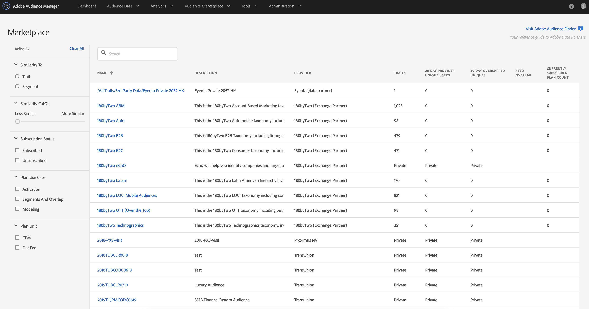

# [!UICONTROL Audience Marketplace] for Data Buyers {#audience-marketplace-for-data-buyers}

Overview and workflow for data buyers who want to purchase third-party data from within [!DNL Audience Manager].

>[!NOTE]
>[Role-based permissions](../../../reporting/reports-dashboard.md) control access to [!UICONTROL Audience Marketplace] features.
>
>* Administrators can create data feeds, manage subscribers, and subscribe to data feeds.
>* Users can search and view feeds only.

## The [!UICONTROL Marketplace]: About {#about-marketplace}

The [!UICONTROL Marketplace] is an [!DNL Audience Manager] feature for data buyers that lists data feeds you can subscribe to. It lists flat rate, [!DNL CPM], and private data feeds. These feeds are provided by third-party vendors that use [!DNL Audience Manager] to sell data.

In the [!UICONTROL Marketplace], reporting tools let you track feed usage and the overlap between your [!UICONTROL traits] and those in a subscribed data feed. Finally, with [!UICONTROL Audience Marketplace], [!DNL Adobe] takes care of invoices and fee payments (though you do have to self-report usage when subscribed to a [!DNL CPM] feed). These features let you find effective data sources without wasting time looking for a data provider.

>[!TIP]
>
>Use the **[Adobe Audience Finder](https://www.adobe-audience-finder.com/)** to find high quality data feeds that you can subscribe to. Then, go back into the [!DNL Audience Manager] user interface or use the [Audience Marketplace Buyer API](https://bank.demdex.com/portal/swagger/index.html#/Audience_Marketplace_Buyer_API) to subscribe to the feeds you found.

The [!UICONTROL Marketplace] list contains information that you can sort and search to find the data feed that's right for you. Items in the [!UICONTROL Marketplace] buyer's list include:

* **[!UICONTROL Search]**: Find data feeds by name or text description.
* **[!UICONTROL Similar Traits]**: Shows you the number of similar [!UICONTROL traits] from a data feed. This column is shown after you enter a [!UICONTROL trait] or [!UICONTROL segment] to filter by in the **[!UICONTROL Similarity To]** section.
* **[!UICONTROL Name]**: Name of the data feed.
* **[!UICONTROL Description]**: Information about the contents of a data feed.
* **[!UICONTROL Provider]**: Name of the data provider.
* **[!UICONTROL Traits]**: The number of [!UICONTROL traits] in a data feed.
* **[!UICONTROL 30 Day Provider Unique Users]**: The number of unique users seen in the last 30 days.
* **[!UICONTROL 30 Day Overlapped Uniques]**: The number of users in your account that overlap with the users in the provider’s account.
* **[!UICONTROL Feed Overlap]**: The 30 day overlapped uniques value, displayed in percentages, calculated as: Data buyer 30 day overlapped uniques / Data buyer 30 day uniques) x 100.
* **[!UICONTROL Private Feeds]**: See [Private Data Feeds](../../../features/audience-marketplace/marketplace-private-feeds.md).
* **[!UICONTROL Currently Subscribed Plan Count]**: The number of subscriptions you have with a data provider.

&nbsp;

To easily find the best data feeds for your needs, use the following filters available on the left side of the [!UICONTROL Marketplace] page:

* **[!UICONTROL Similarity To]**: Filter data feeds based on their similarity to either a [!UICONTROL trait] or [!UICONTROL segment] of your choosing. When entering the [!UICONTROL trait] or segment to compare to, you can use the [!UICONTROL trait] or [!UICONTROL segment] ID, or their respective names.
* **[!UICONTROL Similarity Cutoff]**: Drag the slider to filter the data feeds based on how similar their [!UICONTROL traits] are to your selected [!UICONTROL trait] or [!UICONTROL segment]. To learn more about [!UICONTROL trait] similarity scores, see [Trait Similarity Score](../../segments/trait-recommendations.md#trait-similarity-score)
* **[!UICONTROL Subscription Status]**: Filter the data feeds based on your subscription status.
* **[!UICONTROL Plan Use Case]**: Filter data feeds based on their supported use cases: **[!UICONTROL Activation]**, **[!UICONTROL Segments and Overlap]**, and **[!UICONTROL Modelling]**.
* **[!UICONTROL Plan Unit]**: Filter data feeds based on their pricing type.

## Finding Similar [!UICONTROL Traits] {#finding-similar-traits}

[!UICONTROL Audience Marketplace] gives you the option to find [!UICONTROL traits] from various data feeds, based on their similarity to your existing [!UICONTROL traits] or segments. Here's how to do this:

1. Go to **[!UICONTROL Audience Marketplace]** > **[!UICONTROL Marketplace]**.
2. Use the **[!UICONTROL Similarity To]** selector to choose between filtering based on a [!UICONTROL trait] or [!UICONTROL segment]. You can filter based on [!UICONTROL trait]/[!UICONTROL segment] ID or name. The search box automatically shows you relevant suggestions based on your input.
3. Once you've identified the trait or segment that you want to filter by, click it in the suggestions list.
4. To narrow down the results, use the **[!UICONTROL Similarity Cutoff]** slider to move from less similar [!UICONTROL traits], to more similar ones.

Once the filtering is complete, you'll see a new column in the results page: **[!UICONTROL Similar Traits]**. This column shows you the number of similar [!UICONTROL traits] to the one you filtered by, from each data feed that meets the filtering criteria.

To see the full list of similar traits, click the number in the **[!UICONTROL Similar Traits]** column.

>[!NOTE]
>
> Audience Marketplace displays the top 500 similar [!UICONTROL trait] results from across the data feeds.

Watch the video below for a full overview of how to find similar [!UICONTROL traits].

>[!VIDEO](https://video.tv.adobe.com/v/29370/)

## Private Data Feeds {#private-data-feeds}

In the [!UICONTROL Marketplace] list, sometimes the provider's name and [!UICONTROL trait] data are marked as private. This indicates a [private data feed](../../../features/audience-marketplace/marketplace-private-feeds.md). A private data feed lets sellers limit buyer access to their data. Sellers can make feeds private when they're offering special deals, discounts, or when privacy and access control are important to them. As a buyer, you have to send a subscription request to the seller if you want access to a private feed. See [Subscribe to a Private Data Feed](../../../features/audience-marketplace/marketplace-data-buyers/marketplace-manage-subscriptions.md#subscript-private-data-feed) for details.

>[!MORELIKETHIS]
>
>* [Understanding the Plan Details Page in Audience Marketplace](../../../features/audience-marketplace/marketplace-data-buyers/marketplace-manage-subscriptions.md#marketplace-buyer-details)
>* [Discounts for Data Buyers](../../../features/audience-marketplace/marketplace-data-buyers/marketplace-manage-subscriptions.md#buyer-discount)
