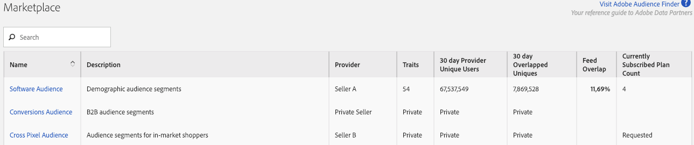

# Audience Marketplace for Data Buyers {#audience-marketplace-for-data-buyers}

Overview and workflow for data buyers who want to purchase third-party data from within [!DNL Audience Manager].

>[!NOTE]
>[Role-based permissions](../../../reporting/reports-dashboard.md) control access to [!UICONTROL Audience Marketplace] features.
>
>* Administrators can create data feeds, manage subscribers, and subscribe to data feeds.
>* Users can search and view feeds only.

## The Marketplace: About {#about-marketplace}

<!-- c_marketplace_about.xml -->

The [!UICONTROL Marketplace] is an [!DNL Audience Manager] feature for data buyers that lists data feeds you can subscribe to. It lists flat rate, [!DNL CPM], or private data feeds. These feeds are provided by third-party vendors that use [!DNL Audience Manager] to sell data. In the [!UICONTROL Marketplace], reporting tools let you track feed usage and the overlap between your traits and those in a subscribed data feed. Finally, with [!UICONTROL Audience Marketplace], [!DNL Adobe] takes care of invoices and fee payments (though you do have to self-report usage when subscribed to a [!DNL CPM] feed). These features let you find effective data sources without wasting time looking for a data provider.

The [!UICONTROL Marketplace] list contains information that you can sort and search to find the data feed that's right for you. Items in the [!UICONTROL Marketplace] buyer's list include:

* **[!UICONTROL Search]:** Find data feeds by name or text description.
* **[!UICONTROL Name]:** Name of the data feed.
* **[!UICONTROL Description]:** Information about the contents of a data feed.
* **[!UICONTROL Provider]:** Name of the data provider.
* **[!UICONTROL Traits]:** The number of traits in a data feed.
* **[!UICONTROL 30 Day Provider Unique Users]:** The number of unique users seen in the last 30 days.
* **[!UICONTROL 30 Day Overlapped Uniques]:** The number of users in your account that overlap with the users in the provider’s account.
* **[!UICONTROL Feed Overlap]:** The 30 day overlapped uniques value, displayed in percentages, calculated as: Data buyer 30 day overlapped uniques / Data buyer 30 day uniques) x 100.
* **[!UICONTROL Private Feeds]:** See [Private Data Feeds](../../../features/audience-marketplace/marketplace-private-feeds.md).
* **[!UICONTROL Currently Subscribed Plan Count]:** The number of subscriptions you have with a data provider.

## Private Data Feeds {#private-data-feeds}

In the [!UICONTROL Marketplace] list, sometimes the provider's name and trait data are marked as private. This indicates a [private data feed](../../../features/audience-marketplace/marketplace-private-feeds.md). A private data feed lets sellers limit buyer access to their data. Sellers can make feeds private when they're offering special deals, discounts, or when privacy and access control are important to them. As a buyer, you have to send a subscription request to the seller if you want access to a private feed. See [Subscribe to a Private Data Feed](../../../features/audience-marketplace/marketplace-data-buyers/marketplace-manage-subscriptions.md#subscript-private-data-feed) for details.

>[!MORE_LIKE_THIS]
>
>* [Understanding the Plan Details Page in Audience Marketplace](../../../features/audience-marketplace/marketplace-data-buyers/marketplace-manage-subscriptions.md#marketplace-buyer-details)
>* [Discounts for Data Buyers](../../../features/audience-marketplace/marketplace-data-buyers/marketplace-manage-subscriptions.md#buyer-discount)
