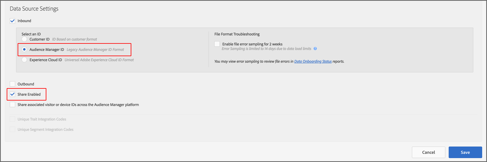
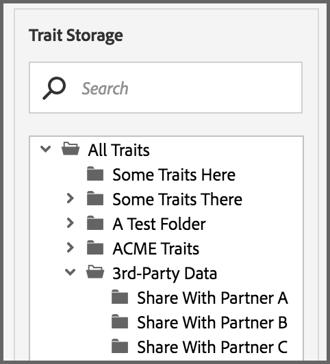
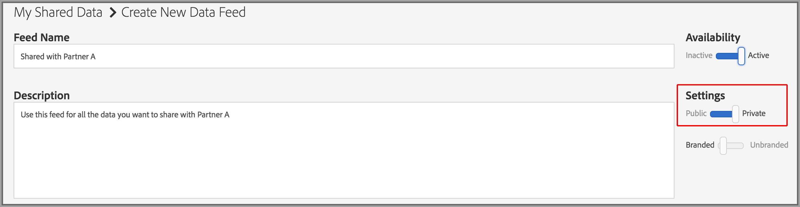

# Private Data Feeds {#private-data-feeds}

A private data feed is an option that lets providers limit buyer access to their data. Data providers and buyers should review this information before creating and subscribing to private data feeds.

<!-- c_marketplace_privatefeed.xml -->

## Private Data Feeds for Providers {#private-data-feeds-providers}

As a provider, your data feeds can be public or private. A private data feed lets you limit buyer access to your data, including the name of the data seller. You may want to create a private data feed to offer special deals, discounts, or when privacy and access control are important. With a private data feed, you get to review and approve buyer requests. After you approve a request, the feed looks just like a public data feed to the buyer. You can view and manage all your feeds in **[!UICONTROL Audience Marketplace > My Shared Data]**. As shown below, this type of feed is marked "Private" in the status column.

### Managing Feed Requests

Clicking the name of a private data feed from [!UICONTROL My Shared Data] takes you to a page that contains several tabs. Click a tab to manage your private data feed requests.

The following table defines the role or functions provided by each action tab.

<table id="table_AFB429CA52A34658859448D9A5215F9F"> 
 <thead> 
  <tr> 
   <th colname="col1" class="entry"> Tab </th> 
   <th colname="col2" class="entry"> Description </th> 
  </tr> 
 </thead>
 <tbody> 
  <tr> 
   <td colname="col1"> 
 <b> Current Subscribers</b> 
 </td> 
   <td colname="col2"> 
Lists approved buyers who have subscribed to a private data feed. 
 </td> 
  </tr> 
  <tr> 
   <td colname="col1"> 
 <b> Potential Subscribers</b> 
 </td> 
   <td colname="col2"> 
Lists approved buyers who have not subscribed to a private data feed. 
 
An approval lets buyers view a data feed as if it were public. This gives them a chance to review and evaluate your feeds before subscribing. You can also offer discounts on data feeds to buyers listed as potential subscribers. Once the buyer subscribes, their profile moves to <b> Current Subscribers</b>. 
 </td>
  </tr> 
  <tr> 
   <td colname="col1"> 
 <b> Access Requests</b> 
 </td>
   <td colname="col2"> 
Lists new subscription requests for a private data feed. Click this tab to review, approve, or reject buyer requests. 

    <ul id="ul_BE0A835A90B14C05B3F63226B79D052D"> 
     <li id="li_2C5686CEB6F4430BA18AED5AD75C330A">Approved buyers move to <b> Potential Subscribers</b>. </li>
     <li id="li_929591FCF81E43A3881813BDBD3AC278">Rejected buyers move to <b> Denied Access</b>. </li>
    </ul> </td>
  </tr>
  <tr> 
   <td colname="col1"> 
 <b> Details Requests</b> 
 </td>
   <td colname="col2"> 
Lists approved buyers who have not yet subscribed to a data feed and have requested more information about your feeds. 
 
An approval lets buyers view a data feed as if it were public. This gives them a chance to review and evaluate your feeds before subscribing. You can also offer discounts on data feeds to buyers requesting access. Responding to a details request removes the buyer profile from this tab. If they haven't subscribed, the buyer profile is still in <b> Potential Subscribers</b>. 
 </td>
  </tr>
  <tr> 
   <td colname="col1"> 
 <b> Denied Access</b> 
 </td> 
   <td colname="col2"> 
Lists rejected subscription requests for a private data feed. 
 
To re-approve denied buyers, change the  Rejection Status to <b> Allow</b>. This moves the buyer to <b> Potential Subscribers</b>. 
 </td> 
  </tr> 
 </tbody> 
</table>

### Next Steps

The following documentation can help you get started with private data feeds.

* [Create a Public or Private Data Feed](../../features/audience-marketplace/marketplace-data-providers/marketplace-create-manage-feeds.md#create-public-private-data-feed) 
* [Review, Approve, or Reject Private Feed Requests](../../features/audience-marketplace/marketplace-data-providers/marketplace-create-manage-feeds.md#manage-private-requests) 
* [Private Data Feeds for Buyers](../../features/audience-marketplace/marketplace-private-feeds.md#private-data-feeds-for-buyers)

## Private Data Feeds for Buyers {#private-data-feeds-for-buyers}

As a buyer, private data feeds appear in the [Marketplace](../../features/audience-marketplace/marketplace-data-buyers/marketplace-data-buyers.md#about-marketplace) like any other offer. However, in this case, the feed list does not show summary information for traits, unique users, and user overlap. Also, the data seller has an option to show or hide their name in the [!UICONTROL Provider] column of the [!UICONTROL Marketplace] list. After the seller approves your subscription request, all the data in a private feed becomes available to you (it works just like a public feed). The [!UICONTROL Marketplace] example below lists the 3 different feed types available to you as a buyer.

Feed types include:

The table describes how these different feed types show or hide data.

<table id="table_41D4A798ACF548A3A03ACB427CA4652D"> 
 <thead> 
  <tr> 
   <th colname="col1" class="entry"> Feed Type </th> 
   <th colname="col2" class="entry"> Description </th> 
  </tr> 
 </thead>
 <tbody> 
  <tr> 
   <td colname="col1"> 
<b> Public</b> 
 </td> 
   <td colname="col2"> 
The provider's name, trait, and unique data appears in the list. 
 </td> 
  </tr> 
  <tr> 
   <td colname="col1"> 
<b> Private Without Branding</b> 
 </td> 
   <td colname="col2"> 
The provider's name is set to "Private Seller," and you cannot see trait counts, unique data, and trait overlap data. 
 </td> 
  </tr> 
  <tr> 
   <td colname="col1"> 
<b> Private With Branding</b> 
 </td> 
   <td colname="col2"> 
The provider's name appears in the list but you cannot see trait counts, unique data, and trait overlap data. 
 </td> 
  </tr> 
 </tbody> 
</table>

### Next Steps

See [Subscribe to a Private Data Feed](../../features/audience-marketplace/marketplace-data-buyers/marketplace-manage-subscriptions.md#subscript-private-data-feed) to request access.

## How to set up the Sharing Relationship between Data Provider and Data Buyer {#set-up-sharing-relationship}

### Step 1 - Enablement - Data Provider and Data Buyer

The first step in the process requires intervention from Adobe Consulting or Customer Care. Data provider and data buyer should contact Adobe Consulting or Customer Care to request the enablement.

### Step 2 - Data Provider - Create New Data Source

In your Audience Manager account, create a new cookie data source with:

* **Audience Manager ID** as the inbound key;
* The **Share Enabled** option checked.

After you click **Save**, a new subfolder is automatically created in **Traits Storage > 3rd Party Data**.

### Step 3 - Data Provider - Identify Traits for Sharing

In this step, you identify the traits that you want to share with your partner. You can either create new traits or edit existing traits. In any case, you need the traits:

* To be associated with the data source you created as part of step 2.
* To be stored in the newly created subfolder, under 3rd party data.

Read more about [creating traits](/help/using/features/traits/create-onboarded-rule-based-traits.md) and [editing traits](/help/using/features/traits/manage-trait-rules.md#edit-trait).

### Step 4 - Data Provider - Create Data Feed

Next, create a data feed to share your traits with the data buyer. Refer to [Create a Public or Private Data Feed](/help/using/features/audience-marketplace/marketplace-data-providers/marketplace-create-manage-feeds.md) for instructions on how to create a data feed.

 >[!IMPORTANT]
 >
 >In Settings, select the Private option. If you set this field to Public, any Audience Marketplace customer can subscribe to your feed.

### Step 5 - Data Buyer - Request Access

Go to **Audience Marketplace > Marketplace**. Search for the data feed created by the data provider in the previous step. Click **Request Access**. The designated contact from the data provider side will now receive an e-mail notification. See also, [Subscribe to a Private Data Feed](/help/using/features/audience-marketplace/marketplace-data-buyers/marketplace-manage-subscriptions.md#subscript-private-data-feed).

### Step 6 - Data Provider - Grant Access

Go to **Audience Marketplace > My Shared Data** and search for the feed you created in step 4. Click into the new access request and click **Allow Access** to approve the request. See also, [Review, Approve, or Reject Private Feed Requests](/help/using/features/audience-marketplace/marketplace-data-providers/marketplace-create-manage-feeds.md#manage-private-requests).

### Step 7 - Data Buyer - Turn On Subscription

After the data provider grants access to the data feed, you can see the feed in your account in **Audience Marketplace > Marketplace**. Review the details, turn the Subscription button ON, and click **Review & Subscribe**. See [Storage for Subscribed Data Feeds](/help/using/features/audience-marketplace/marketplace-data-buyers/marketplace-manage-subscriptions.md#find-subscribed-data-fee) for information on where to find the 3rd party traits.

Please note that these traits can only be edited in the data provider's account.
