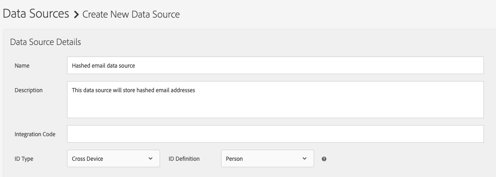
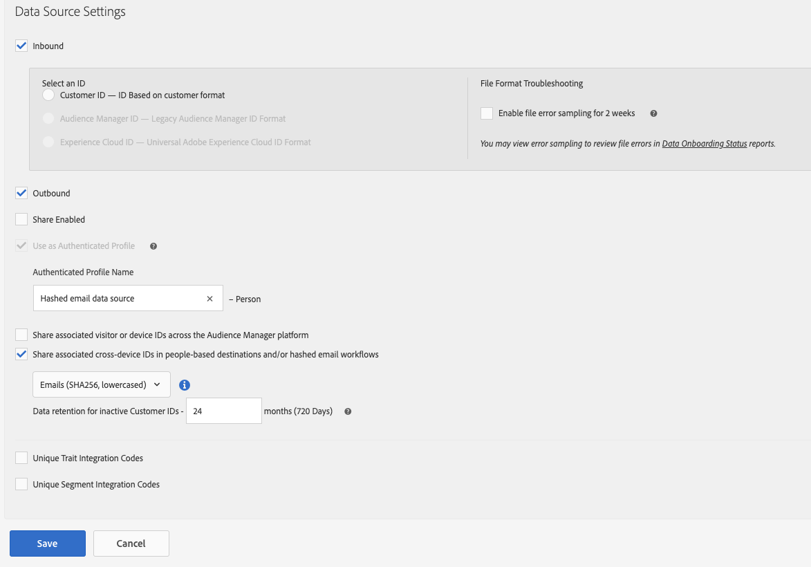

# Configure a data source for hashed email workflows

Hashed email workflows, such as People-Based Destinations, require you to create a data source to store the the hashed email addresses.

Follow the steps below to create and configure a data source for hashed emails.

1. Log in to your Audience Manager account and go to **[!UICONTROL Audience Data]** -> **[!UICONTROL Data Sources]**, and click **[!UICONTROL Add New]**.
1. Enter a **[!UICONTROL Name]** and **[!UICONTROL Description]** for your new data source.
1. In the **[!UICONTROL ID Type]** drop-down menu, select **[!UICONTROL Cross Device]**.

1. In the **[!UICONTROL Data Source Settings]** section, select both the **[!UICONTROL Inbound]** and **[!UICONTROL Outbound]** options, and enable the **[!UICONTROL Share associated cross-device IDs in people-based destinations]** option.
1. Use the drop-down menu to select the **[!UICONTROL Emails(SHA256, lowercased)]** label for this data source.

    >[!IMPORTANT]
    >
    >This option only labels the data source as containing data hashed with that specific algorithm. Audience Manager does not hash the data at this step. Make sure the email addresses that you plan on storing in this data source are already hashed with the [!DNL SHA256] algorithm. Otherwise, you won't be able to use it for hashed email workflows.

    

