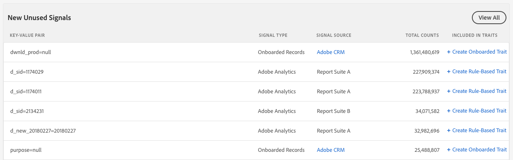

# Signals Dashboard {#signals-dashboard}

Get an overview of the unused signals received by Audience Manager in the past 7 days and identify potential new traits. Unused signals reach Audience Manager from your online properties, but are not used in any of your existing traits. To view the [!UICONTROL Signals Dashboard], go to [!UICONTROL Audience Data] > [!UICONTROL Signals]. The [!UICONTROL Signals Dashboard] shows you actionable insights based on your most active unused signals.

>[!IMPORTANT]
>
>The **[!UICONTROL Top Unused Signals]** and **[!UICONTROL New Unused Signals]** sections only display records with more than **100 occurrences/hour**. Signals below that threshold are included in [!UICONTROL Signals Search].

## Top Unused Signals {#top-unused-signals}

This section shows you the top 50 unused signals (both new and old) sent to [!DNL Audience Manager] in the past 7 days, based on their total count. Depending on the data [!DNL Audience Manager] receives, this table can include some or all of the entries in the **New Unused Signals** table.

## New Unused Signals {#new-unused-signals}

This section shows you the top 50 new unused signals received in the past 7 days.

## Saved Searches {#saved-searches}

[!DNL Audience Manager] shows all your [saved searches](../../features/data-explorer/data-explorer-signals-search/data-explorer-save-search.md) on the [!UICONTROL Dashboard] and reloads them every time you load the [!UICONTROL Dashboard].

Saved searches display the top 50 results for the corresponding criteria.