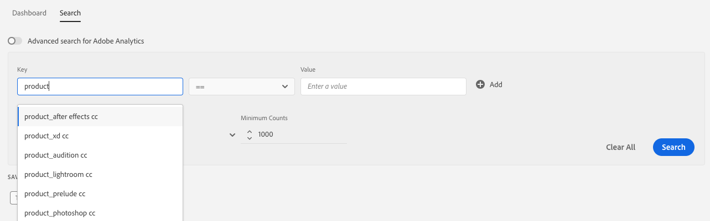

# Search Signals by Key-Value Pairs {#search-signals-by-key-value-pairs}

Search for one or multiple signals, based on their respective key-value pairs.
To search for more than one signal, click the  button. Enter the key-value pairs that you want to search for, then use the following filters to narrow down your results.

* **Signal status**: search for signals included in traits, unused signals, or both.
* **View records for**: select the time interval in which to search for received signals.
* **Minimum counts**: display only signals with the specified minimum total count in the selected interval.

>[!IMPORTANT]
>
>For a streamlined user experience, key-value pair search results are based on data sampling. See [Data Sampling and Error Rates](/help/using/reporting/report-sampling.md) for details on how [!DNL Audience Manager] uses data sampling and why slight result variations may appear when comparing key-value search to general searches.

When searching for signals using multiple key-value pairs, [!DNL Audience Manager] links the pairs using the logical **AND** operator. For instance, let's say you're performing a search with the following key-value pairs:

* [!DNL c_creative == "12345"]
* [!DNL c_product == "smartphone"]
* [!DNL c_location == "europe"]

This search will return only results that qualify for all three filters on the same call: `c_creative == "12345"` `AND` `c_product == "smartphone"` `AND` `c_location == "europe"`.

## Case Insensitivity and Search Auto-Completion {#section_122412F04E7047EF82679DD5A1E614FF}

The key and value search fields are case insensitive. The key search field includes auto-completed suggestions.

Let's say [!DNL Audience Manager] received the following signals:

* `productCategory == smartphone`
* `newProduct == iPhone`
* `PRODUCT == phone`
* `product == PHONE`

When you enter `product` in the key search field, you receive auto-completed suggestions for `productCategory`, `newProduct`, `PRODUCT`, and `product`.

Similarly, when you search for `product == phone`, [!UICONTROL Data Explorer] returns results for both `PRODUCT == phone` and `product == PHONE`.
Backfilled trait realizations are case insensitive. A trait containing the signal with the key-value pair `PRODUCT == SMARTPHONE` also qualifies the signal with the key-value pair `product == smartphone`.