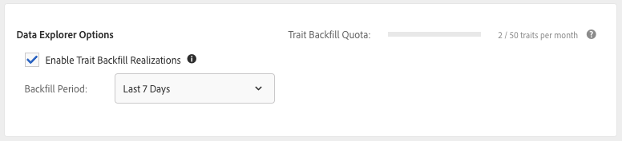
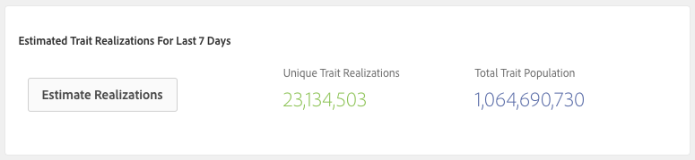

# Backfill Trait Realizations {#backfill-trait-realizations}

Backfill trait realizations to capture historical audiences and avoid loss of relevant data prior to a trait creation date.

>[!IMPORTANT]
>
> [!UICONTROL Data Explorer Trait Backfill] is a premium capability that enhances the Audience Manager experience by unlocking additional use cases. Backfill requires additional processing power and is available to all Audience Manager customers at an incremental cost. Please contact your Adobe sales representative for additional details.

When you create traits from unused signals, you can choose to backfill the trait realizations over a specific period of time. [!DNL Audience Manager] captures the historical data about audiences that qualify for the new trait and stores them on the corresponding profile. You can see the **[!UICONTROL Backfill Options]** in the [!UICONTROL Trait Expression] section of the **[Trait Builder](../../features/traits/about-trait-builder.md)**.

>[!NOTE]
>
>You can backfill trait realizations for rule-based and onboarded traits.

Here's how to backfill trait realizations:

1. Go to [!UICONTROL Audience Data > Signals > Search] amd run a Signals Search or use the [Signals Dashboard](../../features/data-explorer/data-explorer-signals-dashboard.md) to identify the signals to use in the new trait.
1. Create a new trait based on the desired signals.
1. Use the **[!UICONTROL Backfill Options]** in the **[!UICONTROL Trait Expression]** section to select the time interval for which you want to backfill trait realizations. Predefined backfill intervals include 1, 7, 14, and 30 days. You can also choose a custom date range of up to 30 days.
  
    

1. (Optional) Click **[!UICONTROL Estimate Realizations]** in the **[!UICONTROL Estimated Trait Realizations]** section to see the estimated [!UICONTROL Unique Trait Realizations] and [!UICONTROL Total Trait Population] values for the backfilled trait over the last 7 days.

   

    >[!IMPORTANT]
    >
    >Trait backfilling and estimation are not available for traits with expressions that use the following operators:
    >    * `!=`
    >    * `matchesregex`
    >    * `matcheswords`
1. Create the trait.

Once you finish creating the trait, you'll see its backfilled realizations included in the realization statistics.

Watch the video below for a video walkthrough of how to backfill traits.

>[!VIDEO](https://video.tv.adobe.com/v/25169/)

## Trait Backfilling Latency {#trait-backfilling-latency}

Newly created traits start capturing audiences two to three hours after creation. However, due to the large volume of data that [!DNL Audience Manager] performs on a daily basis, the backfilled population is not immediately reflected in the [!UICONTROL Unique Trait Realizations] and [!UICONTROL Total Trait Population] graphs.

Audience Manager updates the [!UICONTROL Trait Graph] with the backfilled population within 48 hours from trait creation.

## Trait Backfilling Limit {#trait-backfilling-limit}

[!UICONTROL Data Explorer] allows you to backfill up to 50 traits per month, with the backfill counter being reset on the 1 day of each month.

>[!NOTE]
>
>Trait backfilling quota does not carry over from previous months. E.g., if you backfill 30 traits this month, the trait backfill quota for the next month is reset to 50, not 70.

## Impact on Reporting {#reporting-impact}

Backfilled trait realizations are reflected in the [!UICONTROL Unique Trait Realizations] and [!UICONTROL Total Trait Population] metrics, as [!DNL Audience Manager] turns historical signals into trait realizations.

However, the [!UICONTROL Trait Graph], [!UICONTROL General Reports], and [!UICONTROL Trend Reports] are not updated retroactively with historical metrics backfilled before the trait creation date.