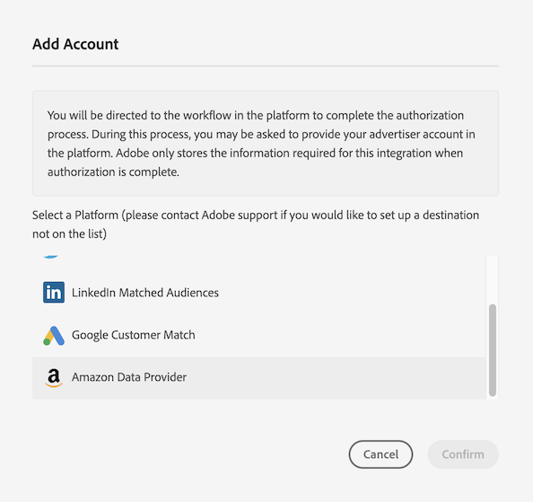
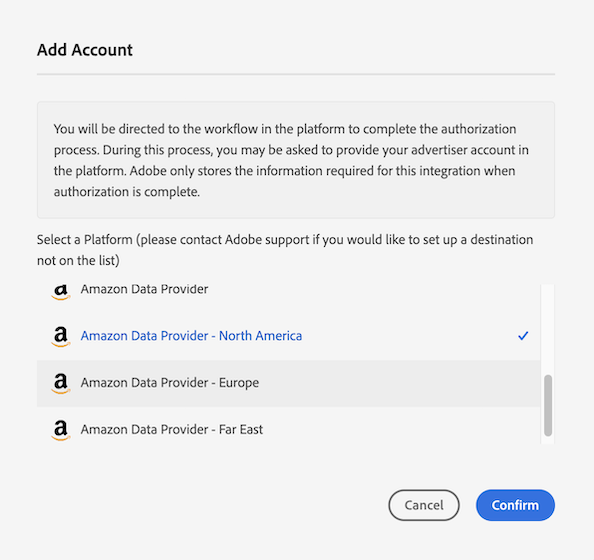
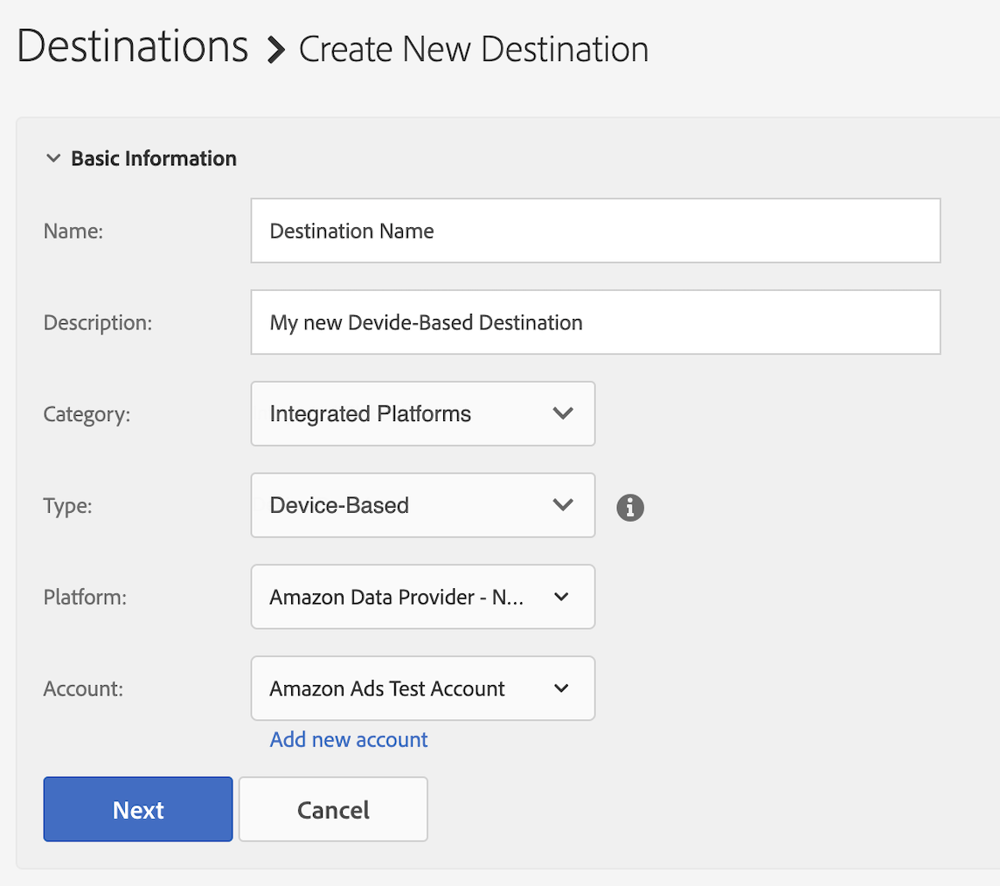

# Configure [!DNL Amazon Advertising] as a Self-Service Device-Based Destination {#configure-amazon}

This article explains how to configure an integration with [Amazon Advertising](https://advertising.amazon.com/API/docs/en-us).

## Prerequisites {#prerequisites}

Before you configure your [!DNL Amazon Advertising] destination, make sure you meet the following prerequisites.

* Your [!DNL Amazon] account must be eligible for advertising. 
* When creating the first [!DNL Amazon Advertising] destination in your Audience Manager instance, please contact Adobe Consulting or Customer Care to enable the [!DNL Amazon] ID synchronization (Data Source ID = 139200) for your account. This is required for the correct synchronization between Audience Manager and [!DNL Amazon].
* After the new data provider audiences are created, you should [update their metadata](https://advertising.amazon.com/API/docs/en-us/data-provider/openapi#tag/Metadata/paths/~1v2~1dp~1audiencemetadata~1%7BaudienceId%7D/put) and add the **[!DNL audience fees]**. For this operation you can use the [Amazon Ads API](https://advertising.amazon.com/API/docs/en-us/guides/onboarding/apply-for-access) or the [Amazon Advertising UI](https://advertising.amazon.com/).

## Add a New [!DNL Amazon Advertising] Destination {#add-new-amazon-destination}

This section describes the steps you need to follow when configuring a new device-based destination for [!DNL Amazon Advertising]. This scenario assumes that you have no existing [!DNL Amazon Advertising] destination configured via your Adobe consultant or Customer Care.

### Step 1. Authenticate with [!DNL Amazon Advertising] {#step1-authenticate-with-amazon}

Before you can add the device-based destination, you need to link Audience Manager and your [!DNL Amazon Advertising] account. Here's how to do this:

1. Log in to your Audience Manager account and go to **[!UICONTROL Administration > Integrated Accounts]**. If you have a previously configured integration with a destination platform, you should see it listed in this page. Otherwise, the page is empty.
1. Select **[!UICONTROL Add Account]**.
1. Select [!UICONTROL Amazon Data Provider].

   

1. Select one of the **[!UICONTROL Amazon Data Provider]** options depending on the region where your [!DNL Amazon Ads] account is created (North America, Europe or Far East)  and click **[!DNL Confirm]** to be redirected to the authentication page.

   

1. Once you've authenticated, you are redirected to Audience Manager where you should see your associated advertiser accounts. Select the advertiser account that you want to use and click **[!UICONTROL Confirm]**. By doing this you authorized access for Audience Manager to send updates for your audiences.

### Step 2. Create a New Device-Based Destination {#step2-create-new-destination}

After you have linked Audience Manager and your [!DNL Amazon Advertising] account, you can create the new destination. Here's how to do this:

>[!NOTE]
>
>You cannot change the name of an existing device-based destination. Make sure to provide a name that will help you identify the destination correctly.

1. Log in to your Audience Manager account, go to **[!UICONTROL Audience Data > Destinations]**, and select **[!UICONTROL Create Destination]**.
1. In the **[!UICONTROL Basic Information]** section, enter a **[!UICONTROL Name]** and **[!UICONTROL Description]** for your new destination, and use the settings below:
   
   

1. Select **[!UICONTROL Next]**.
1. Choose the [Data Export Labels](/help/using/features/data-export-controls.md#controls-labels) that you want to set for this destination.
1. Select **[!UICONTROL Save]**.
1. In the **[!UICONTROL Segment Mappings]** section, select the audience segments that you want to send to this destination.
1. Save the destination.

## Match Rates Considerations {#match-rates-considerations}

The integration between Audience Manager and [!DNL Amazon Advertising] supports historical audience backfills. All segment qualifications get sent to [!DNL Amazon] when you create the destination.

## Troubleshooting {#troubleshooting}

When configuring or sending data to the [!DNL Amazon Advertising] destination, you might run into the errors described below. This section explains what may cause the errors and how to fix them.

| Error message  | Occurrence / Reason  | Resolution |
|---|---|---|
| `Internal server error` | This error message is displayed in the Audience Manager UI when trying to add a new [!DNL Amazon] account using an outdated version of the Amazon API. | Contact Adobe Customer Care. |
| `Amazon Error: Account XXXXXXXXX was not found` | This error message is displayed in the Audience Manager UI when the credentials configured for the destination are not authorized to access the corresponding Amazon Ads account. | <ul><li>Make sure the account credentials that you are using meet the [prerequisites](#prerequisites).</li><li>Navigate to the Amazon Ads UI using the same credentials and check if the correct audiences are displayed under the corresponding account. </li></ul> |
