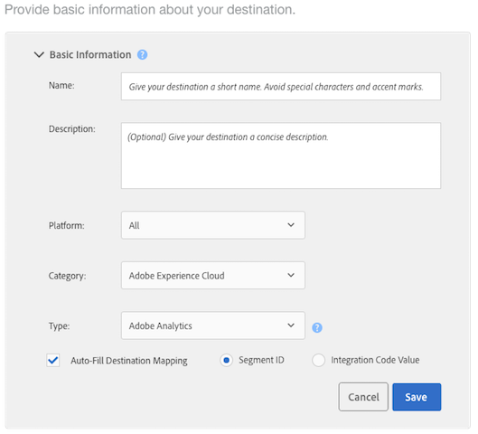
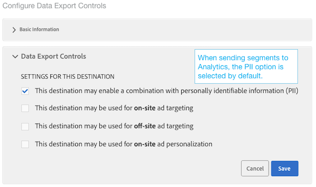
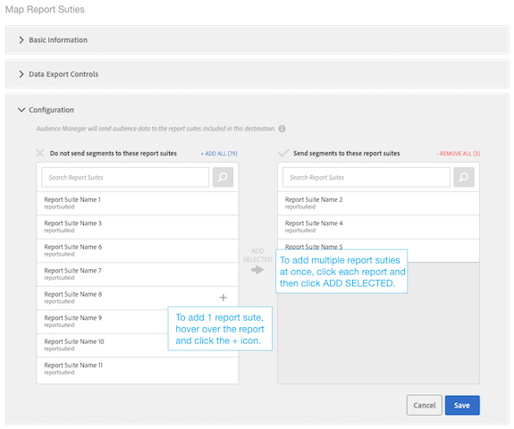
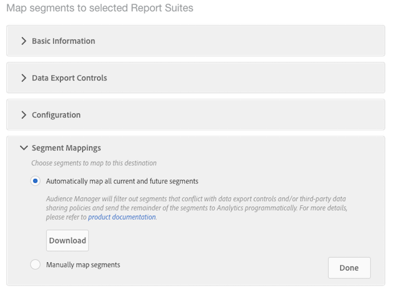

# Configure an Analytics Destination

## Requirements {#requirements}

To configure an Analytics destination, your Audience Manager user must have Admin permissions. See [Create Users](/help/using/features/administration/administration-overview.md#create-users) in the Administration Guide. Note that having the `CREATE_DESTINATIONS` [wildcard permission](/help/using/features/administration/administration-overview.md#wild-card-permissions) is not sufficient to create Analytics destinations.
For further requirements, see Prerequisites in [Audience Analytics](https://docs.adobe.com/content/help/en/analytics/integration/audience-analytics/mc-audiences-aam.html).

## Your Default Analytics Destination and New Analytics Destinations

|  Analytics Destination Type |  Description |
|---|---|
|  Default |  The name of this default destination is "Adobe Analytics," which you can edit. Mapped report suite IDs appear in folder storage for your Audience Manager traits and segments.  &nbsp; Audience Manager creates one destination automatically if your account has:  &nbsp; <ul><li>Met the requirements described in the [Audience Analytics](https://docs.adobe.com/content/help/en/analytics/integration/audience-analytics/mc-audiences-aam.html) documentation.</li><li>A [report suite](https://docs.adobe.com/content/help/en/analytics/admin/manage-report-suites/report-suites-admin.html) in Analytics.</li><li>[Mapped a report suite to an organization](https://docs.adobe.com/content/help/en/core-services/interface/about-core-services/report-suite-mapping.html).</li></ul>|
|  New | To create new Analytics destinations, go to Audience Data > Destinations > Create New Destination and follow the steps for each section described below. |

## Step 1: Provide Basic Information

This section contains fields and options that start the Analytics destination creation process. To complete this section:

1. Click **Basic Information** to expose the controls.
2. Name the destination. Avoid abbreviations and special characters.
3. *(Optional)* Describe the destination. A concise description is an effective way to define or provide more information about a destination.
4. *(Optional)* In the **Platform** list, leave the default set to **All**. Currently, these options don't do anything. They're designed to support features that may be added at a later date.
5. In the **Category** list, select **Adobe Experience Cloud**.
6. In the **Type** list, select **Adobe Analytics**.
7. Click **Save** to go to the Configuration settings or click **Data Export Labels** to apply export controls to the destination.

>[!NOTE]
>
>For an Analytics destination, the **Auto-fill Destination Mappping** check box and **Segment ID** option are selected by default. You cannot change these settings.

## Step 2: Configure Data Export Controls

This section contains options that apply [Data Export Controls](/help/using/features/data-export-controls.md) to an Analytics destination. Skip this step if you do not use data export controls. To complete this section:

1. Click **Data Export Controls** to expose the controls.
1. Select a label that corresponds to the data export control applied to the destination (see [Add Data Export Labels to a Destination](/help/using/features/destinations/add-data-export-labels.md) ). For Analytics destinations, the PII check box is selected by default.
1. Click **Save**.

## Step 3: Map Report Suites

The Configuration section lists your Analytics Report Suites that have been enabled for server-side forwarding. If you have multiple Analytics destinations, the report suites assigned to these destinations will be mutually exclusive and enforced by Audience Manager. To complete this section:

1. Click **Configuration** to expose the controls.
1. Select one (or more) report suites that you want to send segments to.
1. Click **Save**.

## Step 4: Segment Mappings

This section provides options that let you map segments automatically or manually.

|  Mapping Option |  Description |
|---|---|
|  Automatically map all current and future segments |  Selected by default, this feature sends all segments that a visitor qualifies for, on a per-hit basis, to Analytics.  &nbsp; If a visitor belongs to more than 150 Audience Manager segments on a single hit, only the 150-most recently qualified segments are sent to Analytics, while the remaining list is truncated. An additional flag is sent to Analytics signifying that the segment list was truncated. This action displays as “Audience limit reached” in the Audiences Name dimension and “1” in the Audiences ID dimension. See the [FAQ](https://docs.adobe.com/content/help/en/analytics/integration/audience-analytics/audience-analytics-workflow/mc-audiences-faqs.html) for details.  &nbsp; Also, this option affects destination availability in [Segment Builder](/help/using/features/segments/segment-builder.md). For example, if a segment is mapped automatically to an Analytics destination, that destination is not available for selection in the [destination mappings](/help/using/features/segments/segment-builder.md#segment-builder-controls-destinations) section of Segment Builder. The Analytics destination appears grayed-out and shows "Analytics" in the Type column of the Destination browser. |
|  Manually map segments | This option exposes search and browse controls that let you choose which segments you want to send to Analytics.  &nbsp; To search for a segment:  &nbsp; <ol><li>Type the segment name or ID in the search field.</li><li>Click <b>Add.</b></li><li>Continue to search and add segments or click <b>Done</b>.</li></ol> &nbsp; To browse for a segment: <ol><li>Click <b>Browse all segments</b>. This exposes a list of available segments.</li><li>From the list, select the check box of the segment you want to use and click <b>Add selected segments</b>.</li><li>Click <b>Save</b> in the Add Mappings window. You can't change the mappings, start, or end dates during the beta release.</li><li>Continue to browse and add segments or click <b>Done</b>.</li></ol>  |

## Next Steps

After you create and save a destination, you can work with that data in Analytics. However, it can take a few hours before data is available in your selected report suites. See [Use the Audience Data in Analytics](https://docs.adobe.com/content/help/en/analytics/integration/audience-analytics/audience-analytics-workflow/use-audience-data-analytics.html).
