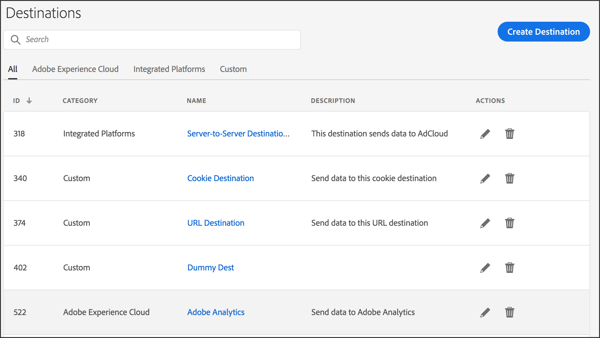

# Destinations Home Page {#destinations-home}

The [!UICONTROL Destination] landing page lists all of your [!DNL URL], cookie, and server-to-server destinations. It provides features that let you create, edit, search for, and report on destinations. The landing page is located in **[!UICONTROL Audience Data > Destinations]**. 

## Default Landing Page {#default-landing-page}

<!-- destinations-home.xml -->

The default landing page lists your destinations, based on type. You can filter the destinations by using the four available tabs:

* **All**: shows all types of destinations.
* **Adobe Experience Cloud**: shows destinations which send data to other Adobe Experience Cloud solutions. Currently, the only supported option is Adobe Analytics. See [Configure an Analytics Destination](/help/using/features/destinations/create-analytics-destination.md).
* **Integrated Platforms**: shows people-based and device-based destinations (also named server-to-server destinations).
* **Custom**: shows cookie and URL destinations. 

## Addressable Audiences Landing Page {#audiences-landing-page}

To see audience data and match rates for your server-to-server destination, select **[!UICONTROL Integrated Platforms > Device-Based]**.

For more information about the displayed information, see [Addressable Audiences Interface](/help/using/features/addressable-audiences.md#addressable-audience-interface).

