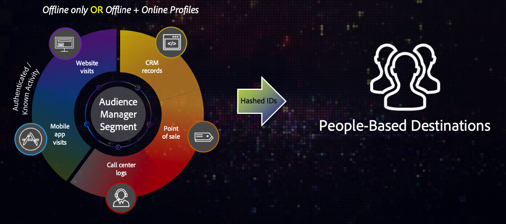
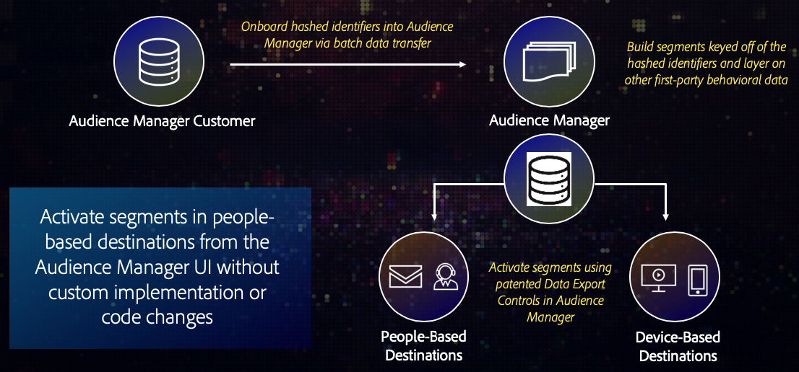

# Overview and Use Cases {#overview-use-cases}

Use [!DNL People-Based Destinations] to send first-party audience segments to people-based environments. These environments are closed ecosystems belonging to one entity that controls the content that is being displayed within it. They include social platforms such as [!DNL Facebook], and other platforms that rely on customer accounts to personalize the displayed content.

>[!IMPORTANT]
>This article contains product documentation meant to guide you through the setup and usage of this feature. Nothing contained herein is legal advice. Please consult your own legal counsel for legal guidance.

## Overview {#overview}

[!DNL People-Based Destinations] enable you to apply segmentation on online and offline data to create audience segments based on [hashed identifiers](people-based-destinations-prerequisites.md#hashing-requirements), such as email addresses. Then, you can send these segments to "walled gardens" such as [!DNL Facebook], where you can target your audience on the social platforms. [!DNL People-Based Destinations] can help you:

* Target offline and online audiences in platforms such as [!DNL Facebook], based on hashed email addresses;
* Complement existing device and cookie targeting capabilities of Audience Manager;
* Eliminate costs associated with third-party data onboarding solutions;
* Eliminate costs associated with developing custom data onboarding workflows;
* Target audiences in cookie-less environments;
* Target audiences by deduplicating hashed email addresses matched to customer IDs.

You can use [!DNL People-Based Destinations] to segment and target high value customers who may not visited your website, or stop targeting those who have already converted offline. Additionally, you can leverage [!DNL Profile Merge Rules] to combine your offline first-party data with your online first-party data, including customer data from other Adobe Experience Cloud solutions, to optimize your social media advertising efforts.

## Availability {#availability}

[!DNL People-Based Destinations] is a premium Audience Manager integration. Please contact your Adobe representative to take advantage of this premium feature.

## Why You Should Use [!UICONTROL People-Based Destinations] {#why-use}

**Provide your customers consistent cross-channel experiences by managing your entire audience segmentation from within Audience Manager.**

Not activating your audience segments in people-based channels through Audience Manager leads to disjointed experiences between what your customers see when visiting your website and what they see, for instance, in their [!DNL Facebook] feeds. Having a consistent targeting across channels can increase your ad revenue while optimizing your ad spending.

**Reach audiences in people-based channels without the need of a dedicated data onboarding solution or custom workflows to send audiences.**

The more "traditional" way of targeting audiences across people-based channels involves you having to export your customer data in a format accepted by the platform that you want to advertise on, and then using the platform's dedicated data onboarding method to bring your customer data to your advertiser account. This is all manual work that you need to do for each platform that you want to advertise on. Additionally, different platforms may have different data format requirements, making the process even more tedious.

Through [!DNL People-Based Destinations], Audience Manager helps you centralize your customer data, build audience segments, and activate them across multiple people-based channels. You can do this all from within the Audience Manager user interface, avoiding the additional work of manually uploading data to each platform, saving you valuable time in the process.

**Create and activate audience segments from purely offline profiles.**

[!DNL People-Based Destinations] solve the issue that previously, you could only activate audience segments based on device activity. With [!DNL People-Based Destinations], you can create segments from purely offline data from your own [!DNL CRM], and activate them in people-based platforms. Additionally, you can correlate your offline data with device data that you already have in Audience Manager.

**Leverage Audience Manager's data governance and privacy controls to safely handle customer data.**

[!DNL People-Based Destinations] requires that you only use irreversibly hashed identifiers. This reduces the risk associated with manually uploading customer data into each destination platform.

Watch the video below to get an overview of the data flow when using [!UICONTROL People-Based Destinations].

>[!VIDEO](https://video.tv.adobe.com/v/28968/)

## Use Cases {#use-cases}

To help you better understand how and when you should use [!DNL People-Based Destinations], here are two sample use cases that Audience Manager customers can solve by using this feature.

### Use Case #1 {#use-case-1}

An online retailer wants to reach existing customers through social platforms and show them personalized offers based on their previous orders. With [!DNL People-Based Destinations], the online retailer can ingest hashed email addresses from their own [!DNL CRM] to Audience Manager, build segments from their own offline data, and send these segments to the social platforms they want to advertise on, optimizing their advertising spending.

### Use Case #2 {#use-case-2}

An airline has different customer tiers (Bronze, Silver, and Gold), and wants to provide each of the tiers with personalized offers via social platforms. The company uses Audience Manager to analyze customer activity on the website. However, not all customers use the airline's mobile app, and some of them have not logged in to the company's website. The only identifiers the company has about these customers are membership IDs and email addresses.

To target them across social media and similar people-based channels, they can onboard the customer data from their [!DNL CRM] into Audience Manager, using the hashed email addresses as identifiers.

Next, they can combine their offline data with their existing online activity traits, to build new audience segments that they can target through [!DNL People-Based Destinations].
