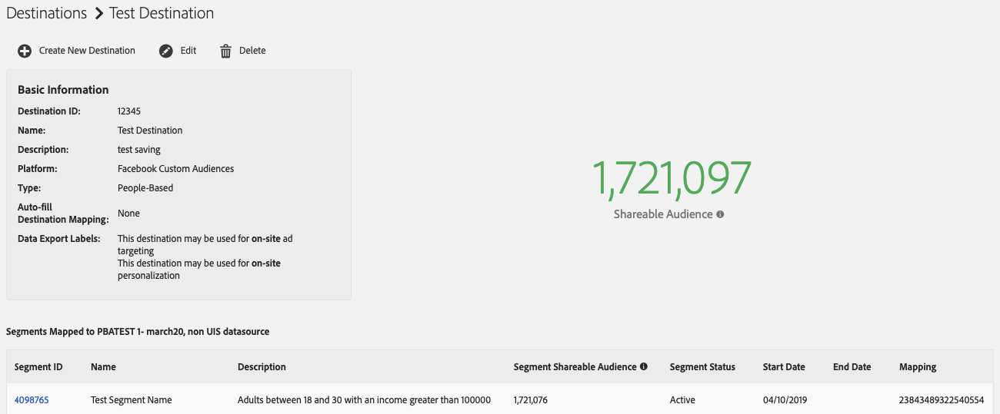
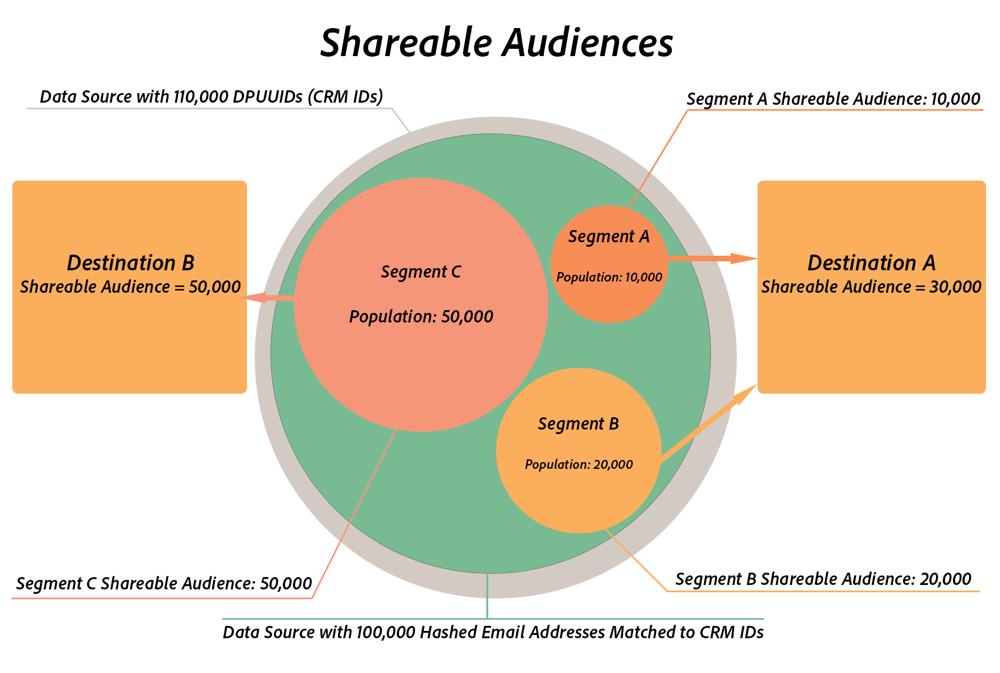

# Shareable Audiences {#shareable-audiences}

>[!IMPORTANT]
>This article contains product documentation meant to guide you through the setup and usage of this feature. Nothing contained herein is legal advice. Please consult your own legal counsel for legal guidance.

[!DNL People-Based Destinations] bring the notion of [!DNL Shareable Audiences] to Audience Manager. This metric helps you understand how many of the hashed email addresses Audience Manager can share with the destination platform.

[!DNL Shareable Audiences] is a metric that helps you interpret audience data in the context of [!DNL People-Based Destinations]. You can see this metric in the [!UICONTROL Destinations] page and in the [!UICONTROL Segment] page.

## Segment Shareable Audiences {#segment-shareable-audiences}

The [!DNL Segment Shareable Audience] metric in the segment page indicates the number of hashed email addresses from the data source with matching [DPUUIDs](../../reference/ids-in-aam.md), that also qualify for the defined segment in the given look-back period, given the profile merge rule applied on it, and that Audience Manager can share with the destination platform.

This metric has a 1 day look-back period. This helps you understand the audience reach for the segment in a specific destination.

## Destination Shareable Audience {#destination-shareable-audience}

The [!DNL Destination Shareable Audience] metric in a people-based destination page indicates the total number of hashed email addresses from the data source with matching [DPUUIDs](../../reference/ids-in-aam.md), that Audience Manager can share with the destination platform, from all segments mapped to that destination.

This metric has a lifetime look-back period. This helps you understand the scale of the audience you can reach from the hashed email addresses data source.

## Example

An Audience Manager customer has a data source with 110,000 [DPUUIDs](../../reference/ids-in-aam.md) (CRM IDs). They ingest 100,000 hashed email addresses into Audience Manager, to use them with multiple people-based destinations, and perform an ID sync for the 100,000 hashed email addresses against the CRM IDs. The customer may use the [!DNL All Cross-Device Profiles] merge rule to create three audience segments:

* Segment A with a population count of 10,000, mapped to Destination A;
* Segment B with a population count of 20,000, mapped to Destination A;
* Segment C with a population count of 50,000, mapped to Destination B.

In this scenario:

* Segment A Shareable Audience = 10,000;
* Segment B Shareable Audience = 20,000;
* Segment C Shareable Audience = 50,000;
* Destination A Shareable Audience = Segment A Shareable Audience + Segment B Shareable Audience = 30,000;
* Destination B Shareable Audience = Segment C Shareable Audience = 50,000.

>[!NOTE]
>
>In the example above, it does not mean that all the 80,000 hashed email addresses from the three segments match existing accounts in the destination platforms. It only means that Audience Manager sends the hashed identifiers from the three segments to their respective destinations. When sending audience segments to people-based destinations, audience matching happens on the partner side. Destination A may have up to 30,000 matching user accounts, whereas Destination B may have up to 50,000 matching user accounts, but there is no guarantee of match rates. Adobe does not have access to partner-specific metrics. See [Match Rates](../../faq/faq-people-based-destinations.md#match-rates) for frequently asked questions about People-Based Destinations visibility in match rates.
