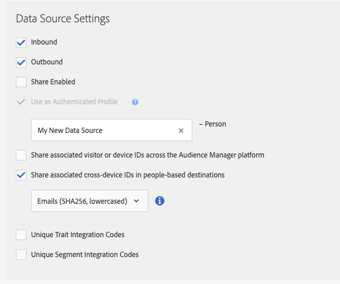
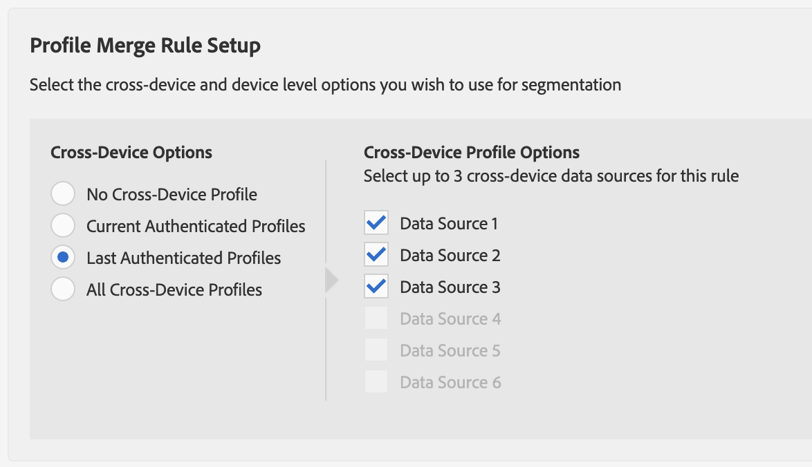
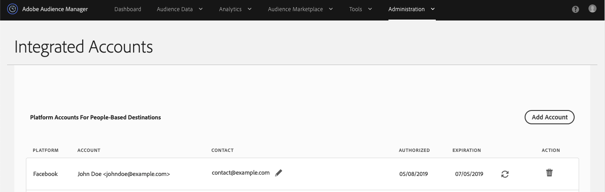
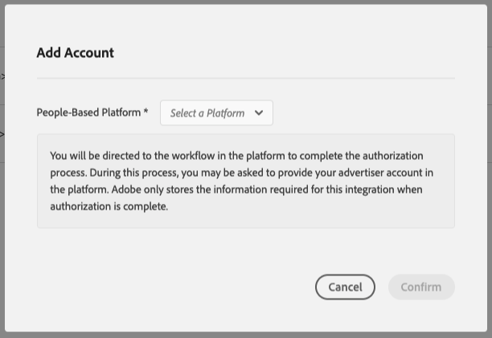
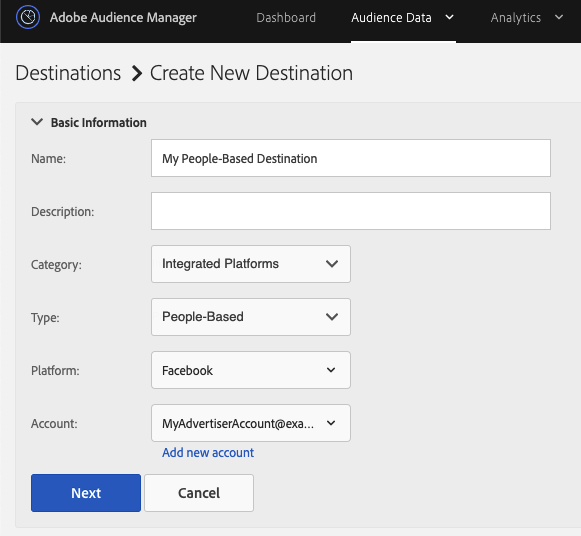

# Workflow C - Personalization Based on Authenticated Activity Combined with Offline Data {#workflow-c}

This page includes step-by-step guidance on how to combine offline [!DNL CRM] data with real-time behavioral data for authenticated users to create audience segments, then send these audience segments to [!DNL People-Based Destinations].

## Step 1 - Configure Data Source Settings {#configure-data-source-settings}

Depending on whether your [DPUUIDs](../../reference/ids-in-aam.md) are lowercase, hashed email addresses, you might need to configure the data source that will store the hashed email addresses.

&nbsp;

**Scenario 1: your [DPUUIDs](../../reference/ids-in-aam.md) are already lowercase, hashed email addresses.**

In this case, skip to [Step 5 - Configure People-Based Platform Authentication](#configure-authentication).

&nbsp;

**Scenario 2: your [DPUUIDs](../../reference/ids-in-aam.md) are not lowercase, hashed email addresses.**

In this case, you need to create a new cross-device data source that will store your hashed email addresses. Here's how to do this:

1. Log in to your Audience Manager account and go to **[!UICONTROL Audience Data]** -> **[!UICONTROL Data Sources]**, and click **[!UICONTROL Add New]**.
1. Enter a **[!UICONTROL Name]** and **[!UICONTROL Description]** for your new data source.
1. In the **[!UICONTROL ID Type]** drop-down menu, select **[!UICONTROL Cross Device]**.
1. In the **[!UICONTROL Data Source Settings]** section, select both the **[!UICONTROL Inbound]** and **[!UICONTROL Outbound]** options, and enable the **[!UICONTROL Share associated cross-device IDs in people-based destinations]** option.
1. Use the drop-down menu to select the **[!UICONTROL Emails(SHA256, lowercased)]** label for this data source.
    >[!IMPORTANT]
    >
    >This option only labels the data source as containing data hashed with that specific algorithm. Audience Manager does not hash the data at this step. Make sure the email addresses that you plan on storing in this data source are already hashed with the [!DNL SHA256] algorithm. Otherwise, you won't be able to use it for [!DNL People-Based Destinations].

    

    >[!NOTE]
    >
    > See [Data Onboarding](people-based-destinations-prerequisites.md#data-onboarding) for frequently asked questions about how you should bring your offline data into Audience Manager for People-Based Destinations.

## Step 2 - Use Declared IDs to Match DPUUIDs to Hashed Email Addresses via Real Time HTTP Calls {#match-email-addresses}

To qualify authenticated users for rule-based traits, you need to send the trait qualification through [declared IDs](../declared-ids.md).

### Example

Let's say you have created the following two data sources.

| Data source ID | Data source contents       |
| -------------- | -------------------------- |
| 999999         | Existing DPUUIDs (CRM IDs) |
| 987654         | Hashed email addresses     |

&nbsp;

Then, you want to qualify the CRM IDs below for the trait in the table.

| DPUUID (CRM ID)                        | Email address         | Hashed email address                                             | Trait         |
| -------------------------------------- | --------------------- | ---------------------------------------------------------------- | ------------- |
| 68079982765673198504052656074456196039 | `johndoe@example.com` | 55e79200c1635b37ad31a378c39feb12f120f116625093a19bc32fff15041149 | location = US |

&nbsp;

Your declared ID should follow this syntax:

`https://yourDomain.demdex.net/event?d_cid_ic=HashedEmailDataSourceIntegrationCode%01myHashedEmail&d_cid_ic=CRMDataSourceIntegrationCode%01myCRMID&key=value`

&nbsp;

In the example above, the declared ID call should look like this:

`https://yourDomain.demdex.net/event?d_cid_ic=MyHashedEmailDataSource%0155e79200c1635b37ad31a378c39feb12f120f116625093a19bc32fff15041149&d_cid_ic=MyCRMDataSource%0168079982765673198504052656074456196039&location=US`

## Step 3 - Create a Profile Merge Rule for Segmentation {#create-profile-merge-rule-segmentation}

The next step is creating a new merge rule that will help you create the audience segments to send to your [!DNL People-Based Destinations].

>[!IMPORTANT]
>
>If you already have a rule defined with the **[!UICONTROL Current Authenticated Profiles]** or **[!UICONTROL Last Authenticated Profiles]** options, you can skip to [Step 4 - Create Audience Segments](#create-audience-segments).

1. Log in to your Audience Manager account and go to **[!UICONTROL Audience Data]** -> **[!UICONTROL Profile Merge Rules]**.
2. Click **[!UICONTROL Add New Rule]**.
3. Enter a profile merge rule **[!UICONTROL Name]** and **[!UICONTROL Description]**.
4. In the **[!UICONTROL Profile Merge Rule Setup]** section, select the **[!UICONTROL Current Authenticated Profiles]** or **[!UICONTROL Last Authenticated Profiles]** rule from the **[!UICONTROL Cross-Device Options]** list.
5. In the **[!UICONTROL Cross-Device Profile Options]** list, select the data sources that you want to run the segmentation on. These should be the data sources containing your existing DPUUIDs.
    

## Step 4 - Create Audience Segments {#create-audience-segments}

To create new segments, use the [Segment Builder](../segments/segment-builder.md). If you have existing audience segments that you want to send to [!DNL People-Based Destinations], skip to [Step 5 - Configure People-Based Platform Authentication](#configure-authentication).

## Step 5 - Configure People-Based Platform Authentication {#configure-authentication}

1. Log in to your Audience Manager account and go to **[!UICONTROL Administration]** > **[!UICONTROL Integrated Accounts]**. If you have a previously configured integration with a social platform, you should see it listed in this page. Otherwise, the page is empty.
    
2. Click **[!UICONTROL Add Account]**.
3. Use the **[!UICONTROL People-Based Platform]** drop-down menu to select the platform that you want to configure the integration with.
    
4. Click **[!UICONTROL Confirm]** to be redirected to the authentication page of the selected platform.
5. Once you've authenticated to your social platform account, you are redirected to Audience Manager where you should see your associated advertiser accounts. Select the advertiser account that you want to use and click **[!UICONTROL Confirm]**.
6. Audience Manager displays a notification at the top of the page to let you know whether the account was successfully added. The notification also allows you to add a contact email address to receive notifications when the social platform authentication is about to expire.

>[!IMPORTANT]
>
>Audience Manager handles the integration with social platforms through authentication tokens that expire after a certain amount of time. See Authentication Token Renewal for details on how to renew the expired tokens.

## Step 6 - Create a People-Based Destination {#create-destination}

1. Log in to your Audience Manager account, go to **[!UICONTROL Audience Data]** > **[!UICONTROL Destinations]**, and click **[!UICONTROL Create Destination]**.
1. In the **[!UICONTROL Basic Information]** section, enter a **[!UICONTROL Name]** and **[!UICONTROL Description]** for your new data source, and use the following settings:
    * **[!UICONTROL Category]**: Integrated Platforms;
    * **[!UICONTROL Type]**: People-Based;
    * **[!UICONTROL Platform]**: select the people-based platform that you want to send audience segments to;
    * **[!UICONTROL Account]**: select the desired advertiser account associated with the selected platform.
    
1. Click **[!UICONTROL Next]**.
1. Choose the **[!UICONTROL Data Export Labels]** that you want to set for this destination.
1. In the **[!UICONTROL Configuration]** section, select the data source that contains your hashed data sources.
1. In the **[!UICONTROL Segment Mappings]** section, select the segments that you want to send to this destination. This would be the segments that you created at [Step 4 - Create Audience Segments](#create-audience-segments).
1. Save the destination.
