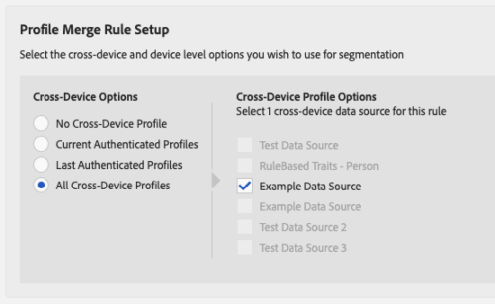

# Workflow B - Personalization Based on Offline-Only Data {#workflow-b}

This page includes step-by-step guidance on how to build audience segments from offline-only customer data, and send them to People-Based Destinations.

## Step 1 - Onboard Offline Traits {#step-1-onboard-traits}

The first step creating audience segments in this scenario is to bring your offline customer data into Audience Manager.

>[!IMPORTANT]
>
> Before continuing, make sure that the customer activity that you are about to onboard is already defined in Audience Manager with corresponding [onboarded traits](../traits/trait-qualification-reference.md).

Regardless of whether your existing Audience Manager customer IDs ([DPUUIDs](../../reference/ids-in-aam.md)) are hashed emails or not, you must perform the trait onboarding against the data source that contains your [DPUUIDs](../../reference/ids-in-aam.md).

### Example

You want to qualify the customer IDs from the table below for the corresponding onboarded trait IDs. Let's consider that your [DPUUIDs](../../reference/ids-in-aam.md) are stored in a data source with the ID 999999, and your Audience Manager Partner ID is 123.

|Customer ID (DPUUID)| Onboarded Trait ID |
|-|-|
|68079982765673198504052656074456196039|12345, 23456 |
|67412682083411995725538770443620307584 |45678|
|89159024796760343733111707646026765593 |11223, 93342, 27341|

To qualify the customer IDs in the example above for the corresponding onboarded traits, you must upload an [inbound data file](../../integration/sending-audience-data/batch-data-transfer-explained/inbound-file-contents.md) with the following contents:

```
68079982765673198504052656074456196039<TAB>d_sid=12345,d_sid=23456
67412682083411995725538770443620307584<TAB>d_sid=45678
89159024796760343733111707646026765593<TAB>d_sid=11223,d_sid=93342,d_sid=27341
```

The file name would look like this: `ftp_dpm_999999_123_TIMESTAMP.sync.gz`.
See [Amazon S3 Name and File Size Requirements for Inbound Data Files](../../integration/sending-audience-data/batch-data-transfer-explained/inbound-s3-filenames.md) for detailed information on the file name structure.

## Step 2 - Configure Data Source Settings {#configure-data-source-settings}

Depending on whether your [DPUUIDs](../../reference/ids-in-aam.md) are lowercase, hashed email addresses, you might need to configure the data source that will store the hashed email addresses.

**Scenario 1: your [DPUUIDs](../../reference/ids-in-aam.md) are already lowercase, hashed email addresses.**

In this case, you need to need to label the corresponding data source as such:

1. Go to **[!UICONTROL Audience Data]** -> **[!UICONTROL Data Sources]**.
1. Find the data source that contains your [DPUUIDs](../../reference/ids-in-aam.md), and click it.
1. Make sure the option **[!UICONTROL Cannot be tied to personally identifiable information]** is unchecked.
1. Save the data source settings.

**Scenario 2: your [DPUUIDs](../../reference/ids-in-aam.md) are not lowercase, hashed email addresses.**

In this case, you need to create a new cross-device data source that will store your hashed email addresses. Here's how to do this:

1. Log in to your Audience Manager account and go to **[!UICONTROL Audience Data]** -> **[!UICONTROL Data Sources]**, and click **[!UICONTROL Add New]**.
1. Enter a **[!UICONTROL Name]** and **[!UICONTROL Description]** for your new data source.
1. In the **[!UICONTROL ID Type]** drop-down menu, select **[!UICONTROL Cross Device]**.
1. In the **[!UICONTROL Data Source Settings]** section, select both the **[!UICONTROL Inbound]** and **[!UICONTROL Outbound]** options, and enable the **[!UICONTROL Share associated cross-device IDs in people-based destinations]** option.
1. Use the drop-down menu to select the **[!UICONTROL Emails(SHA256, lowercased)]** label for this data source.
    >[!IMPORTANT]
    >
    >This option only labels the data source as containing data hashed with that specific algorithm. Audience Manager does not hash the data at this step. Make sure the email addresses that you plan on storing in this data source are already hashed with the [!DNL SHA256] algorithm. Otherwise, you won't be able to use it for [!DNL People-Based Destinations].

    

    >[!NOTE]
    >
    > See [Data Onboarding](people-based-destinations-prerequisites.md#data-onboarding) for frequently asked questions about how you should bring your offline data into Audience Manager for People-Based Destinations.

## Step 3 - Match DPUUIDs to Hashed Email Addresses via File-Based ID Synchronization {#match-ids-emails}

>[!IMPORTANT]
>
> This step only applies to [Scenario 2](people-based-destinations-workflow-offline.md#configure-data-source-settings) described above. If your existing [DPUUIDs](../../reference/ids-in-aam.md) are already hashed email addresses, skip to [Step 4 - Create a Profile Merge Rule for Segmentation](#create-profile-merge-rule).

Let's say you want to match your existing [DPUUIDs](../../reference/ids-in-aam.md) from the example at Step 1 to the hashed email addresses from the table below (right column), and store the hashed email addresses in the new data source that you created at [Step 2 - Configure Data Source Settings](#configure-data-source-settings).

As a reminder, you would now have two data sources:

|Data source ID |Data source contents |
|-|-|
|999999|Existing DPUUIDs (CRM IDs)|
|987654|Hashed email addresses|

|DPUUIDs (CRM IDs)|Email address|Hashed email address|
|-|-|-|
|68079982765673198504052656074456196039 |johndoe@example.com |55e79200c1635b37ad31a378c39feb12f120f116625093a19bc32fff15041149|
|67412682083411995725538770443620307584 |janedoe@email.com|16d72e3edbeb089b299e0d12fc09522fdc5ece2d11dcb1304ecdd6fab4f7193a|
|89159024796760343733111707646026765593 |name@mydomain.com|feec5debcea411f54462a345a0d90c9975415d2d4862745ff8af00c49b6b4ae6|

Your [ID synchronization file](../../integration/sending-audience-data/batch-data-transfer-explained/id-sync-file-based.md) would have the following contents:

```
68079982765673198504052656074456196039<TAB>55e79200c1635b37ad31a378c39feb12f120f116625093a19bc32fff15041149
67412682083411995725538770443620307584<TAB>16d72e3edbeb089b299e0d12fc09522fdc5ece2d11dcb1304ecdd6fab4f7193a
89159024796760343733111707646026765593<TAB>feec5debcea411f54462a345a0d90c9975415d2d4862745ff8af00c49b6b4ae6
```

The [ID synchronization file](../../integration/sending-audience-data/batch-data-transfer-explained/id-sync-file-based.md) must follow this naming structure:

`c2c_id_<DPUUID_DATA_SOURCE_ID>_<HASHED_EMAIL_DATA_SOURCE_ID>_TIMESTAMP.sync`

In the example above, the file name would look like this: `c2c_id_999999_987654_1560431657.sync`

[Download example file here](https://marketing.adobe.com/resources/help/en_US/aam/downloads/c2c_id_999999_987654_1560431657.sync).

## Step 4 - Create a Profile Merge Rule for Segmentation {#create-profile-merge-rule}

The next step is creating a new merge rule that will help you create the audience segments to send to your [!DNL People-Based Destinations].

1. Log in to your Audience Manager account and go to **[!UICONTROL Audience Data]** -> **[!UICONTROL Profile Merge Rules]**.
2. Click [!UICONTROL Add New Rule].
3. Enter a profile merge rule **[!UICONTROL Name]** and **[!UICONTROL Description]**.
4. In the **[!UICONTROL Profile Merge Rule Setup]** section, select the **[!UICONTROL All Cross-Device Profiles]** rule from the **[!UICONTROL Cross-Device Options]** list.
5. In the **[!UICONTROL Cross-Device Profile Options]** list, select the data source that your traits are onboarded against.
    

## Step 5 - Create Audience Segments {#create-audience-segments}

To create new segments from offline-only data, use the [Segment Builder](../segments/segment-builder.md) and make sure you use the new profile merge rule that you created in the previous step when creating the segment.

## Step 6 - Configure People-Based Platform Authentication {#configure-authentication}

1. Log in to your Audience Manager account and go to **[!UICONTROL Administration]** > **[!UICONTROL Integrated Accounts]**. If you have a previously configured integration with a social platform, you should see it listed in this page. Otherwise, the page is empty.
    
1. Click **[!UICONTROL Add Account]**.
1. Use the **[!UICONTROL People-Based Platform]** drop-down menu to select the platform that you want to configure the integration with.
    
1. Click **[!UICONTROL Confirm]** to be redirected to the authentication page of the selected platform.
1. Once you've authenticated to your social platform account, you are redirected to Audience Manager where you should see your associated advertiser accounts. Select the advertiser account that you want to use and click **[!UICONTROL Confirm]**.
1. Audience Manager displays a notification at the top of the page to let you know whether the account was successfully added. The notification also allows you to add a contact email address to receive notifications when the social platform authentication is about to expire.

>[!IMPORTANT]
>
>A udience Manager handles the integration with social platforms through authentication tokens that expire after a certain amount of time. See Authentication Token Renewal for details on how to renew the expired tokens.

## Step 7 - Create a People-Based Destination {#create-destination}

1. Log in to your Audience Manager account, go to **[!UICONTROL Audience Data]** > **[!UICONTROL Destinations]**, and click **[!UICONTROL Create Destination]**.
1. In the **[!UICONTROL Basic Information]** section, enter a **[!UICONTROL Name]** and **[!UICONTROL Description]** for your new data source, and use the following settings:
    * **[!UICONTROL Category]**: Integrated Platforms;
    * **[!UICONTROL Type]**: People-Based;
    * **[!UICONTROL Platform]**: select the people-based platform that you want to send audience segments to;
    * **[!UICONTROL Account]**: select the desired advertiser account associated with the selected platform.
    
1. Click **[!UICONTROL Next]**.
1. Choose the **[!UICONTROL Data Export Labels]** that you want to set for this destination.
1. In the **[!UICONTROL Configuration]** section, select the data source that contains your hashed data sources.
1. In the **[!UICONTROL Segment Mappings]** section, select the segments that you want to send to this destination. This would be the segments that you created at [Step 5 - Create Audience Segments](people-based-destinations-workflow-offline.md#create-audience-segments).
1. Save the destination.
