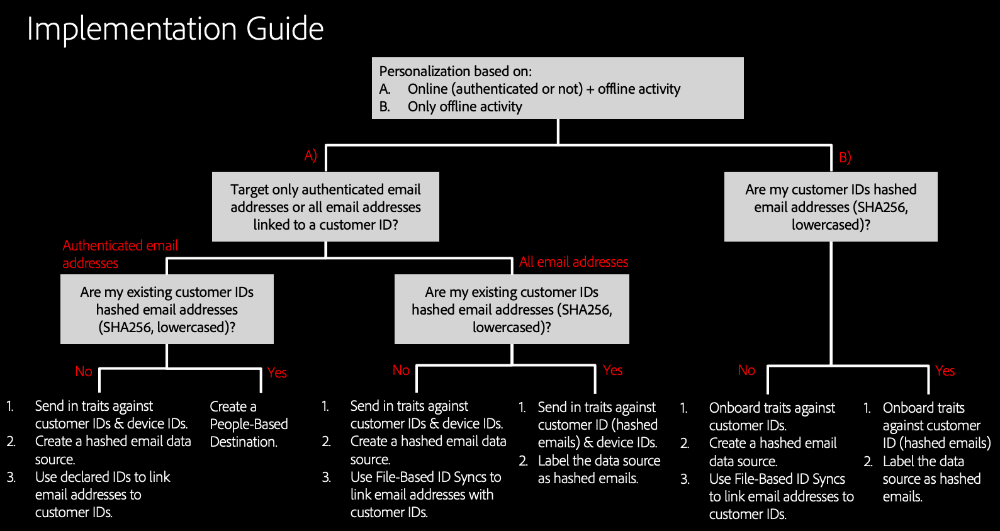

# Implementation Guidance {implementation-guidance}

[!DNL People-Based Destinations] offers multiple implementation strategies, depending on how your customer data is structured. This article provides an overview of the implementation steps that you need to follow for [!DNL People-Based Destinations], depending on your scenario.

## Overview {overview}

The configuration of [!DNL People-Based Destinations] takes you through multiple sections of Audience Manager and requires different settings and data onboarding methods, depending on what kind of customer data you already have in Audience Manager, and what kind of audience targeting you want to perform.

>[!IMPORTANT]
> Before configuring [!DNL People-Based Destinations], make sure to read this article carefully and completely. After reading this guide, you should have a clear understanding of the scenario that you will be enabling through [!DNL People-Based Destinations].

There are six implementation aspects that you need to clarify before using [!DNL People-Based Destinations]. This article will help you understand what your current configuration is, so that you can correctly follow the implementation steps for your scenario.

## 1. Defining Your Use Case {defining-your-use-case}

Before your begin implementing [!DNL People-Based Destinations], you need to clearly define the use case that you will be using this feature for. You can use [!DNL People-Based Destinations] to target audiences in two ways, based on audience activity:

**A) Audience targeting based on combined online and offline user activity**. In this scenario, you want to combine existing audience data from Audience Manager with data from your internal [!DNL CRM] system, and send the resulting audience segments to [!DNL People-Based Destinations]. Here's an example that illustrates this scenario:

Your company, an airline, has different customer tiers (Bronze, Silver, and Gold), and you want to provide each of the tiers with personalized offers via social platforms. You use Audience Manager to analyze customer activity on your website. However, not all customers use the airline's mobile app, and some of them never even logged in to the company's website. Your customer data is mostly limited to membership IDs and email addresses.

To target them across social media and similar people-based channels, you can bring the [hashed email addresses](people-based-destinations-prerequisites.md) into Audience Manager and combine them with existing online activity traits, to build new audience segments. Next, you can use those segments to target your audience through [!DNL People-Based Destinations].

**B) Audience targeting based exclusively on offline user activity**. In this scenario, your [!DNL CRM] system contains customer email addresses and other customer attributes, but customers have not interacted with your website at all, so you don't have any customer activity in Audience Manager. Here's an example that illustrates this scenario:

Your company, a telecom services provider, keeps customer data like email addresses and purchased telecom plans in an internal [!DNL CRM]. You want to target existing customers in social platforms to offer them upgrade packages based on their existing subscriptions. To do this, you can ingest hashed customer email addresses into Audience Manager, and create segments based on the existing customer subscriptions. Then, you can send these segments to [!DNL People-Based Destinations] to target your customers with personalized offers.

## 2. Define the Type of Targeted Email Addresses {define-target-email}

The second step in defining your implementation strategy is deciding what type of customer email addresses you want to target.

**A) Audience targeting based on authenticated email addresses**. In this scenario, your users have multiple accounts associated with multiple email addresses, and you want to target them with personalized offers, based only on the email address that they authenticate on your website, in real time.

**B) Audience targeting based on all associated email addresses**. In this scenario, your users have multiple accounts associated with multiple email addresses, and you want to target them across all of their associated email addresses, regardless of authenticated activity.

## 3. Identify the Type of Customer IDs (CRM IDs) That You Have {identify-customer-id}

Targeting audiences in [!DNL People-Based Destinations] requires you to send [SHA256 hashed](people-based-destinations-prerequisites.md) versions of your customer email addresses. Depending on your existing Audience Manager configuration, you may find yourself in one of the following two scenarios:

**A) Your Audience Manager customer IDs ([DPUUIDs](../../reference/ids-in-aam.md)) are already lowercase, hashed email addresses**. In this scenario, you can use these existing IDs to target your audiences in [!DNL People-Based Destinations].

**B) Your Audience Manager customer IDs ([DPUUIDs](../../reference/ids-in-aam.md)) are not lowercase, hashed email addresses**. In this scenario, your existing customer IDs cannot be sent to [!DNL People-Based Destinations]. To use [!DNL People-Based Destinations], you need to perform an ID synchronization between your existing customer IDs and lowercase, hashed versions of your customer email addresses. You do this either through [file-based ID synchronization](../../integration/sending-audience-data/batch-data-transfer-explained/id-sync-file-based.md) or by using [declared IDs](../declared-ids.md).

## 4. Trait Qualification {trait-qualification}

To accurately target your audience in [!DNL People-Based Destinations], your users need to qualify for either rule-based or onboarded traits, depending on the type of audience targeting that you want to perform.

**A) Qualify customer IDs and device IDs in real time for rule-based traits**. This option applies to use case A from [1. Defining Your Use Case](people-based-destinations-workflow.md#defining-your-use-case). If your plan is to target audiences based on online and offline activity, then you most likely are already qualifying your audience for [rule-based traits](../traits/trait-qualification-reference.md).

**B) Onboard traits against customer IDs via inbound data files**. This option applies to use case B from [1. Defining Your Use Case](people-based-destinations-workflow.md#defining-your-use-case). When targeting your audience based on purely offline activity, you need to qualify customer IDs for onboarded traits through [inbound data files](../../integration/sending-audience-data/batch-data-transfer-explained/inbound-file-contents.md).

## 5. Create or Label Data Sources and Onboard Hashed Email Addresses {create-label-data-sources}

Depending on the type of customer IDs that you have in Audience Manager (see [3. Identify the Type of Customer IDs (CRM IDs) That You Have](people-based-destinations-workflow.md#identify-customer-id), you will find yourself in one of the following scenarios:

**A) Label an existing data source**. This option applies to the scenario where your Audience Manager customer IDs ([DPUUIDs](../../reference/ids-in-aam.md)) are already lowercase, hashed email addresses. In this situation, what you need to do is label the data source that you store the IDs in as a [!DNL PII] data source. See [Data Source Settings](../datasources-list-and-settings.md) for details on the data source settings. What you need to do is make sure the Cannot be tied to personally identifiable information option is unchecked.

**B) Create a new data source**. This option applies to the scenario where your Audience Manager customer IDs ([DPUUIDs](../../reference/ids-in-aam.md)) are not hashed email addresses. In this case, you need to create a new cross-device data source and onboard the hashed email addresses against it. You can do this in two ways:

* Use file-based ID synchronization. See [Name and Content Requirements for ID Synchronization Files](../../integration/sending-audience-data/batch-data-transfer-explained/id-sync-file-based.md) for details on what ID synchronization files should look like. When using this method, you can target all of the hashed email addresses from your [!DNL CRM] database.
* Use [declared IDs](../declared-ids.md) to declare hashed email addresses when passing in authenticated customer IDs. When using this method, Audience Manager only targets the hashed email addresses from users who have authenticated online. The email addresses targeted through Facebook are only the ones in the declared ID event calls. Other email addresses associated with the customer ID are not activated in real-time.

## 6. Use a Profile Merge Rule for Segmentation {use-profile-merge-rules}

Depending on your use case (see [1. Defining Your Use Case](people-based-destinations-workflow.md#defining-your-use-case)), there are two ways to use [!DNL Profile Merge Rules] for segmentation.

**A) Use existing [!DNL Profile Merge Rules]**. This option applies to the first use case (audience targeting based on combined online and offline user activity). In this scenario, you have existing customer activity in Audience Manager and have already defined at least one Profile Merge Rule that you have used in segmentation. In this case, you don't need to create any new [!DNL Profile Merge Rules].

**B) Create a new, [!DNL All Cross-Device Profiles] Merge Rule**. This option applies to the second use case (audience targeting based exclusively on offline user activity). In this scenario you are bringing offline customer data from your [!DNL CRM] into Audience Manager, and want to create segments from that data. To do this, [!DNL People-Based Destinations] introduces a new, fourth Profile Merge Rule, called **[!DNL All Cross-Device Profiles]**. This is the rule that you need to use when segmenting purely offline data.
