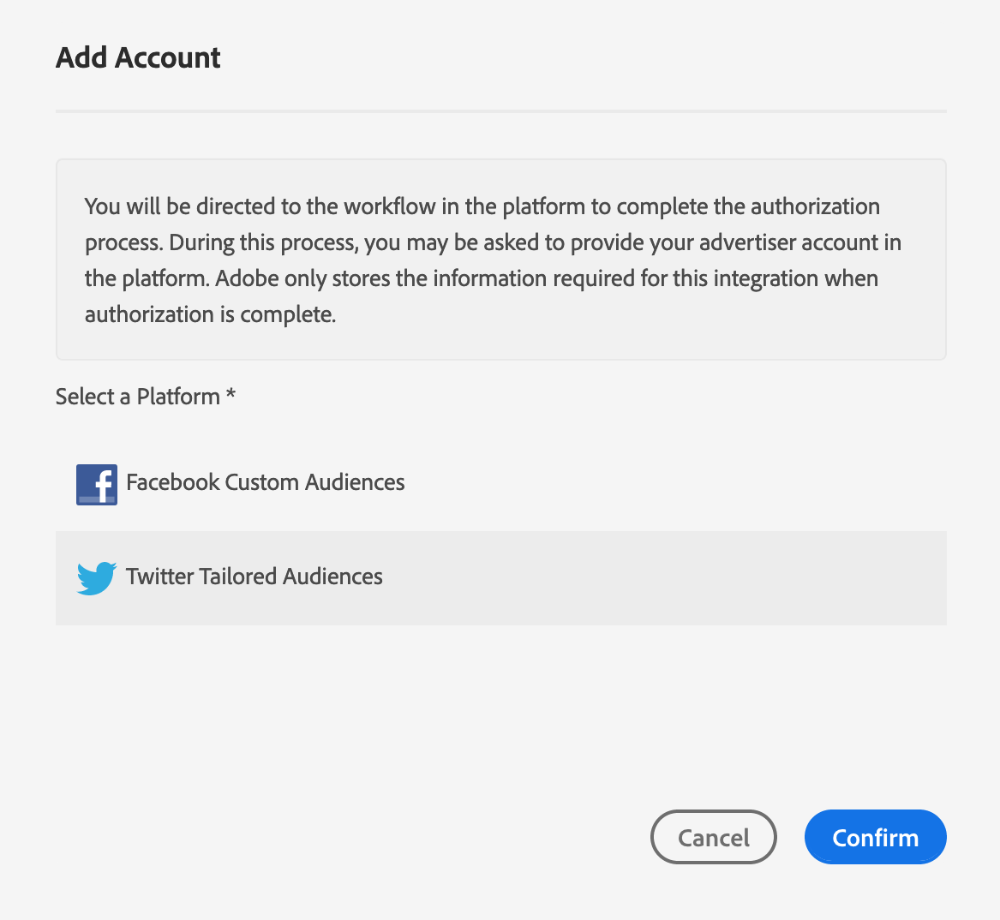
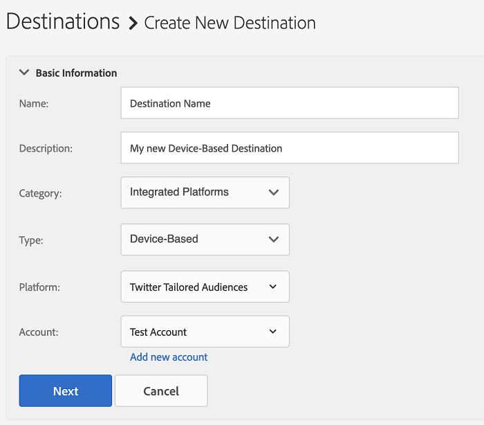

# Configure [!DNL Twitter Tailored Audiences] as a Self-Service Device-Based Destination {#configure-twitter}

This article explains how to configure [Twitter Tailored Audiences](https://business.twitter.com/en/targeting/tailored-audiences.html) for both new and existing integrations.

## Prerequisites {#prerequisites}

Before you configure your [!DNL Twitter Tailored Audiences] destination, make sure to review the following Twitter prerequisites that you need to meet.

1. Your [!DNL Twitter Ads] account must be eligible for advertising. New [!DNL Twitter Ads] accounts are not eligible for advertising in the first 2 weeks after creating them.
1. Your Twitter user account that you authorized access for in Audience Manager must have the [Partner audience manager](https://business.twitter.com/en/help/troubleshooting/multi-user-login-faq.html#accesslevels) permission enabled.
1. If you are [updating your existing Twitter integration to self-service administration](#update-existing-twitter-integrations), your Twitter user account must have the [Ad manager](https://business.twitter.com/en/help/troubleshooting/multi-user-login-faq.html#accesslevels) permission enabled.
1. When creating the first [!DNL Twitter Tailored Audiences] destination in your Audience Manager instance, please contact Adobe Consulting or Customer Care to enable the [!DNL Twitter] ID synchronization (Data Source ID = 1123) for your account. This is required for the correct synchronization between Audience Manager and [!DNL Twitter].

## Add a New [!DNL Twitter Tailored Audiences] Destination {#add-new-twitter-destination}

This section describes the steps you need to follow when configuring a new device-based destination for [!DNL Twitter Tailored Audiences]. This scenario assumes that you have no existing [!DNL Twitter Tailored Audiences] destination configured via your Adobe consultant or Customer Care.

### Step 1. Authenticate with [!DNL Twitter Tailored Audiences] {#step1-authenticate-with-twitter}

Before you can add the device-based destination, you need to link Audience Manager and your [!DNL Twitter Tailored Audiences] account. Here's how to do this:

1. Log in to your Audience Manager account and go to **[!DNL Administration > Integrated Accounts]**. If you have a previously configured integration with a destination platform, you should see it listed in this page. Otherwise, the page is empty.
1. Click **[!DNL Add Account]**.
1. Select [!DNL Twitter Tailored Audiences] and click **[!DNL Confirm]** to be redirected to the authentication page.                     
1. Once you've authenticated, you are redirected to Audience Manager where you should see your associated advertiser accounts. Select the advertiser account that you want to use and click **[!DNL Confirm]**.

### Step 2. Create a New Device-Based Destination {#step2-create-new-destination}

After you have linked Audience Manager and your [!DNL Twitter Tailored Audiences], you can create the new destination. Here's how to do this:

>[!NOTE]
>
>You cannot change the name of an existing device-based destination. Make sure to provide a name that will help you identify the destination correctly.

1. Log in to your Audience Manager account, go to **[!DNL Audience Data > Destinations]**, and click **[!DNL Create Destination]**.
1. In the **[!DNL Basic Information]** section, enter a **[!DNL Name]** and **[!DNL Description]** for your new destination, and use the settings below: 
1. Click **[!DNL Next]**.
1. Choose the [Data Export Labels](/help/using/features/data-export-controls.md#controls-labels) that you want to set for this destination.
1. Click **[!DNL Save]**.
1. In the **[!DNL Segment Mappings]** section, select the audience segments that you want to send to this destination.
1. Save the destination.

## Update Existing Twitter Integrations To Self-Service Administration {#update-existing-twitter-integrations}

To improve the user experience and streamline the configuration process, we are upgrading the [!DNL Twitter Tailored Audiences] integration to a self-service model, where you can perform the configuration yourself, from the Audience Manager UI. This section describes the steps you need to take to update your existing Twitter integration.

>[!IMPORTANT]
>
>The steps described below only apply if you have an existing integration with [!DNL Twitter Tailored Audiences], configured by an Audience Manager consultant or Customer Care.
> See item number 3 in [Prerequisites](#prerequisites) before migrating your [!DNL Twitter Tailored Audiences] to the self-service model.

Follow the steps below to migrate your existing [!DNL Twitter Tailored Audiences] destination to the self-service model.

1. Log in to your Audience Manager account and go to **[!DNL Administration > Integrated Accounts]**.
1. Click **[!DNL Add Account]**.
1. Select [!DNL Twitter Tailored Audiences] and click **[!DNL Confirm]** to be redirected to the authentication page. 
1. Once you've authenticated with your [!DNL Twitter] account, you are redirected to Audience Manager where you should see your associated advertiser accounts. Select the advertiser account that you want to use and click **[!DNL Confirm]**.
1. Go to **[!UICONTROL Audience Data]** > **[!UICONTROL Destinations]** and click the Twitter destination that you need to configure.
1. Click **[!UICONTROL Edit]**. In the **[!UICONTROL Basic Information]** section, click the **[!UICONTROL Integrated Account]** drop-down menu and select the [!DNL Twitter] account that you have authenticated with at Step 4.
1. **[!UICONTROL Save]** the destination.

<!-- ## Validating the Migration to Self-Service Administration {#migration-validation}

The complete migration of existing [!DNL Twitter] integrations to self-service administration can take up to 7 days. Once the migration is complete, Audience Manager shows you a notification in the UI.

You will also see a new set of audiences in your [!DNL Twitter] account, with their names prefixed by [[!DNL Adobe DMP Audience]]. Please allow up to 7 days for the audience population to be completely backfilled. Once the migration is complete, you should use these new audiences instead of the old ones. -->

## Segment Mapping Considerations {#segment-mapping-considerations}

When mapping audience segments to Twitter, make sure to meet the following segment naming requirements:

* Provide human-readable segment mapping names. We recommend using the same name that you used for the Audience Manager segments.
* Do not use commas in segment and segment mapping names.

### Example

* Correct segment or mapping name: "US and European Shoppers";
* Incorrect segment or mapping name: "US, European 5h0pP3rs".

>[!IMPORTANT]
>
>You cannot change the names of already mapped segments. Audience Manager uses the segment names to correctly identify the segments in the integration.

## Match Rates Considerations {#match-rates-considerations}

When using [!UICONTROL Twitter Tailored Audiences], the [!UICONTROL Segment Addressable Audience] and [!UICONTROL Segment Match Rate] metrics from the destination page will not display any values. This is normal behavior, since audience matching along with the match rates for this destination are handled and hosted by [!UICONTROL Twitter], not Adobe.
