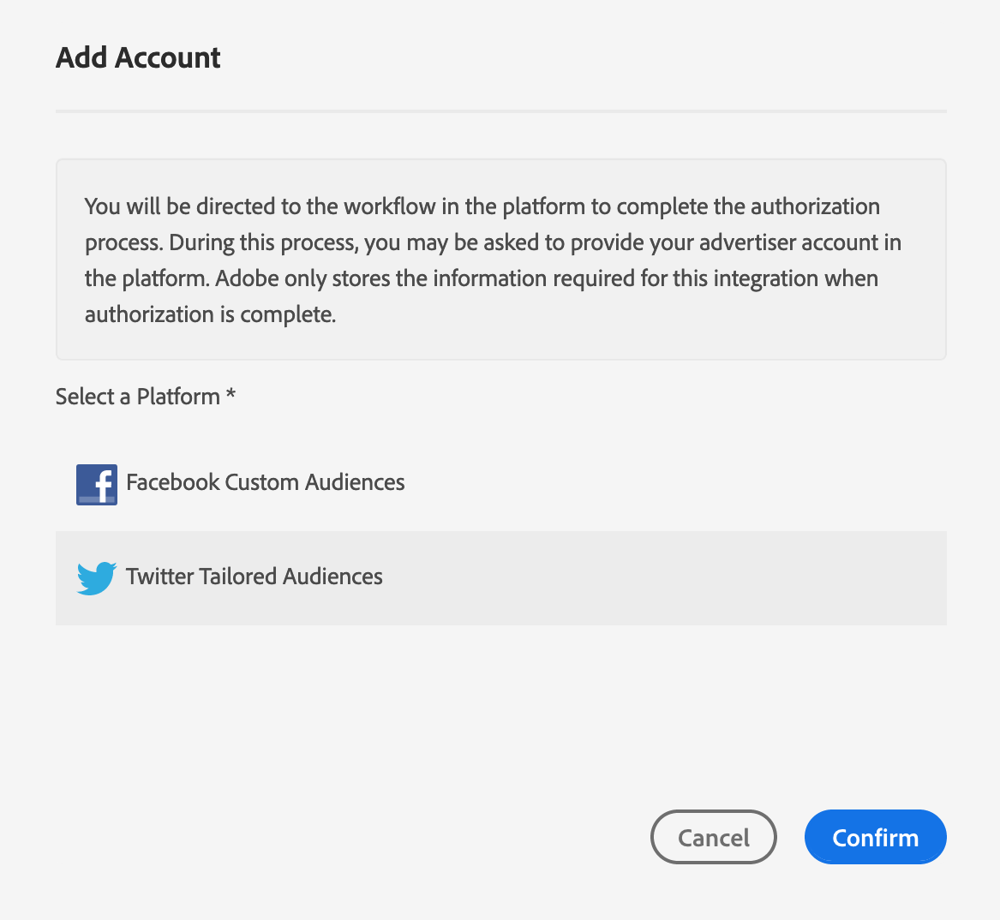

# Configure [!DNL Twitter Custom Audiences] as a Self-Service Device-Based Destination {#configure-twitter}

This article explains how to configure an integration with [Twitter Custom Audiences](https://business.twitter.com/en/help/campaign-setup/campaign-targeting/custom-audiences.html).

## Prerequisites {#prerequisites}

Before you configure your [!DNL Twitter Custom Audiences] destination, make sure you meet the following prerequisites.

* Your [!DNL Twitter Ads] account must be eligible for advertising. New [!DNL Twitter Ads] accounts are not eligible for advertising in the first 2 weeks after creating them.
* Your [!DNL Twitter] user account that you authorized access for in Audience Manager must have the [Partner audience manager](https://business.twitter.com/en/help/troubleshooting/multi-user-login-faq.html#accesslevels) permission enabled.
* When creating the first [!DNL Twitter Custom Audiences] destination in your Audience Manager instance, please contact Adobe Consulting or Customer Care to enable the [!DNL Twitter] ID synchronization (Data Source ID = 1123) for your account. This is required for the correct synchronization between Audience Manager and [!DNL Twitter].

## Add a New [!DNL Twitter Custom Audiences] Destination {#add-new-twitter-destination}

This section describes the steps you need to follow when configuring a new device-based destination for [!DNL Twitter Custom Audiences]. This scenario assumes that you have no existing [!DNL Twitter Custom Audiences] destination configured via your Adobe consultant or Customer Care.

### Step 1. Authenticate with [!DNL Twitter Custom Audiences] {#step1-authenticate-with-twitter}

Before you can add the device-based destination, you need to link Audience Manager and your [!DNL Twitter Custom Audiences] account. Here's how to do this:

1. Log in to your Audience Manager account and go to **[!DNL Administration > Integrated Accounts]**. If you have a previously configured integration with a destination platform, you should see it listed in this page. Otherwise, the page is empty.
1. Click **[!DNL Add Account]**.
1. Select [!DNL Twitter Custom Audiences] and click **[!DNL Confirm]** to be redirected to the authentication page.
    
    

1. Once you've authenticated, you are redirected to Audience Manager where you should see your associated advertiser accounts. Select the advertiser account that you want to use and click **[!DNL Confirm]**.  

### Step 2. Create a New Device-Based Destination {#step2-create-new-destination}

After you have linked Audience Manager and your [!DNL Twitter Custom Audiences], you can create the new destination. Here's how to do this:

>[!NOTE]
>
>You cannot change the name of an existing device-based destination. Make sure to provide a name that will help you identify the destination correctly.

1. Log in to your Audience Manager account, go to **[!DNL Audience Data > Destinations]**, and click **[!DNL Create Destination]**.
1. In the **[!DNL Basic Information]** section, enter a **[!DNL Name]** and **[!DNL Description]** for your new destination, and use the settings below: 
1. Click **[!DNL Next]**.
1. Choose the [Data Export Labels](/help/using/features/data-export-controls.md#controls-labels) that you want to set for this destination.
1. Click **[!DNL Save]**.
1. In the **[!DNL Segment Mappings]** section, select the audience segments that you want to send to this destination.
1. Save the destination.

## Segment Mapping Considerations {#segment-mapping-considerations}

When mapping audience segments to [!UICONTROL Twitter], make sure to meet the following segment naming requirements:

* Provide human-readable segment mapping names. We recommend using the same name that you used for the Audience Manager segments.
* Do not use special characters (`+` `&` `,` `%` `:` `;` `@` `/` `=` `?` `$`) in segment and segment mapping names. If your Audience Manager segment name contains these characters, please remove them before mapping the segment to a [!UICONTROL Twitter] destination.

### Example

* Correct segment or mapping name: "US and European Shoppers";
* Incorrect segment or mapping name: "US, European 5h0pP3rs".

>[!IMPORTANT]
>
>You cannot change the names of already mapped segments. Audience Manager uses the segment names to correctly identify the segments in the integration.

## Match Rates Considerations {#match-rates-considerations}

* The integration between Audience Manager and [!UICONTROL Twitter Custom Audiences] supports historical audience backfills. All segment qualifications get sent to [!UICONTROL Twitter] when you create the destination.

## Troubleshooting {#troubleshooting}

When configuring or sending data to the Twitter Custom Audiences destination, you might run into the errors described below. This section explains what may cause the errors and how to fix them.

|Error message|Occurrence / Reason|Resolution|
|---|---|---|
|`Internal server error`|This error message is displayed in the Audience Manager UI when trying to add a new [!DNL Twitter] account using an outdated version of the Twitter API.|Contact Adobe Customer Care.|
|`Twitter Error: This request is not properly authenticated`|This error message is displayed in the Audience Manager UI when trying to map segments with unsupported segment names to the destination.|Review the mapped segment names and make sure they do not contain unsupported characters. See [segment mapping considerations](#segment-mapping-considerations) for the list of unsupported characters. |
|`Twitter Error: Account XXXXXXXXX was not found`|This error message is displayed in the Audience Manager UI when the credentials configured for the destination are not authorized to access the corresponding Twitter Ads account.|<ul><li>Make sure the account credentials that you are using meet the [prerequisites](#prerequisites).</li><li>Navigate to the Twitter Ads UI using the same credentials and check if the correct audiences are displayed under the corresponding `XXXXXXXXX` account. </li></ul>|