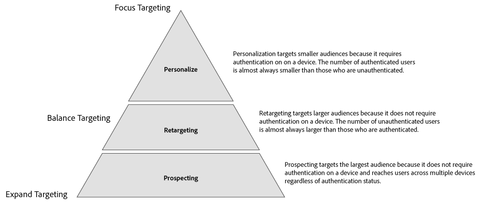
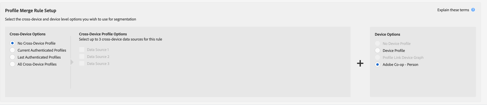
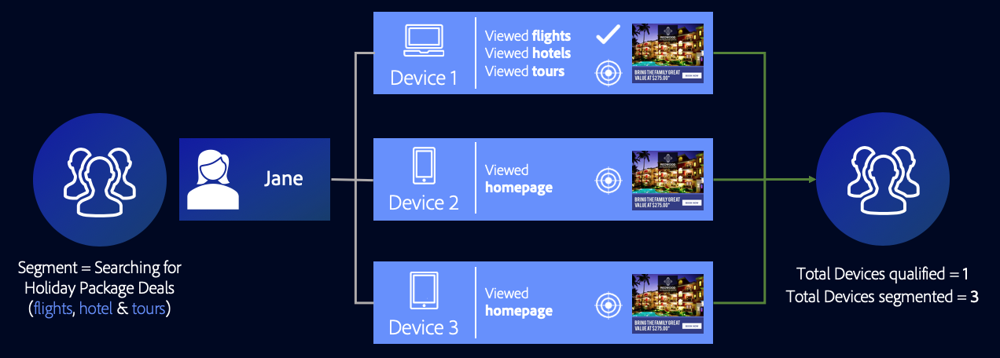
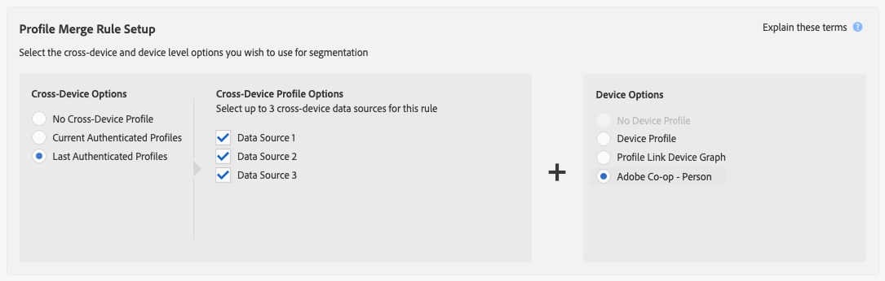
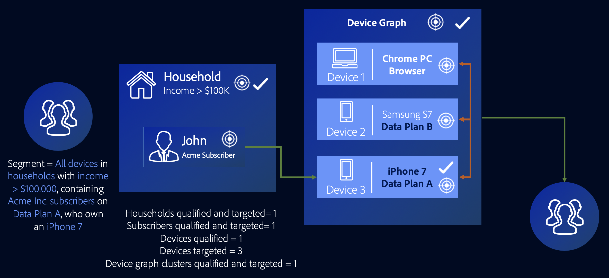

# External Device Graph Use Cases {#external-device-graph-use-cases}

Recommendations and use cases for prospecting, retargeting, and personalization for unknown users with an external device graph. An external device graph is defined as a device graph that is separate from Audience Manager. This includes the [!DNL Adobe Experience Cloud Device Co-op] and other integrations Adobe has with third-party deterministic or probabilistic device graph companies.

## Recommendations {#recommendations}

Consider the [!DNL Experience Cloud Device Co-op] and third-party device graph options for campaigns that:

* Have a low level of authentication across their digital properties. Use the [!UICONTROL Profile Link Device Graph option] if you have a large number of authenticated users.
* Target large audiences. The [!DNL Experience Cloud Device Co-op] and third-party device graphs contain authenticated and un-authenticated data.
* Segment authenticated and/or unauthenticated visitors at the individual and household level.

<!-- 
## Prospecting/Branding Use Case {#prospecting-branding-use-cases}

A branding campaign is designed to reach as many people as possible. It places few limits on segment qualification. But, these campaigns can waste budget and impressions by constantly targeting people who see your content multiple times and don't convert. A [!UICONTROL Profile Merge] rule that uses the [!DNL Device Co-op] or third-party option can help you create an efficient branding campaign. For example, you can add these unknown users to a "not in-market" segment after seeing them across multiple devices for your set frequency cap.

<table id="table_00F6EED172574E80A38CADA8A92A23B1"> 
 <thead> 
  <tr> 
   <th colname="col1" class="entry"> Use Case </th> 
   <th colname="col2" class="entry"> Description </th> 
  </tr> 
 </thead>
 <tbody> 
  <tr> 
   <td colname="col1"> 
 <b>Conditions</b> 
 </td> 
   <td colname="col2">This use case assumes these conditions: 
 
     <ul id="ul_F5CA7EE525774F7EBA5FBB5F94E4EDC8"> 
      <li id="li_81AE304924724146A24FAB5B6533AD8E">You want to deliver a maximum of 10 impressions to an anonymous user for a specific ad campaign. </li> 
      <li id="li_E371F989735245B0B82433DE240D56D0">A user has 4 devices and may or may not have authenticated on your site. </li> 
      <li id="li_9231ABE15CA249E6B79D8BF0E511FD33">An anonymous user sees the ad a total of 10 times while browsing in an unauthenticated state on their current device and 3 devices linked to the current device by an external device graph. </li> 
      <li id="li_8C276C07019C49EFA3A0D0D54CF73C31">You have defined an  Audience Manager segment to qualify anonymous users after they have seen 10 impressions. </li> 
     </ul> 
 </td> 
  </tr> 
  <tr> 
   <td colname="col1"> 
 <b>Results</b> 
 </td> 
   <td colname="col2"> 
Given these conditions,  Audience Manager: 
 
 
     <ul id="ul_8E988B1005324526BC6DC6637BBACCFB"> 
      <li id="li_C9DD546754914BACB8F4C92C7D4ED70E">Merges the anonymous, unauthenticated activity collected from the current device and the 3 devices linked by the external device graph (the ad impressions from each device). </li> 
      <li id="li_FB55CB9116074525BA30FF062D1136AE">Evaluates the unauthenticated user for segment qualification based on a combination of anonymous activity across all 3 devices linked by the external device graph and the current device. </li> 
      <li id="li_B28EB32F718145A7ABBDAC0AF75E2AFC">Sends the segment to any real-time destination for use as a suppression segment on the current device and all 3 devices linked by the external device graph. </li> 
     </ul> 
 </td> 
  </tr> 
 </tbody> 
</table>

## Retargeting or Site Personalization Use Case {#retargeting-use-case}

These strategies are designed to bring an unauthenticated or unknown user back to your site or personalize their browsing experience while they're on-site.

<table id="table_0EE2052AA3E744B3B76036FC06B5A453"> 
 <thead> 
  <tr> 
   <th colname="col1" class="entry"> Use Case </th> 
   <th colname="col2" class="entry"> Description </th> 
  </tr> 
 </thead>
 <tbody> 
  <tr> 
   <td colname="col1"> 
 <b>Conditions</b> 
 </td> 
   <td colname="col2">This use case assumes these conditions: 
 
     <ul id="ul_FD0B869B4AF3453FAEC9BA3A45ABF039"> 
      <li id="li_8E30BAED42E94AB3B81FCB1C7464E5FC">You want to deliver a personalized on-site and/or off-site experience to an anonymous user based on their activity on your site while in an unauthenticated state. </li> 
      <li id="li_3DBE53BA94324F1BA1C52A37AD4E426C">A user has multiple devices and may or may not have authenticated to your site. </li> 
      <li id="li_F867AFBDC1A54CD6A68AB0EC196E27C9">A user views multiple pages on your site while browsing in an unauthenticated state on their current device and 3 other devices linked by an external device graph. </li> 
      <li id="li_7E35D77949CE4E69BD51655AA4C40BEE">You have defined an  Audience Manager segment to qualify users after they have viewed multiple pages on your site while browsing in an unauthenticated state.</li>
     </ul> 
 </td> 
  </tr> 
  <tr> 
   <td colname="col1"> 
 <b>Results</b> 
 </td> 
   <td colname="col2"> 
Given these conditions,  Audience Manager: 
 
 
     <ul id="ul_301339426B0643B295DC5B17E1939CFB"> 
      <li id="li_7E8BC3B179804F4A929497DE81E76911">Merges the anonymous, unauthenticated activity collected from the current devices and the 3 devices linked by the external device graph (the multiple page views from each device). </li> 
      <li id="li_803EFD58AA124A5BBC8279C4DC695544">Evaluates the unauthenticated user for segment qualification based on a combination of anonymous activity across all 3 devices linked by the external device graph and the current device. </li> 
      <li id="li_98D749268CC5456CBC9CF3BF5EB91BA8">Sends the segment to any real-time destination to deliver a personalized on-site and/or off-site experience across the current device and all 3 devices linked by the external device graph. </li>
     </ul> 
 </td>
  </tr>
 </tbody>
</table> -->

## Expanded Device Targeting {#audience-expansion}

This use case exemplifies how you can expand the size of your addressable audience with accurate cross-device personalization, through the [!DNL Adobe Co-Op Device Graph] or other [!DNL External Device Graphs].

Let's say Jane owns three devices that she uses regularly to search for holiday package deals: her laptop ([!DNL Device 1]), her smartphone ([!DNL Device 2]), and her tablet ([!DNL Device 3]). While using the laptop, Jane searched for flights, hotels, and guided tours. While using the smartphone and tablet, she only visited the homepage of the travel agency.

By using the [!UICONTROL No Cross-Device Profile] + [!UICONTROL Adobe Co-op Device Graph] rule, the travel agency can merge all three devices profiles, since they are linked to the same owner through the [!UICONTROL Adobe Co-op Device Graph].

In our example, the traits required to qualify for the segment have all been collected on [!DNL Device 1]. Since Audience Manager qualifies every device profile that took part in the profile merge for a segment, all of Jane's three device profiles are now segmented.

Through this rule, the device graph has expanded the number of device profiles which qualify for the segment from one to three and has enabled the travel agency to deliver a consistent message to all three devices owned by Jane.

## Advanced Cross-Device Targeting {#advanced-graph-expansion}

This use case shows how you can expand audience targeting for authenticated visitors with devices from an external device graph or from the [!DNL Adobe Co-Op Device Graph], by using the **[!UICONTROL Last Authenticated Profiles]** + **[!UICONTROL Adobe Co-Op Device Graph]** rule.

In the example below, the Acme Inc. company wants to target all households with incomes over $100.000/year, that have [!DNL Acme Inc.] subscribers on [!DNL Data Plan A], that use an [!DNL iPhone 7] device.

John uses his iPhone 7 on Data Plan A to authenticate on the Acme Inc. website. At the same time, John's [!DNL Co-Op Device Graph] cluster contains two additional devices that he uses regularly: his laptop ([!DNL Device 1]), and his secondary smartphone, [!DNL Device 2] (a [!DNL Samsung S7] on [!DNL Data Plan B]).

By using the **[!UICONTROL Last Authenticated Profiles]** + **[!UICONTROL Adobe Co-Op Device Graph]**, [!DNL Acme Inc.] is able to deliver personalized messages to all three devices from John's device graph cluster, even though only one of them initially qualifies for the segment.

>[!MORELIKETHIS]
>
>* [Profile Link Device Graph Use Cases](profile-link-use-case.md)
>* [General Use Cases for Profile Merge Rules](merge-rule-targeting-options.md)
>* [Profile Merge Rules FAQ](../../faq/faq-profile-merge.md)
