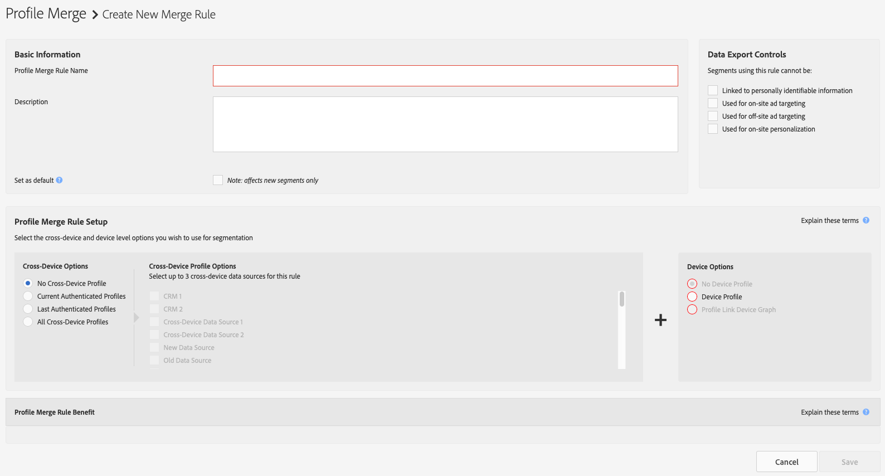

# [!UICONTROL Profile Merge Rules] Options Defined {#profile-merge-rule-options-defined}

The [!UICONTROL profile merge rule] options let you control the type of data [!DNL Audience Manager] uses for segmentation. A [!UICONTROL profile merge rule] can include device profiles mapped by the [!UICONTROL Profile Link] device graph, the [!UICONTROL Adobe Experience Cloud Device Co-op], and/or other, third-party device graph providers who are integrated with [!DNL Audience Manager]. You can create a maximum of 4 [!UICONTROL Profile Merge Rules]. The fourth [!UICONTROL Profile Merge Rule] is available exclusively to customers who purchased the [!UICONTROL People-Based Destinations] add-on.

You build a [!UICONTROL Profile Merge Rule] by making a selection from the options described below, in [!UICONTROL Profile Merge Rule Setup].

## [!UICONTROL Profile Merge Rule] Options Overview {#overview}

[!UICONTROL Profile Merge Rules] allow for a number of rule combinations, each geared towards specific use cases. See the table below for details on when to use each rule combination.

| [!UICONTROL Cross-Device Option]            | [!UICONTROL Device Option]                                       | Availability                                                                                                                                                                                      | Evaluation Type     | [!UICONTROL Audience Lab] Support | Use Cases                                                                               |
| ------------------------------ | --------------------------------------------------- | ------------------------------------------------------------------------------------------------------------------------------------------------------------------------------------------------- | ------------------- | ----| -------------------- |
| [!UICONTROL No Cross-Device Profile]        | [!UICONTROL Device Profile]                                      | All customers                                                                                                                                                                                     | Real-time and batch | Yes                  | [Device Targeting](merge-rule-targeting-options.md#device-personalization)              |
| [!UICONTROL No Cross-Device Profile]        | [!UICONTROL External Device Graph] (includes [!UICONTROL Co-op Device Graph]) | All customers                                                                                                                                                                                     | Real-time and batch | No                   | [Expanded Device Targeting](external-graph-use-cases.md#audience-expansion)             |
| [!UICONTROL Current Authenticated Profiles] | [!UICONTROL No Device Profile]                                   | All customers                                                                                                                                                                                     | Real-time only      | No                   | [Shared Device Targeting](merge-rule-targeting-options.md#target-shared-devices)        |
| [!UICONTROL Last Authenticated Profiles]    | [!UICONTROL Device Profile]                                      | All customers                                                                                                                                                                                     | Real-time and batch | Yes                   | [Online/Offline Targeting](merge-rule-targeting-options.md#device-household-targeting)  |
| [!UICONTROL Last Authenticated Profiles]    | [!UICONTROL Profile Link Device Graph]                           | All customers                                                                                                                                                                     | Real-time and batch | Yes                   | [Cross-device Targeting](profile-link-use-case.md#cross-device-personalization)         |
| [!UICONTROL Last Authenticated Profiles]    | [!UICONTROL External Device Graph] (includes [!UICONTROL Co-op Device Graph]) | All customers                                                                                                                                                                                     | Real-time and batch | No                   | [Advanced Cross-Device Targeting](external-graph-use-cases.md#advanced-graph-expansion) |
| [!UICONTROL All Cross-Device Profiles]      | N/A                                                 | Exclusive to [People-Based Destinations](../destinations/people-based-destinations-overview.md) customers | Batch only          | No                   | [Targeting for People-Based Destinations](merge-rule-targeting-options.md#all-cross-device)              |

## [!UICONTROL Profile Merge Rule] [!UICONTROL Segment] Evaluation {#segment-evaluation}

Depending on your [!UICONTROL Profile Merge Rules] configuration, [!DNL Audience Manager] can perform the [!UICONTROL segment] evaluation in real-time, in batch, or both.

* Real-time [!UICONTROL segment] evaluation requires the [!DNL DCS] to see visitors access your digital properties in real-time, to qualify for the [!UICONTROL segment].
* Batch [!UICONTROL segment] evaluation is performed against previously qualified [!UICONTROL traits].
* [!UICONTROL Profile Merge Rules] that support both real-time and batch [!UICONTROL segment] evaluation combine the real-time visitor activity with previously qualified [!UICONTROL traits].

## [!UICONTROL Profile Merge Rules] Reporting Latency {#reporting-latency}

Real-time [!UICONTROL segment] evaluation reflects immediately in the [!UICONTROL Profile Merge Rules] reports.

Batch [!UICONTROL segment] evaluation can take up to 24 hours to reflect in the [Profile Merge Rules reports](profile-link-metrics.md).

## [!UICONTROL Cross-Device Options] {#auth-options}

The [!UICONTROL Cross-Device Options] let you select authenticated and unauthenticated users and leverage their cross-device profile for segmentation. These options help you identify and reach specific users on a shared device. For more information on anonymous and authenticated users, see [Visitor Authentication States in Audience Manager](../../reference/visitor-authentication-states.md).

<table id="table_4CE2DD312F54480E96BEAF72800789FB"> 
 <thead> 
  <tr> 
   <th colname="col1" class="entry"> Cross-Device Option </th> 
   <th colname="col2" class="entry"> Description </th> 
  </tr> 
 </thead>
 <tbody> 
  <tr> 
   <td colname="col1"> 
 <b> No Cross-Device Profile</b> 
 </td> 
   <td colname="col2"> 
Tells  Audience Manager not to use data collected from authenticated users. 
 </td> 
  </tr> 
  <tr> 
   <td colname="col1"> 
 <b> Current Authenticated Profiles</b> 
 </td> 
   <td colname="col2"> 
Tells  Audience Manager to read and write data to the authenticated profile if a visitor has logged in to your site. 
 </td> 
  </tr> 
  <tr> 
   <td colname="col1"> 
 <b> Last Authenticated Profiles</b> 
 </td> 
   <td colname="col2"> 
Tells  Audience Manager to read data from the authenticated profile of the user who last logged in on the device. 
 
When selected,  Audience Manager will not write new trait data to the authenticated profile if the user is anonymous. Upon authentication, new trait data gets written to the user's authenticated profile. 
 </td>
  </tr> 
  <tr> 
   <td colname="col1"> 
 <b> All Cross-Device Profiles</b> 
 </td> 
   <td colname="col2"> 
Tells Audience Manager to read data from all cross-device profiles, regardless of the authentication state. This option is only available for Audience Manager customers who have purchased the People-Based Destinations add-on.
 </td>
  </tr>
 </tbody>
</table>

## [!UICONTROL Cross-Device Profile Options] {#profile-options}

The [!UICONTROL Cross-Device Profile Options] lists your [!UICONTROL cross-device data sources]. These options use the names you provided when you created a [!UICONTROL cross-device] [!UICONTROL data source] (see [Create a Cross-Device Data Source](merge-rules-start.md#create-data-source)). You can select up to 3 [!UICONTROL cross-device data sources] to use with each profile rule. The [!UICONTROL Authenticated Profile Options] are available when you choose **[!UICONTROL Current Authenticated Profiles]** or **[!UICONTROL Last Authenticated Profiles]**.

## [!UICONTROL Device Options] {#device-options}

The [!UICONTROL Device Options] let you select the type of *`device profile`* used by a [!UICONTROL Profile Merge Rule]. A device profile is built from [!UICONTROL traits] collected from anonymous browsing activity. At a minimum, a [!UICONTROL profile merge rule] includes an [!UICONTROL authenticated option] and a [!UICONTROL device option].

<table id="table_D373FB787D1A4E3485C02C4A76F03395"> 
 <thead> 
  <tr> 
   <th colname="col1" class="entry"> Device Option </th> 
   <th colname="col2" class="entry"> Description </th> 
  </tr> 
 </thead>
 <tbody> 
  <tr> 
   <td colname="col1"> 
 <b> No Device Profile</b> 
 </td> 
   <td colname="col2"> 
Tells  Audience Manager not to use the traits contained in the anonymous profile for segmentation. 
 </td> 
  </tr> 
  <tr> 
   <td colname="col1"> 
 <b> Device Profile</b> 
 </td> 
   <td colname="col2"> 
Tells  Audience Manager to use the anonymous device profile for segmentation. 
 </td> 
  </tr> 
  <tr> 
   <td colname="col1"> 
 <b> Profile Link Device Graph</b> 
 </td> 
   <td colname="col2"> 
Tells  Audience Manager to read the profiles from the current device and up to 100 other devices that the user has authenticated from. This device graph is built on your own, first-party data in  Audience Manager. It is ideal for customers who have a high level of authentication across their digital properties. The  Profile Link device graph is updated in real time. This option is available when you select <b> Current Authenticated Profile</b> or <b> Last Authenticated Profile</b>. When using this option, you can only choose a single authenticated profile ( Audience Manager automatically grays out the others). See also, <a href="profile-link-use-case.md"> Profile Link Device Graph Use Cases</a>. 
 </td>
  </tr> 
  <tr> 
   <td colname="col1"> 
 <b> Co-op Device Graph</b> 
 </td> 
   <td colname="col2"> 
Tells  Audience Manager to read the profiles from the current device and up to 100 other devices using the links provided by the <a href="https://experienceleague.adobe.com/docs/device-co-op/using/about/overview.html" format="https" scope="external"> Experience Cloud Device Co-op</a>. 
 
The  Device Co-op is a digital cooperative where participating customers share device link information. The  Device Co-op processes this data in a  device graph. A device graph links devices together form device clusters. These links are built from <a href="https://experienceleague.adobe.com/docs/device-co-op/using/device-graph/links.html" format="https" scope="external"> probabilistic and deterministic data</a>. The clusters represent a group of devices used by an unknown person. The  Device Co-op shares these clusters among its members, which helps them deliver valuable and consistent cross-device experiences to their customers. 
 
 For more information about the  Device Co-op, see the: 
 
 
     <ul id="ul_8EDA7D092ECD444C8C19CDC7534D84DE"> 
      <li id="li_323BC5993D6A4BA3962169BF0ED37C55"> <a href="https://experienceleague.adobe.com/docs/device-co-op/using/home.html" format="https" scope="external"> Device Co-op Overview</a> </li> 
      <li id="li_0BDB2144EC584002B3B9F1D64B6CD580"> <a href="https://experienceleague.adobe.com/docs/device-co-op/using/about/requirements.html" format="https" scope="external"> Membership Requirements</a> </li> 
      <li id="li_632D1014909146758F07CFAC79B90CFE"> <a href="https://experienceleague.adobe.com/docs/device-co-op/using/device-graph/device-graph-overview.html" format="https" scope="external"> Device Graph: Internal Processes and Output</a> </li>
     </ul> 
 </td>
  </tr> 
  <tr> 
   <td colname="col1"> 
<b>Third-Party Device Graph Options</b> (Person and Household) 
 </td>
   <td colname="col2"> 
These options let you build merge rules based on device graph technology provided by a third-party vendor. A third-party device graph provides: 
 
 
     <ul id="ul_5BA0D940BA15484FADF134A5A73815D5"> 
      <li id="li_389ACEBBF79A47499B6119B0F9CB3B5D"> Probabilistic and/or deterministic data. </li> 
      <li id="li_E8606D3871A145A68E87BDC3554AC4EF">Data at the person or household level. </li> 
     </ul> 
 
To use these options, you must be a customer of a device graph provides who is already integrated with  Audience Manager. Contact your account manager for more information or to get started. 
 </td>
  </tr>
 </tbody>
</table>

## [!UICONTROL External Merge Policies] {#external-merge-policies}

Audience segments that were automatically created from other [!DNL Experience Cloud] solutions, based on merge rules defined outside of [!DNL Audience Manager], are marked as using an [!UICONTROL External Merge Policy]. For example, see [Audience Sharing Between Audience Manager and Adobe Experience Platform](../../integration/integration-aep/aam-aep-audience-sharing.md).

>[!MORELIKETHIS]
>
>* [Profile Merge Rules FAQ](../../faq/faq-profile-merge.md)
