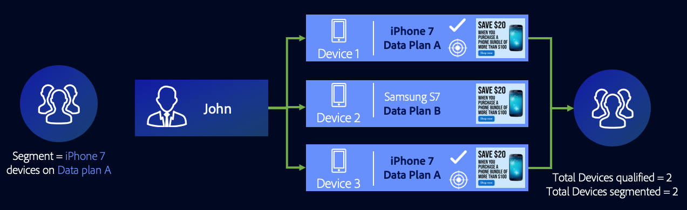
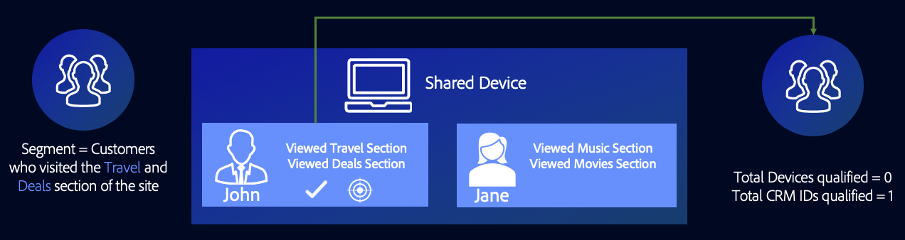
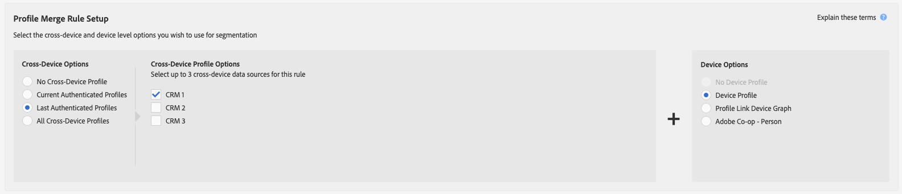
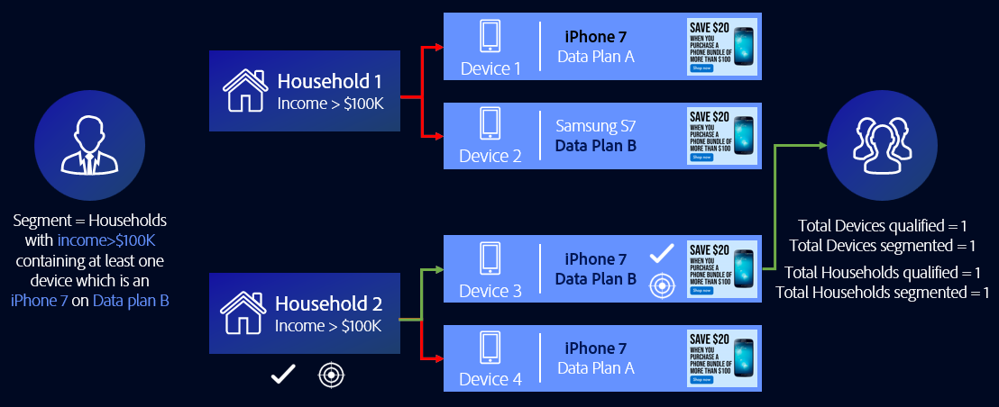
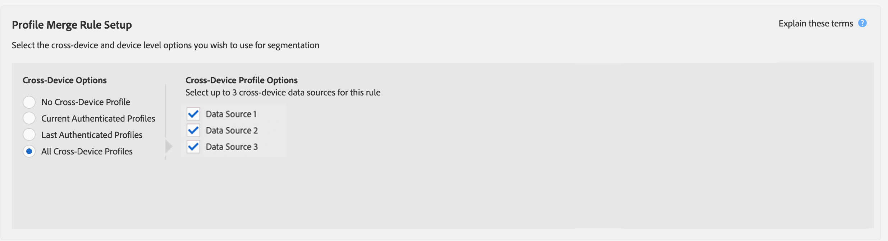

# General Use Cases for Profile Merge Rules {#general-use-cases-for-profile-merge-rules}

[!UICONTROL Profile Merge Rules] options let you expand or tighten audience focus on specific audiences based on business needs or goals. These general use cases explore how to use available options and create merge rules for individual, household, and cross-device targeting. [!UICONTROL Profile Merge Rules] work with real-time and batch destinations.

>[!TIP]
>
>For definitions and descriptions of these [!UICONTROL Merge Rule] settings, see [Profile Merge Rule Options Defined](merge-rule-definitions.md).

## Device Targeting {#device-personalization}

This scenario applies to marketers who want to evaluate a single device profile for an audience segment defined in Audience Manager, in order to deliver a consistent experience to the device using targeting platforms that support device IDs (DSPs, on-site personalization platforms and other device-based targeting platforms), not taking into account user authentication.

To create a rule that targets only device profiles, select **[!UICONTROL No Cross-Device Profile]** + **[!UICONTROL Device Profile]**.

Let's say John owns three smartphones. Two of them are iPhone 7s on Data Plan A, and one of them is a Samsung on Data Plan B. Not taking into account his authenticated state on any of the three devices, John's mobile carrier wants to offer him a data plan upgrade, but only for iPhone 7 devices that run on Data Plan A.

By using the **[!UICONTROL No Cross-Device Profile]** + **[!UICONTROL Device Profile]** rule, [!DNL Device 1] and [!DNL Device 3] both qualify for the segment, while Device 2 is ignored.

## Shared Device Targeting {#target-shared-devices}

Let's say John and his wife, Jane, use the same laptop to visit an online store and order various items.

John uses his own account to book travel tickets and special deals, while Jane uses her own account to shop for music and movies.

The store's marketing team can use the **[!UICONTROL Current Authenticated Profiles]** + **[!UICONTROL No Device Profile]** rule to target John and Jane with specific deals, based on purely on their authenticated activity.

By using this rule, Audience Manager completely ignores the device profile, qualifying John's CRM ID for the segment, and not qualifying Jane's CRM ID.

## Online/Offline Targeting {#device-household-targeting}

This use-case covers household identity management. A company can merge a single device profile with the last profile that authenticated on that device, using the **[!UICONTROL Last Authenticated Profiles]** + **[!UICONTROL Device Profile]** rule.

Let's consider a segment made of households with incomes greater than $100.000/year, containing at least one device which is an [!DNL iPhone 7] on [!DNL Data Plan B]. We have two household profiles (cross-device profiles), each connected to two different device profiles. The traits required to qualify for the segment are distributed across the device and cross-device profiles.

Audience Manager merges every device + cross-device profile pair to see if the merged set of traits qualifies for the segment. Since Audience Manager evaluates every profile which was included in the merge, both a device profile and a household profile can be segmented.

The link between the device and the household profile allows Audience Manager to qualify [!DNL Household 2] for the segment, but not [!DNL Household 1]. From [!DNL Household 2], only [!DNL Device 3] qualifies for the segment. This [!UICONTROL Profile Merge Rule] has enabled the marketer to deliver a consistent marketing message to an individual device ([!DNL Device 3]) and the wider household ([!DNL Household 2]).

## Targeting for People-Based Destinations {#all-cross-device}

> [!IMPORTANT]
>
> This article contains product documentation meant to guide you through the setup and usage of this feature. Nothing contained herein is legal advice. Please consult your own legal counsel for legal guidance.

This targeting scenario is only available to customers who have purchased the [!DNL People-Based Destinations] add-on. This rule allows marketers to reach customers based on their own, authenticated data.

Let's say an online retailer wants to reach existing customers through social platforms and show them personalized offers based on their previous orders. With [!UICONTROL People-Based Destinations], they can ingest hashed email addresses from their own [!DNL CRM] into Audience Manager, build segments from the offline data, and send these segments to the social platforms they want to advertise on, using that hashed identifier, optimizing their advertising spending.

To learn more about this option, see [People-Based Destinations](../destinations/people-based-destinations-overview.md).

## Device Graph Options {#device-graph-options}

Choosing a [!UICONTROL device graph] option for a [!UICONTROL Profile Merge] rule depends on conditions unique to your digital properties and business goals. These general guidelines can help you understand when to use one type of graph vs another. Note, you must be a member of the [Adobe Experience Cloud Device Co-op](https://docs.adobe.com/content/help/en/device-co-op/using/home.html) or have a contractual relationship with an external device graph to use these options. Refer to the table below for general guidance on when to choose a device graph option. For specific use cases, see [Profile Link Device Graph Use Cases](profile-link-use-case.md) and [External Device Graph Use Cases](external-graph-use-cases.md).

<table id="table_66D9152D4FF040A186003272D456625D"> 
 <thead> 
  <tr> 
   <th colname="col1" class="entry"> Device Graph Type </th> 
   <th colname="col2" class="entry"> Description </th> 
  </tr>
 </thead>
 <tbody> 
  <tr> 
   <td colname="col1"> 
 Profile Link Device Graph 
 </td> 
   <td colname="col2"> 
 Profile Merge rules built with the  Profile Link option are ideal for: 
 
 
     <ul id="ul_FF44FA894BB2448887C8EDA9C8407EF9"> 
      <li id="li_E22505210C664FE6A9AA7C61244B36DA">Digital properties that have a high-level of customer authentication. </li> 
      <li id="li_BE7112EE611E4DEB95B5C0A2852BFA97">Focused, low-reach campaigns. The  Profile Link device graph is built on deterministic data only. This pool of device profiles will always be smaller relative to the pool of unauthenticated users and devices. </li> 
      <li id="li_5FD9E936A72A4EFE80E694FA2E08E385">Use cases where customers need to be in an authenticated state to qualify for segmentation. </li> 
     </ul> 
 </td> 
  </tr> 
  <tr> 
   <td colname="col1"> 
External Device Graph Options 
 </td> 
   <td colname="col2"> 
 Profile Merge rules built with the <a href="https://marketing.adobe.com/resources/help/en_US/mcdc/" format="https" scope="external"> Experience Cloud Device Co-op</a> or any external device graph integrated with  Audience Manager are ideal for: 
 
 
     <ul id="ul_D76D773988604A619FA4A3BF37F910F0"> 
      <li id="li_969A0755A9E34CBEB2F7331C137B9A26">Digital properties that have a low-level of customer authentication. </li> 
      <li id="li_AC78C8B4AD5340FFAC44FE851096C6A6">Broad, high-reach brand campaigns. </li> 
      <li id="li_14AEC54CE34440889A3A36324EC6F497">Use cases where customers do not need to be in an authenticated state to qualify for segmentation. </li> 
     </ul> 
 
 
Tip: The  Device Co-op is your best option if you're a  Experience Cloud customer with low authentication and no relationship with any device graph provider. 
 
 </td> 
  </tr> 
 </tbody> 
</table>

Watch the video below for an overview of possible use cases for [!UICONTROL Profile Merge Rules].

>[!VIDEO](https://video.tv.adobe.com/v/28975/)

>[!MORELIKETHIS]
>
>* [Profile Link Device Graph Use Cases](profile-link-use-case.md)
>* [External Device Graph Use Cases](external-graph-use-cases.md)
>* [Profile Merge Rules FAQ](../../faq/faq-profile-merge.md)
