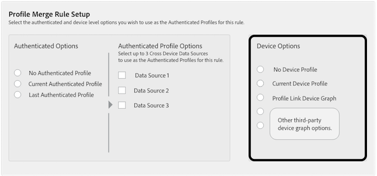

# General Use Cases for Profile Merge Rules {#general-use-cases-for-profile-merge-rules}

[!UICONTROL Profile Merge Rules] options let you expand or tighten audience focus on specific audiences based on business needs or goals. These general use cases explore how to use available options and create merge rules for individual, household, and cross-device targeting. Currently, [!UICONTROL Profile Merge Rules] work with real-time destinations only.

 

>[!TIP]
>
>For definitions and descriptions of these [!UICONTROL Merge Rule] settings, see [Profile Merge Rule Options Defined](../../features/profile-merge-rules/merge-rule-definitions.md).

## Focused targeting {#focused-targeting}

User authentication to a website should trigger a declared ID call to [!DNL Audience Manager]. After this event, [!DNL Audience Manager] writes trait data to (and reads from) an authenticated profile. The authenticated profile lets [!DNL Audience Manager]:

* Write traits to the authenticated profile specific to a particular user.
* Identify and differentiate between multiple device users for segmentation.

### Reach authenticated users

The authenticated profile options create rules which let you target users who are logged on to a website or app based on offline attributes. For example, a financial services company would use this option to target authenticated users with targeted credit card upgrade offers or specialized service offers based on income or offline activity. Another example would be an airline targeting authenticated frequent fliers with deals based on accrued mileage.

To create a rule that reaches only authenticated users, select **[!UICONTROL Current Authenticated Profile]** + **[!UICONTROL No Device Profile]**. This option will evaluate a segment using only authenticated profile data. This rule will ignore data in the anonymous device profile.

To also include data in the anonymous device profile, use the **[!UICONTROL Current Authenticated Profile]** + **[!UICONTROL Current Device Profile]** rule.

### Reach users based on previous authentication state

These options reach specific users when they're browsing but not logged on. You can do this with options that rely on inferred user-level targeting. Inferred targeting helps you reach people who are not explicitly authenticated to your site but may be browsing online. It works by reading (but not writing) data from the last authenticated profile. And, to help keep the authenticated profile clean, [!DNL Audience Manager] writes new trait qualifications to the device profile instead of the authenticated profile. For example, say you're a marketer that wants to test different offers with existing customers who are not logged on to your site or app. As a marketer, you can test these ads with current, un-authenticated customers to see which offers get the most response.

An example of a rule that reaches users based on preivous authentication is:

* **[!UICONTROL Last Authenticated Profiles]** + **[!UICONTROL Current Device Profile]**

## Expanded targeting {#expanded-targeting}

Along with rules that help reach specific customers, marketers also need rules that increase the size of data sets available for targeting. [!UICONTROL Profile Merge Rules] let you do this with the device profile option. The device options expand the data set eligible for segmentation because they draw on traits realized while a user was in an anonymous state on one or many devices. This could be useful when you're trying to reach a user across all of their devices using a person device graph or all devices in a household using a household device graph. A use case for this option could include advertising a family vacation offer. In this case, you'll want to reach every device in a household with the offer if a user on any device has shown interest in the offer.

To create a rule that expands the targeting data set, select the **[!UICONTROL Last Authenticated Profiles]** + **[!UICONTROL Device Graph]** rule.

<!-- 

Rules that use the device graph option extend your data set even further. With the device graph option,  Audience Manager relies on the device profiles aggregated from the last 3 devices that a visitor used for authentication to your site. The device graph rules include: 
 

 
 <ul id="ul_3008B6AF16EC408F98EC4088111281FB"> 
  <li id="li_FA2087F1ED454CD0B9E09656B79ED23B"> <b> Current Authenticated Profiles</b> + <b> Profile Merge Device Graph</b> or a Co-op device graph option </li> 
  <li id="li_001A8DB517CB4EE394DBD530F2080FD5"> <b> Last Authenticated Profiles</b> + <b> Profile Merge Device Graph</b> or a Co-op device graph option </li> 
 </ul> 
 

 
 <note type="tip">
  Create a simple rule with 
  <b> No Authenticated Profile</b> + 
  <b> Current Device Profile</b> when you're still developing a strategy and are unsure about which options to choose or if your site doesn't use authentication. 
 </note> 

 -->

## Device Graph Options {#device-graph-options}

Choosing a [!UICONTROL device graph] option for a [!UICONTROL Profile Merge] rule depends on conditions unique to your digital properties and business goals. These general guidelines can help you understand when to use one type of graph vs another. Note, you must be a member of the [!DNL Adobe Experience Cloud Device Co-op] or have a contractual relationship with an external device graph to use these options. Refer to the table below for general guidance on when to choose a device graph option. For specific use cases, see [Profile Link Device Graph Use Cases](../../features/profile-merge-rules/profile-link-use-case.md) and [External Device Graph Use Cases](../../features/profile-merge-rules/external-graph-use-cases.md).

<table id="table_66D9152D4FF040A186003272D456625D"> 
 <thead> 
  <tr> 
   <th colname="col1" class="entry"> Device Graph Type </th> 
   <th colname="col2" class="entry"> Description </th> 
  </tr>
 </thead>
 <tbody> 
  <tr> 
   <td colname="col1"> 
 Profile Link 
 </td> 
   <td colname="col2"> 
 Profile Merge rules built with the  Profile Link option are ideal for: 
 
 
     <ul id="ul_FF44FA894BB2448887C8EDA9C8407EF9"> 
      <li id="li_E22505210C664FE6A9AA7C61244B36DA">Digital properties that have a high-level of customer authentication. </li> 
      <li id="li_BE7112EE611E4DEB95B5C0A2852BFA97">Focused, low-reach campaigns. The  Profile Link device graph is built on deterministic data only. This pool of device profiles will always be smaller relative to the pool of unauthenticated users and devices. </li> 
      <li id="li_5FD9E936A72A4EFE80E694FA2E08E385">Use cases where customers need to be in an authenticated state to qualify for segmentation. </li> 
     </ul> 
 </td> 
  </tr> 
  <tr> 
   <td colname="col1"> 
External Device Graph Options 
 </td> 
   <td colname="col2"> 
 Profile Merge rules built with the <a href="https://marketing.adobe.com/resources/help/en_US/mcdc/" format="https" scope="external"> Experience Cloud Device Co-op</a> or any external device graph integrated with  Audience Manager are ideal for: 
 
 
     <ul id="ul_D76D773988604A619FA4A3BF37F910F0"> 
      <li id="li_969A0755A9E34CBEB2F7331C137B9A26">Digital properties that have a low-level of customer authentication. </li> 
      <li id="li_AC78C8B4AD5340FFAC44FE851096C6A6">Broad, high-reach brand campaigns. </li> 
      <li id="li_14AEC54CE34440889A3A36324EC6F497">Use cases where customers do not need to be in an authenticated state to qualify for segmentation. </li> 
     </ul> 
 
 
Tip: The  Device Co-op is your best option if you're a  Experience Cloud customer with low authentication and no relationship with any device graph provider. 
 
 </td> 
  </tr> 
 </tbody> 
</table>

>[!MORE_LIKE_THIS]
>
>* [Profile Link Device Graph Use Cases](../../features/profile-merge-rules/profile-link-use-case.md)
>* [External Device Graph Use Cases](../../features/profile-merge-rules/external-graph-use-cases.md)
>* [Profile Merge Rules FAQ](../../faq/faq-profile-merge.md)
