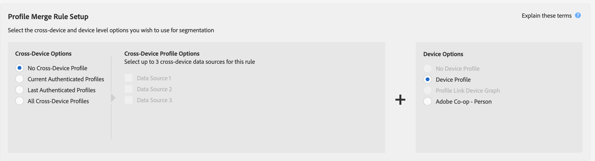
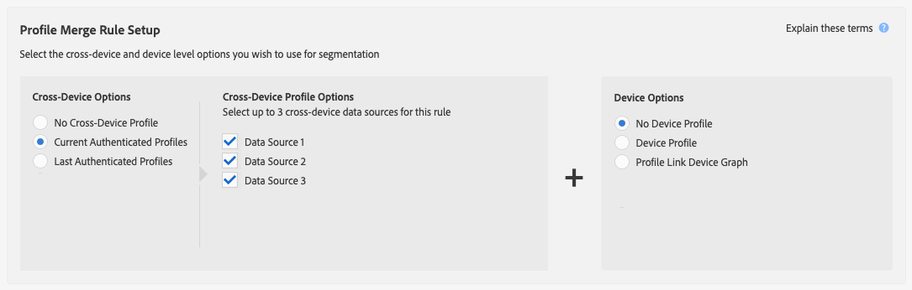

# Profile Merge Rules and Device Un-Segmentation Processes {#profile-merge-rules-and-device-un-segmentation-processes}

Unsegmentation describes processes that disqualify and remove device profiles from segments. Your ability to remove a device profile from a segment depends on the device option used to create a [!UICONTROL Profile Merge Rule].

## Available Device Options {#device-options}

As a reminder, the [!UICONTROL Device Options] are available in the [!UICONTROL Profile Merge Rules Setup] section when you create or edit a [!UICONTROL Profile Merge Rule].

## Current Device Profile Option and Device Unsegmentation {#current-device-profile-options}

**[!UICONTROL Device Profile]** is the default device profile option for a [!UICONTROL Profile Merge Rule]. [!DNL Audience Manager] can remove a device profile from a segment when your [!UICONTROL Profile Merge Rule] uses the **[!UICONTROL Device Profile]** option. Under these conditions, unsegmentation happens when:

* The device profile has been inactive for 120 days. A weekly data cleanup process removes inactive device profiles from your segments.
* The device no longer qualifies for a segment because updates or changes to the device profile disqualify it. This happens when segment qualification criteria change, or you apply an [!DNL AND NOT] operator to a segment rule, or specify [recency and frequency](../segments/recency-and-frequency.md) conditions that use the less than/equal to settings. Use cases are described in the [Instant Cross-Device Suppression](instant-cross-device-suppression.md) documentation.

## No Device Option and Device Unsegmentation {#no-device-option}

[!DNL Audience Manager] can remove a cross-device ID from a segment when your [!UICONTROL Profile Merge Rule] uses the **[!UICONTROL Current Authenticated Profiles]** + **[!UICONTROL No Device Profile]** option. Under these conditions, unsegmentation happens when the cross-device ID no longer qualifies for a segment because updates or changes to the cross-device profile disqualify it. This happens when segment qualification criteria change, or you apply an [!UICONTROL AND NOT] operator to a segment rule, or specify [recency and frequency](../segments/recency-and-frequency.md) conditions that use the less than/equal to settings. Use cases are described in the [Instant Cross-Device Suppression](instant-cross-device-suppression.md) documentation.

## Device Graph Options and Device Unsegmentation {#device-graph-options-unsegmentation}

[!DNL Audience Manager] can remove multiple device profiles from a segment when your [!UICONTROL Profile Merge Rule] uses a device graph option. Unsegmentation happens when the merged profile of the device from the device graph no longer qualifies for the segment because updates or changes to this merged profile disqualify it from the segment. This happens when segment qualification criteria change, or you apply an [!UICONTROL AND NOT] operator to a segment rule, or specify [recency and frequency](../segments/recency-and-frequency.md) conditions that use the less than/equal to settings. Use cases are described in the [Instant Cross-Device Suppression](instant-cross-device-suppression.md) documentation.

>[!NOTE]
>
>**100 device limit for segment evaluation and disqualification**.
>Audience Manager merges up to 100 devices when evaluating segments with a Profile Merge Rule that uses a device graph. Audience Manager evaluates the current device and up to 99 devices linked to the current device by an [authenticated profile](../../reference/visitor-authentication-states.md) (cross-device ID). If the unsegment signal is issued, the current device and additional devices will be removed from the segment in the destination.

>[!MORELIKETHIS]
>
>* [Profile Merge Rules and Device Graph FAQ](../../faq/faq-profile-merge.md)
>* [Instant Cross-Device Suppression](instant-cross-device-suppression.md)
