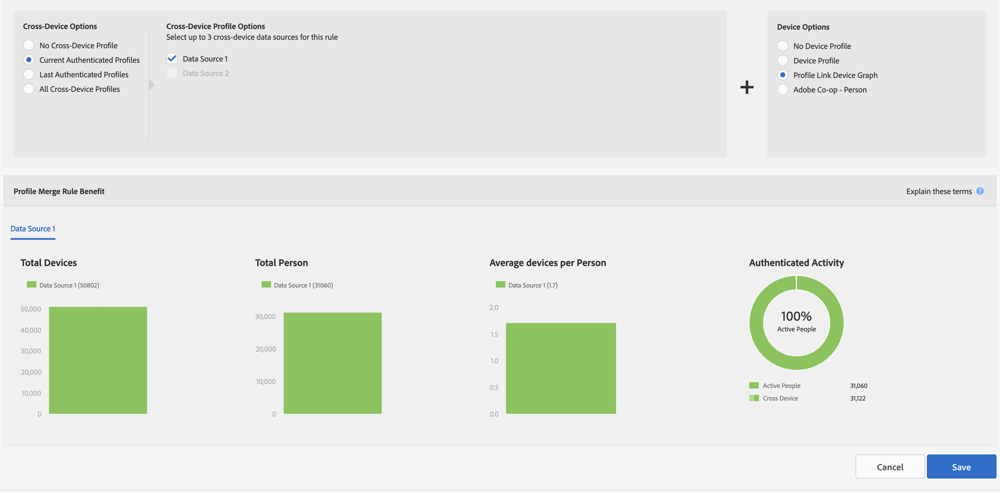
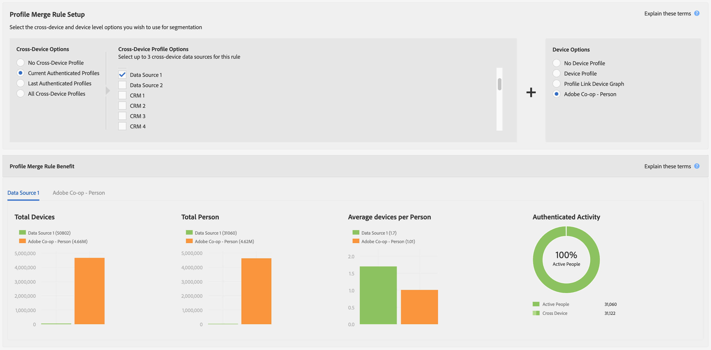

# Report Metrics for Profile Merge Rules {#report-metrics-for-profile-merge-rules}

[!UICONTROL Profile Merge Rule] metrics provide data about people and devices that authenticate to your site. The data and graphs in [!UICONTROL Profile Merge Rule Reports] update dynamically as you create a merge rule or when you click an existing rule from the [!UICONTROL Profile Merge Rules] dashboard. These metrics can include device graphs from the [!DNL Adobe Experience Cloud Device Co-op] or other third-party device graph sources.

## Merge Rule Metrics {#merge-rule-metrics}

Reports return data in side-by-side bar graphs when your merge rules use data from the [Adobe Experience Cloud Device Co-op](https://marketing.adobe.com/resources/help/en_US/mcdc/) or other, third-party device graphs you may have access to in [!DNL Audience Manager]. This lets you compare your authenticated, first-party data with cross-device data provided by the [!UICONTROL Experience Cloud Device Co-op] or another, third-party device graph. For information about data returned by the [!UICONTROL Device Co-op], see [The Device Graph: Internal Processes and Output](https://marketing.adobe.com/resources/help/en_US/mcdc/mcdc-processes.html). This data is updated daily.

<table id="table_A7FB2F9804F84AC8A6DD05C0E6EE7555"> 
 <thead> 
  <tr> 
   <th colname="col1" class="entry"> Metric </th> 
   <th colname="col2" class="entry"> Description </th> 
  </tr> 
 </thead>
 <tbody> 
  <tr> 
   <td colname="col1"> 
 <b> Authenticated Activity</b> 
 </td> 
   <td colname="col2"> 
Shows: 
 
    <ul id="ul_7F7373919A4A49028EF4BF7B28D9F8E9"> 
     <li id="li_FE2F93C496D64ED8928B3E522C9585EA">  Active People: The number of people who have authenticated to your site for the last 60-days. </li> 
     <li id="li_60CFD26EE68B442683C0ED5FED1A79C8">  Cross Device: The total number of <a href="merge-rules-start.md#create-data-source"> Cross Device IDs</a> stored in the <a href="https://docs.adobe.com/content/help/en/audience-manager/user-guide/features/data-sources/manage-datasources.html"> Data Source</a> of the selected <a href="merge-rule-definitions.md"> Authenticated Profile</a> for the lifetime that the data source has existed. </li> 
     <li id="li_F2F07B6A326C4A18B79A0CF2C47D9677">  % Active People: Shows  Active People as a %. </li> 
    </ul> 
  Authenticated Activity lets you compare data sources by activity, volume, and percent. It can help you find a data source that has a lot of people and a high percentage of active users. Or, you may find value in comparing data sources with high proportion of active users compared to the total audience size. For example, sometimes a data source with low total lifetime numbers and high activity are more valuable than those with high lifetime results and low activity numbers. 
 
 
Note: The  Authenticated Activity metrics contain  Profile Link data only. This report does not include  Device Graph data. 
 
 </td> 
  </tr> 
  <tr> 
   <td colname="col1"> 
 <b> Average Devices per Person</b> 
 </td> 
   <td colname="col2"> 
 Shows the average number of devices that are used by visitors who have authenticated to your site for the selected data source. 
 </td> 
  </tr> 
  <tr> 
   <td colname="col1"> 
 <b> Total Devices</b> 
 </td> 
   <td colname="col2"> 
Shows the total number of devices people have used to authenticate to your site for the selected data source. 
 </td> 
  </tr> 
  <tr> 
   <td colname="col1"> 
 <b> Total People</b> 
 </td> 
   <td colname="col2"> 
Shows the total number of people who have been identified deterministically for the selected data source. 
 </td> 
  </tr> 
 </tbody> 
</table>

## Device Graph Metrics {#device-graph-metrics}

The [!UICONTROL Merge Rules] reports also show data on the total number of people and devices who have visited your site for the selected data source and device graph. These metrics return data based on pre-set time intervals (the look-back period) that vary depending on the device option you select when creating a rule. The following table lists these report intervals for each of the device graph options.

<table id="table_038983EBC71F4A55BBCA99212AC5DEE6"> 
 <thead> 
  <tr> 
   <th colname="col1" class="entry"> Device Graph Option </th> 
   <th colname="col2" class="entry"> Report Look-back Interval </th> 
  </tr>
 </thead>
 <tbody> 
  <tr> 
   <td colname="col1"> 
 Profile Link 
 </td> 
   <td colname="col2"> 
 
     <ul id="ul_B2FF2341573840549FFB96579F537082"> 
      <li id="li_B37323C2F2434F41B407500AC5C15447">Total People: 60-days </li> 
      <li id="li_08D911224A60418BBB3CFB4E70CE73D4">Total Devices: 120-days </li> 
     </ul> 
 </td> 
  </tr> 
  <tr> 
   <td colname="col1"> 
 Co-op Device Graph 
 </td> 
   <td colname="col2"> 
 
     <ul id="ul_64AD1DD89DF64703B70B973A463BA020"> 
      <li id="li_D7D3A3871F434CBFA71BE8929EB41648">Total People: 180-days </li> 
      <li id="li_125D387986B2463EB310203CE5857EDA">Total Devices: 180-days </li> 
     </ul> 
 </td> 
  </tr> 
  <tr> 
   <td colname="col1"> 
 LiveRamp 
 </td> 
   <td colname="col2"> 
 
     <ul id="ul_2772F3AD7E1440789B635794ECDE8DFB"> 
      <li id="li_1432363829D64615B1D349A3722D6268">Total People: 180-days </li> 
      <li id="li_D5C0E3CE92524B54BBD36C73A326292B">Total Devices: 180-days </li> 
     </ul> 
 </td> 
  </tr> 
  <tr> 
   <td colname="col1"> 
 Tapad 
 </td> 
   <td colname="col2"> 
 
     <ul id="ul_274529DB58E6442E95C6AD89BECB1362"> 
      <li id="li_67102211A72A4E47AACFE5E369793C17">Total People: 60-days </li> 
      <li id="li_3E8F3DA6A7B5487895A626674DA363A5">Total Devices 60-days </li> 
     </ul> 
 </td> 
  </tr> 
 </tbody> 
</table>

## Sample Reports {#sample-reports}

### Standard Profile Link Report

A standard [!UICONTROL Profile Link] report looks like the following example. Merge rules that use multiple data sources (up to 3, maximum) show graphs in separate tabs for each data source. This merge rule does not include [!UICONTROL Device Co-op] data.

### Profile Link Report With Device Graph Data

A [!UICONTROL Profile Link Device Graph] report that includes device graph data from the [!UICONTROL Adobe Experience Cloud Device Co-op] or a third-party device graph shows [!UICONTROL Profile Link] and device graph data with side-by-side bar graphs. Placing these graphs adjacent to each other lets you evaluate the benefits of using the [!UICONTROL Experience Cloud Device Co-op] compared to [!UICONTROL Profile Link] by itself. Merge rules that use multiple data sources (up to 3, maximum) show graphs in separate tabs for each data source. As a reminder, the [!UICONTROL Authenticated Activity] graph and metrics do not return data from the [!DNL Adobe] device graph or other, third-party device graphs you may have access to in [!DNL Audience Manager].

## Profile Link Trend Graphs {#profile-link-trend}

In addition to the other data visualizations, [!UICONTROL Profile Link] reports include a line graph. The line graph is designed to show you trends over time for your profile rules. Trend graphs (and the other reports) are available when you click a rule from the [!UICONTROL Profile Merge Rules] landing page ( **[!UICONTROL Audience Data > Profile Merge Rules]**). These graphs include device graph data if you're a member of the [!UICONTROL Device Co-op] or other, third-party device graphs you may have access to in [!DNL Audience Manager]. Click on a trend line to see underlying data.

>[!MORELIKETHIS]
>
>* [Profile Merge Rules FAQ](../../faq/faq-profile-merge.md)
