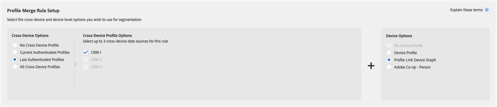
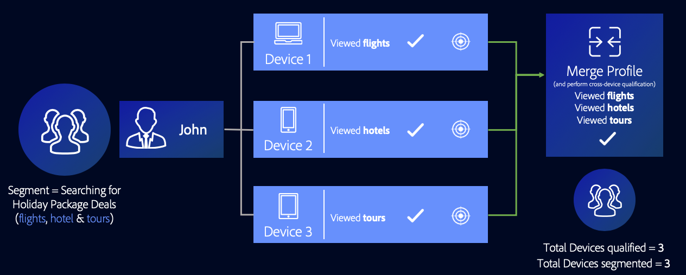

# Profile Link Device Graph Use Cases {#profile-link-device-graph-use-cases}

Recommendations and use cases for segment retargeting and personalized segment qualification with the [!UICONTROL Profile Link Device Graph].

## Recommendations {#recommendations}

Consider the [!UICONTROL Profile Link] device graph for campaigns that:

* Have a high-level of authentication across their digital properties. Use an [external device graph option](merge-rule-definitions.md#device-options) if you have a small amount of authenticated users.
* Require accurate targeting of known audiences. The [!UICONTROL Profile Link Device Graph] is built using first-party, authenticated data.
* Target known audiences across their authenticated and unauthenticated states in real-time.

## Cross-Device Targeting {#cross-device-personalization}

Let's say John owns three devices that he uses regularly to search for holiday package deals: his laptop ([!DNL Device 1]), his smartphone ([!DNL Device 2]), and his tablet ([!DNL Device 3]). However, John uses his devices to search for different items of the package deals:

* He uses his laptop to search for flights;
* He uses his smartphone to search for hotels;
* He uses his tablet to search for guided tours.

Even if John is not authenticated on all three of the devices mentioned above, by using the **[!UICONTROL Last Authenticated Profiles]** + **[!UICONTROL Profile Link Device Graph]** rule, a holiday package provider can associate these devices to John's authenticated profile, assuming that he was the last person to authenticate on all three devices.

Since Audience Manager qualifies every device profile that took part in the profile merge for a segment, all three device profiles are segmented. The [!UICONTROL Profile Link Device Graph] allows Audience Manager to look at the behavior across all three devices and qualify every device for a segment that no single device profile qualifies for on its own.

This [!UICONTROL Profile Merge Rule] enables marketers to deliver a consistent experience to all devices owned by one person, based on the user activity instead of the individual device activity.

>[!MORELIKETHIS]
>
>* [External Device Graph Use Cases](external-graph-use-cases.md)
>* [General Use Cases for Profile Merge Rules](merge-rule-targeting-options.md)
>* [Profile Merge Rules FAQ](../../faq/faq-profile-merge.md)
