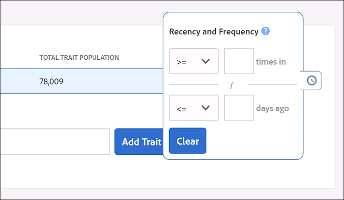
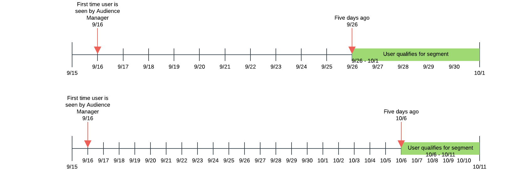
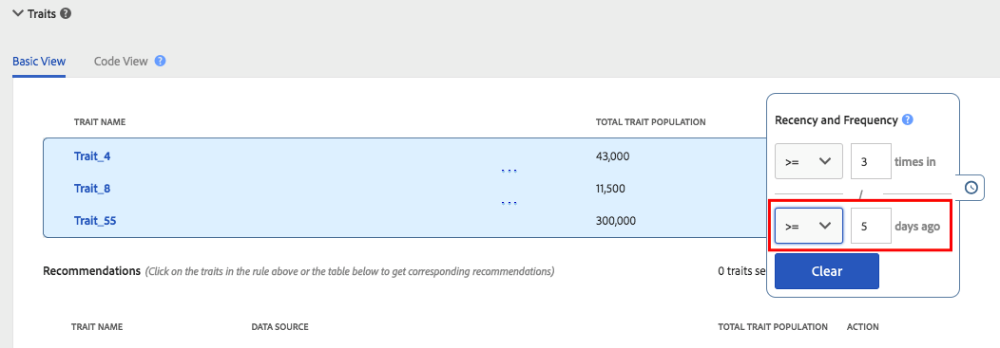
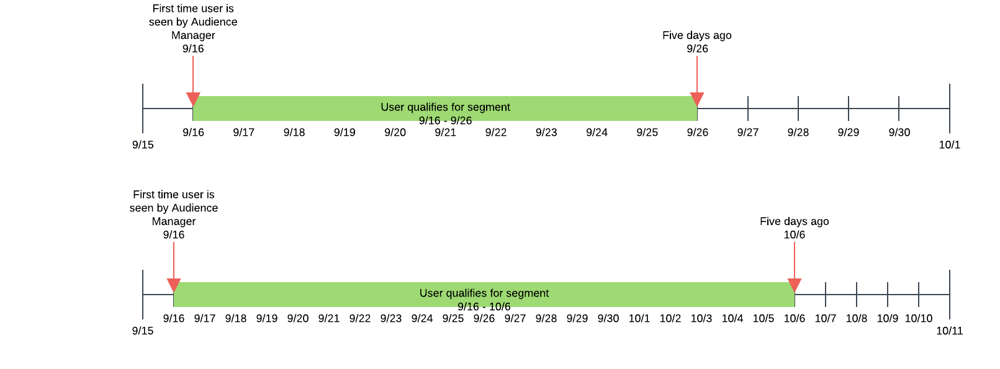

# Recency and Frequency {#recency-and-frequency}

In [!UICONTROL Segment Builder], recency and frequency let you segment visitors based on actions that occur or repeat over a set daily interval.

Audience Manager defines [!DNL recency] and [!DNL frequency] as follows:

* **[!UICONTROL Recency]:** How recently a user viewed or qualified for one (or more) [!UICONTROL traits].
* **[!UICONTROL Frequency]:** The rate at which a user viewed or qualified for one (or more) [!UICONTROL traits].

[!UICONTROL Recency] and [!UICONTROL Frequency] settings help you segment visitors based on their real (or perceived) level of interest in a site, section, or particular creative. For example, users who qualify for a segment with high recency/frequency requirements may be more interested in a site or product than users who visit less often or less frequently.

## Location of [!UICONTROL Recency and Frequency] Settings {#location}

In [!UICONTROL Segment Builder], [!UICONTROL Recency] and [!UICONTROL Frequency] settings are located in the [!UICONTROL Basic View] section of the [!UICONTROL Traits] panel. Click the clock icon to expose these controls.

## Limitations and Rules {#limitations-rules}

Review and understand these limits and rules when you want to apply recency and frequency to traits in your segments.

### [!UICONTROL Recency] {#recency}

<table id="table_026064124C694D75B7A960457D50170B"> 
 <thead> 
  <tr> 
   <th colname="col1" class="entry"> Limit or Rule </th> 
   <th colname="col2" class="entry"> Description </th> 
  </tr> 
 </thead>
 <tbody> 
  <tr> 
   <td colname="col1"> 
 <b>Minimum Value</b> 
 </td> 
   <td colname="col2"> 
Recency must be greater than 0. 
 </td> 
  </tr>
  <tr> 
   <td colname="col1"> 
 <b>Trait Types</b> 
 </td> 
   <td colname="col2"> 
You can apply recency controls to rule-based and folder traits only. 
 </td> 
  </tr> 
  <tr> 
   <td colname="col1"> 
 <b>Third-Party Traits</b> 
 </td> 
   <td colname="col2"> 
You cannot set recency rules on individual third-party traits or trait groups that contain third-party traits. Recency and frequency applies to your own traits only. 
 </td> 
  </tr> 
 </tbody> 
</table>

### [!UICONTROL Frequency] {#frequency}

<table id="table_EBD621D26C8B4D03933E8C0753C892A7"> 
 <thead> 
  <tr> 
   <th colname="col1" class="entry"> Limit or Rule </th> 
   <th colname="col2" class="entry"> Description </th> 
  </tr> 
 </thead>
 <tbody> 
  <tr> 
   <td colname="col1"> 
 <b>Third-Party Traits</b> 
 </td> 
   <td colname="col2"> 
You cannot set frequency rules on individual third-party traits or trait groups that contain third-party traits. Recency and frequency applies to your own traits only. 
 </td> 
  </tr> 
  <tr> 
   <td colname="col1"> 
 <b>Trait Types</b> 
 </td> 
   <td colname="col2"> 
You can apply frequency controls to rule-based and folder traits only. 
 </td> 
  </tr> 
  <tr> 
   <td colname="col1"> 
 <b>Recency Requirements</b> 
 </td> 
   <td colname="col2"> 
You can configure frequency requirements <i>without</i> configuring recency requirements. Just set a frequency value and leave the recency field blank. 
 </td> 
  </tr> 
  <tr> 
   <td colname="col1"> 
<b>Profile Merge Rules</b> 
 </td> 
   <td colname="col2"> 
See <a href="../../faq/faq-profile-merge.md#trait-freq-device-rules"> Trait Frequency, External Device Graphs, and Profile Merge Rules</a>. 
 </td> 
  </tr> 
 </tbody> 
</table>

## Recency Examples {#recency-examples}

Here are two examples of how recency works, depending on your selection in the UI:

### Using a less than or equal to operator (<=)

In this example, you select the <= operator, as shown in the screenshot. This qualifies your user for the [!UICONTROL segment] if they qualify for any of the three [!UICONTROL traits] a minimum of three times within the last five days. The timeline below shows the [!UICONTROL segment] qualification at the time the [!UICONTROL segment] is created, on October 1st, and ten days later.

### Using a greater than or equal to operator (=>)

In this example, you select the => operator, as shown in the screenshot. This qualifies your user for the [!UICONTROL segment] if they qualify for any of the three [!UICONTROL traits] a minimum of three times anytime between their first qualification on the Audience Manager platform and the cut-off time five days ago. The timeline below shows the [!UICONTROL segment] qualification at the time the [!UICONTROL segment] is created, on October 1st, and ten days later.

## Frequency Capping Examples {#frequency-capping}

Frequency-capping expressions include all the users whose number of [!UICONTROL trait] realizations is below a desired value. Here are a few Right and Wrong examples:

* Wrong - The expression `frequency([1000T]) <= 5` includes all users that have realized the [!UICONTROL trait] with the ID "1000" a maximum of five times but also includes users who have not realized the [!UICONTROL trait]. Therefore, Audience Manager does not validate this expression for performance reasons, as it would qualify too many users for the [!UICONTROL segment].

* Right - If you want to include all users that have realized the [!UICONTROL trait] with the ID "1000" a maximum of five times, add another condition to the expression, to make sure the users have qualified for the [!UICONTROL trait] at least once:  `frequency([1000T]) >= 1  AND  frequency([1000T]) <= 5`

* Right- When you need recency/frequency requirements to be less than a specific number of times or days, join that [!UICONTROL trait] to another with an `AND` operator. Using the example in the first bullet point, this expression becomes valid when joined with another [!UICONTROL trait] as shown here: `frequency([1000T]) <= 5 AND isSiteVisitorTrait`.

* Right - For advertising frequency-capping use cases, you could create a [!UICONTROL segment] rule similar to this: `(frequency([1000T] <= 2D) >= 5)`. This expression includes all users that have realized the [!UICONTROL trait] with the ID "1000" in the past 2 days at least five times. Set frequency capping by sending this [!UICONTROL segment] to the ad server with a `NOT` set on the [!UICONTROL segment] in the ad server. This approach achieves greater performance in [!DNL Audience Manager] while still serving the same purpose for frequency capping.

>[!MORELIKETHIS]
>
>* [Segment Builder Controls: Traits Section](../../features/segments/segment-builder.md#segment-builder-controls-traits)
>* [Code Syntax Used in the Segment Expression Editor](../../features/segments/segment-code-syntax.md)
