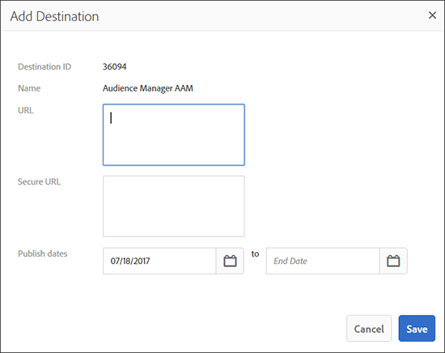

# Segment Builder {#segment-builder}

Describes the required and optional steps that create a segment in [!UICONTROL Segment Builder].

## Create a Segment {#create-segment}

### Segment Builder Section

<!-- t_create_segment.xml -->

[!UICONTROL Segment Builder] consists of 3 separate sections: [!UICONTROL Basic Information], [!UICONTROL Traits], and [!UICONTROL Destinations Mapping]. To create a segment, complete the required fields in the [!UICONTROL Basic Information] and [!UICONTROL Traits] sections. [!UICONTROL Destinations Mapping] settings are optional. See the instructions below for additional help.

1. In the [Basic Information](../../features/segments/segment-builder.md#segment-builder-controls-basics) section:
    * Name the segment. The maximum length of a segment name is 255 characters.
    * Set the segment status (active is default).
    * Choose a data source.
    * Select a profile merge rule to use for segment qualification.
    * Assign the segment to a storage folder.
1. In the [Traits](../../features/segments/segment-builder.md#segment-builder-controls-traits) section:
    * Search for the trait you want to add to a segment and click **[!UICONTROL Add Trait]**. Add another trait to create a trait group.
    * Bring up the Advanced Search modal by clicking **[!UICONTROL Browse All Traits]**. Search for traits by name, ID, description or data source. Click on a folder while searching to limit results to that folder and its subfolders. You can also filter traits by trait type.
    * Get live [trait recommendations](trait-recommendations.md) as you build your segment.
    * Click and drag traits to create separate groups.
    * Hover between groups to set relationships with Boolean [!UICONTROL AND], [!UICONTROL OR], [!UICONTROL AND NOT] values.
    * Hover over the clock icon to add [recency and frequency](../../features/segments/recency-and-frequency.md#concept_957D9E1977774D28A98ACEE6035E7B37) rules to the trait.
    * View segment population data as you add or remove traits. Click **[!UICONTROL Calculate Estimates]** to see (or refresh) the estimated population numbers. Read more about [segment population data](../../features/segments/segment-builder-data.md#segment-populations) in the Segment Builder.
    * Click **[!UICONTROL Save]** when done.
1. *(Optional)* Map a segment to a destination in the [Destination Mapping](../../features/segments/segment-builder.md#segment-builder-controls-destinations) section:
    * Search for the destination and click **[!UICONTROL Add Destination]**. Note, the destination must already exist before you can add it to a segment.
    * Click **[!UICONTROL Save]** when done.

## Segment Builder Controls: Basic Information Section {#segment-builder-controls-basics}

In [!UICONTROL Segment Builder], [!UICONTROL the Basic Information] settings let you create new, or edit existing traits. To create a new segment, provide a name, a data source, and select a storage folder. All other fields are optional. Move on to the [!UICONTROL Traits] section when done.

<!-- r_segment_basic_info_section.xml -->

<table id="table_39DA4BC9470448B48F6654F2774EE0D5"> 
 <thead> 
  <tr> 
   <th colname="col1" class="entry"> Field </th> 
   <th colname="col2" class="entry"> Description </th> 
  </tr> 
 </thead>
 <tbody> 
  <tr> 
   <td colname="col1"> <b>Name</b> </td> 
   <td colname="col2"> 
Give the segment a short, logical name that describes its function or purpose. Avoid abbreviations and special characters. The maximum length of a segment name is 255 characters. 
 </td> 
  </tr> 
  <tr> 
   <td colname="col1"> <b>Description</b> </td> 
   <td colname="col2"> 
A field for additional descriptive information about the segment. 
 </td> 
  </tr> 
  <tr> 
   <td colname="col1"> <b>Integration Code</b> </td> 
   <td colname="col2"> 
A field for a user-defined ID or other company-specific information. 
 </td> 
  </tr> 
  <tr> 
   <td colname="col1"> <b>Data Source</b> </td> 
   <td colname="col2"> 
Associates the segment with a specific data provider. 
 </td> 
  </tr> 
  <tr> 
   <td colname="col1"><b>Profile Merge Rule</b> </td> 
   <td colname="col2"> 
Selects the Profile Merge Rule to use for segment qualification. 
 </td> 
  </tr> 
  <tr> 
   <td colname="col1"> <b>Status</b> </td> 
   <td colname="col2"> 
Activates or deactivates the segment (active by default). 
 </td> 
  </tr> 
  <tr> 
   <td colname="col1"> <b>Folder Storage</b> </td> 
   <td colname="col2"> 
Determines which storage folder the segment belongs to. 
 </td> 
  </tr> 
 </tbody> 
</table>

## Segment Builder Controls: Traits Section {#segment-builder-controls-traits}

In [!UICONTROL Segment Builder], the [!UICONTROL Traits] section lets you manage traits in a segment, create trait groups, and set qualification criteria. To add a trait to a segment, type the trait name in the search field and click [!UICONTROL Add Trait]. Save the trait (if finished) or move on to [!UICONTROL Destinations Mapping].

<!-- r_segment_traits_section.xml -->

**Prerequisites:** Complete the required fields in the [!UICONTROL Basic Information] section.

| Field | Description |
|--- |--- |
|Basic View|This section provides visual controls that let you: <ul><li>Build new and manage existing segments.</li><li>Remove traits from a segment.</li><li>Add up to 50 (maximum) traits to a segment.</li><li>Drag and drop traits to create new groups.</li><li>View traits and trait groups in a segment.</li><li>Set qualification criteria with Boolean expressions, comparison operators, and recency/frequency settings.</li></ul>|
|Code View|Opens a development environment that lets you create and manage traits, groups, and qualification requirements with code instead of the visual interface. The code view is useful if your segments: <ul><li>Contain more than 50 traits in an individual segment. Note: Segments are limited to 5000 traits (maximum).</li><li>Contain many trait groups.</li><li>Have complex qualification requirements.</li></ul>|
|Search|Helps you find traits to add to a segment.|
|Recommendations|Get live recommendations for similar traits to add to the segment rule. Read more in [Trait Recommendations](trait-recommendations.md).|
|Real and Estimated Segment Size Data|See [Trait and Segment Population Data in Segment Builder](segment-builder-data.md).|

## Segment Builder Controls: Destinations Mappings Section {#segment-builder-controls-destinations}

In [!UICONTROL Segment Builder], the optional [!UICONTROL Destinations Mapping] section lets you send segment data to a third-party [!DNL cookie], [!DNL URL], or server-to-server destination. To add a destination, search (or browse) for a destination, provide destination specific information, and click **[!UICONTROL Add Destination]**.

<!-- r_segment_destinations_map.xml -->

### Prerequisites

Complete the required fields in the [!UICONTROL Basic Information] and [!UICONTROL Traits] sections. Also, the destination must already exist.

### Destination Mappings Search Tools

The **[!UICONTROL Destination Mappings]** panel contains search tools as described in the table below.  

|  Search Type  | Description  |
|---|---|
| **Search by Destination Name** |Lets you search for a specific destination by name. To search, start typing. The field will auto-complete based on your search terms. Click **[!UICONTROL Add Destination]** when done.|
| **Browse All Destinations** |Browse a list of *all* destinations available to you. Select and add destinations to your segment from the popup list.  |

## Fields in the Destination Mappings Pop-up Windows {#fields-in-dest-mappings}

In [!UICONTROL Segment Builder], the [!UICONTROL Add Destination] dialog appears after you select a destination. This window displays static information about the destination and fields that vary depending on the destination type. Provide the required information in the empty fields to set up a destination mapping.

>[!NOTE]
>
>Publication dates are optional. When blank, the destination becomes active and never expires.

<!-- r_add_mappings_pop.xml -->

### Cookie Destination Fields

In the [!UICONTROL Destination Mapping] fields, specify the key-value pairs used to send data to the destination. Enter the key in the first field and the values in the second. Your cookie destination pop could look similar to this:

### URL Destination Fields

In the [!UICONTROL URL] and [!UICONTROL Secure URL] fields, specify the complete standard or secure address used to send data to the destination.

### Server-to-Server Destination Fields

In the [!UICONTROL Destination Value] field specify the value (part of a key-value pair) used to send data to the destination.

>[!MORE_LIKE_THIS]
>
>* [Create a Cookie Destination](../../features/destinations/manage-destinations.md#create-cookie-destination)
>* [Create a URL Destination](../../features/destinations/manage-destinations.md#configure-url-destination)
